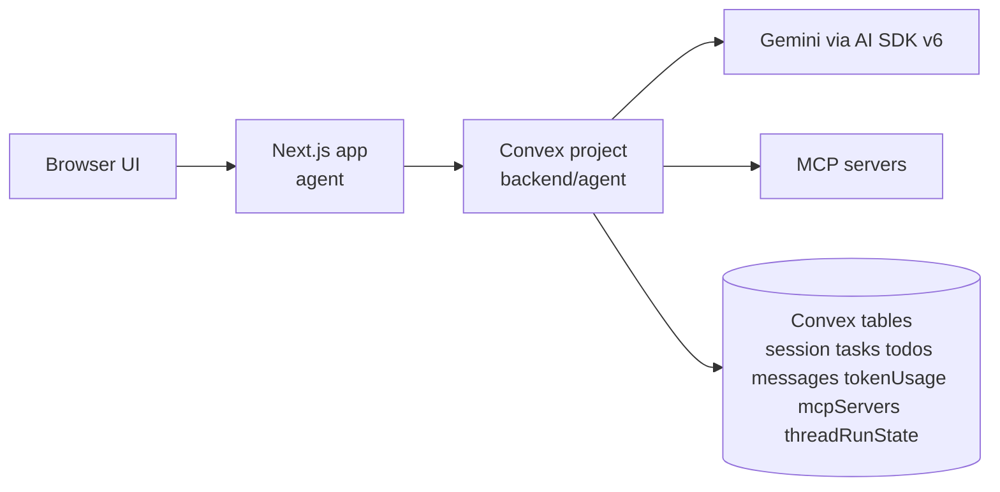
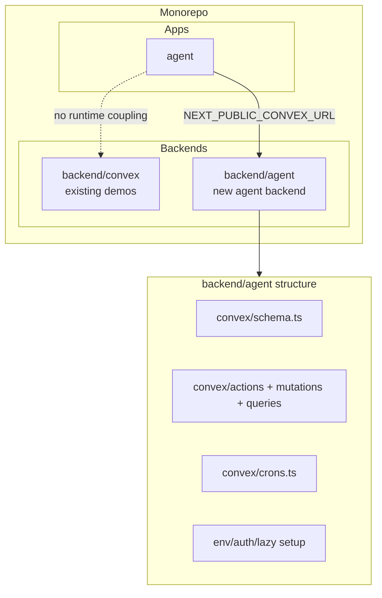
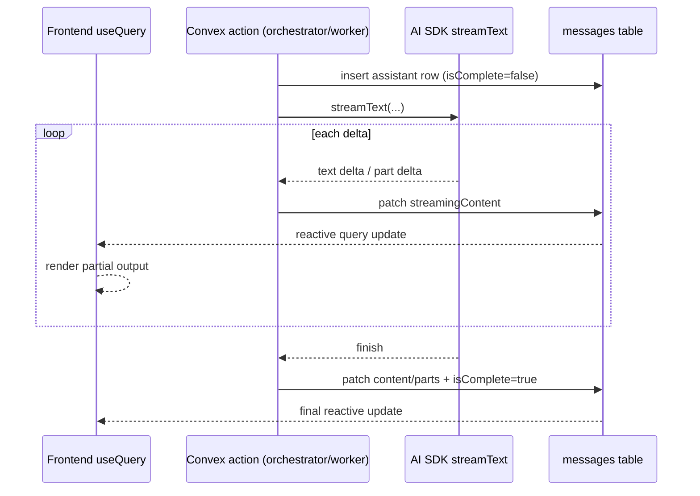
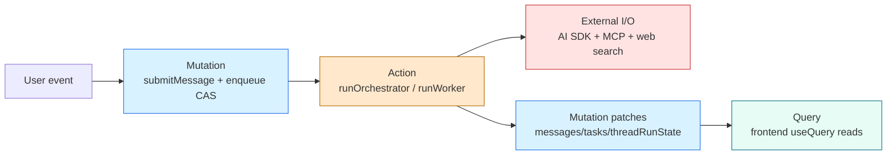

# Architecture

This module defines the web agent harness architecture after removing `@convex-dev/agent`. Runtime orchestration uses AI SDK v6 (`streamText`) directly, and all conversational state lives in first-party Convex tables in `backend/agent`.

## Reference Sources

- AI SDK docs: https://ai-sdk.vercel.ai/docs
- Convex docs: https://docs.convex.dev
- oh-my-openagent inspiration paths:
  - `src/index.ts`
  - `src/agents/`
  - `src/features/background-agent/`
  - `src/hooks/todo-continuation-enforcer/`

## System Topology

The frontend app (`agent`) and backend Convex project (`backend/agent`) are split intentionally. `backend/agent` owns schema, actions, mutations, crons, auth wiring, and deploy lifecycle.

## Convex Topology In Monorepo

`backend/agent` is an independent backend package, not an extension of `backend/convex`.

## Data Flow

Primary turn path:

1. User submits input from `agent`.
2. Public mutation writes user message into `messages` and updates session activity.
3. Mutation enqueues orchestrator run through `threadRunState` (CAS queue semantics).
4. Orchestrator action claims run token, reads thread context, runs `streamText` with function tools.
5. Tool calls may enqueue worker tasks; workers run in separate thread IDs, then write completion reminders.
6. Assistant response is streamed into the same thread’s `messages` row and finalized.
7. Frontend rerenders continuously via standard Convex `useQuery` reactivity.

## Streaming Architecture (DIY, No Agent Component)

Streaming state is stored on the message row directly:

- Create assistant message row with `isComplete=false` and initial `streamingContent`.
- For each AI SDK delta chunk, patch `messages.streamingContent`.
- On finish, set final `content` / `parts`, clear or freeze `streamingContent`, and mark `isComplete=true`.
- UI reads thread messages with `useQuery`; no specialized message hook is required.

### Message Parts Format

The `parts` field on messages is a JSON array storing structured content beyond plain text. Each part has a `type` discriminator:

- `{ type: 'text', text: string }` — plain text segment
- `{ type: 'reasoning', text: string }` — model reasoning/thinking
- `{ type: 'tool-call', toolCallId: string, toolName: string, args: string, status: 'pending' | 'success' | 'error', result?: string }` — tool invocation with lifecycle
- `{ type: 'source', title: string, url: string, snippet?: string }` — grounding search source

During streaming, the orchestrator action builds parts incrementally. Tool calls start with `status: 'pending'` and are updated to `success`/`error` when the tool returns. The frontend renders each part type with the corresponding component (reasoning-block, tool-call-card, source-card). Worker thread messages use the same format.

There are no separate `role: 'tool'` message rows. Tool invocations and their results are embedded in the assistant message `parts` array. This simplifies compaction (tool pairs cannot be split across messages) and message ordering.

### Parts Streaming Lifecycle

During an orchestrator turn:

1. **Turn starts**: Insert assistant message row with `isComplete: false`, `streamingContent: ''`, `parts: []`
2. **Text streaming**: Patch `streamingContent` with accumulating text deltas
3. **Tool call starts**: Append `{ type: 'tool-call', toolCallId, toolName, args, status: 'pending' }` to `parts` array
4. **Tool call completes**: Update the matching `parts` entry: set `status: 'success'` + `result`, or `status: 'error'` + error message
5. **Reasoning**: Append `{ type: 'reasoning', text }` to `parts`
6. **Sources**: Append `{ type: 'source', title, url, snippet }` to `parts` (from webSearch results)
7. **Turn ends**: Set `content` from final accumulated text, clear `streamingContent`, set `isComplete: true`

Frontend renders: `streamingContent` for in-progress text, `content` for completed text, `parts` for structured elements (always available, updated incrementally).

### Canonical Message Serializer (`buildModelMessages`)

All model context assembly (orchestrator turns, worker turns, compaction input) uses a single `buildModelMessages` function that converts stored message rows into AI SDK `CoreMessage` format:

- **User messages**: `{ role: 'user', content: m.content }`
- **System messages**: `{ role: 'system', content: m.content }`
- **Assistant messages**: Reconstructed from BOTH `content` AND `parts`:
  - Text content from `m.content`
  - Tool calls from `parts` entries with `type: 'tool-call'` → mapped to AI SDK tool-call content parts
  - For each assistant message with tool-call parts: emit the assistant `CoreMessage` with text + tool-call content parts (type `tool-call`), then emit a SEPARATE `{ role: 'tool', content: [...] }` CoreMessage containing the tool results for all terminal tool-call parts in that message. AI SDK requires tool results in their own message, not embedded in the assistant message. Storage remains parts-only (single DB row per assistant turn) — the split happens only during serialization.
  - Reasoning from `parts` entries with `type: 'reasoning'` → included as reasoning content
  - Sources are metadata-only (not sent to the model, only rendered in UI)

Tool results serialization: All terminal tool outcomes (both `success` and `error`) are included in the model context. This ensures the model sees the full history of what was attempted and what failed, enabling intelligent retry decisions or user-facing error reporting in follow-up turns.

This ensures the model sees the full conversation history including prior tool interactions, not just plain text. Without this, follow-up turns after tool-heavy conversations would lose all tool context.

**Multi-step turn handling**: when an assistant turn includes multiple steps (text → tool-call → tool-result → more text), all steps are stored in one message row’s `parts` array in execution order. During serialization, `buildModelMessages` emits: (1) an assistant CoreMessage with text + tool-call parts, then (2) a tool CoreMessage with tool results, preserving the correct assistant→tool ordering. If a turn has multiple sequential tool calls, each call-result pair is serialized in order. Single-row storage is a deliberate simplification that preserves full content and tool outcomes.

## Thread Model

- Threads are UUID strings generated by `crypto.randomUUID()`.
- `session.threadId` is the parent conversation thread.
- `messages.threadId`, `tasks.threadId`, and `threadRunState.threadId` are plain string references.
- No `threads` table exists.
- Worker threads are distinguished from orchestrator threads only by association with a `tasks` row.
- No component thread/message API is used.

## Action vs Mutation Boundaries

Convex boundary is explicit:

- Actions: external I/O and long-running orchestration (`streamText`, MCP HTTP calls, search bridges).
- Mutations: atomic state transitions, queue CAS, message patching, task lifecycle transitions.
- Queries: ownership-safe reads for UI and internal orchestration checks.

## Runtime Constraints To Preserve

- Keep queue/state transitions mutation-first and idempotent.
- Keep one active orchestrator run per thread with queued continuation payloads.
- Keep actions side-effecting only through explicit mutation calls.
- Keep ownership checks on every public entry point before thread/session/task access.

## Tests

Tests for this module are defined in [testing.md](./testing.md). Key test areas:

### convex-test

- Orchestrator Runtime: #17-20

### E2E (Playwright)

- Chat & Streaming: #2-5

### Edge Cases

- Edge Cases: #1-2
