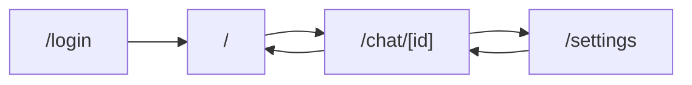
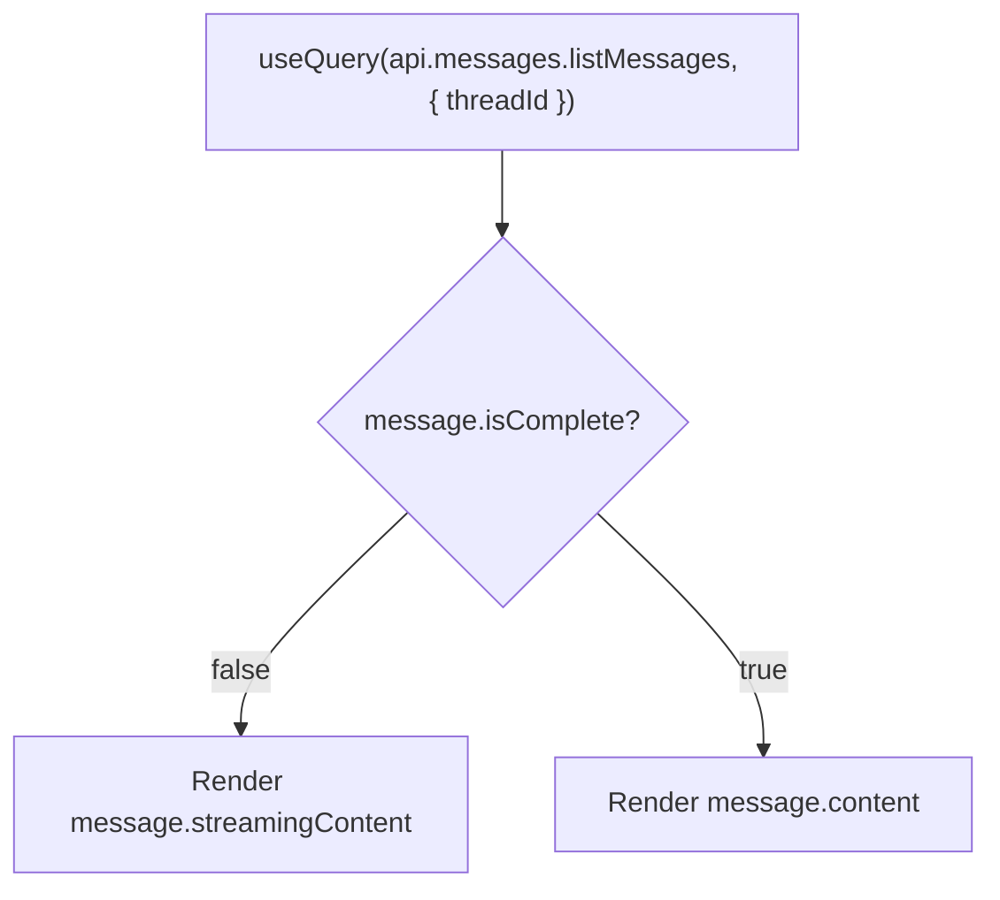
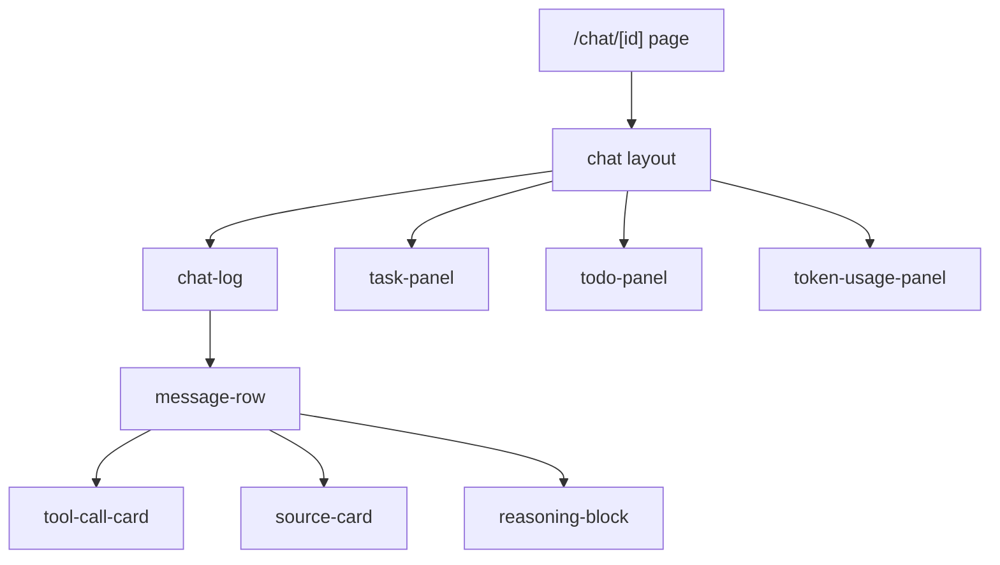
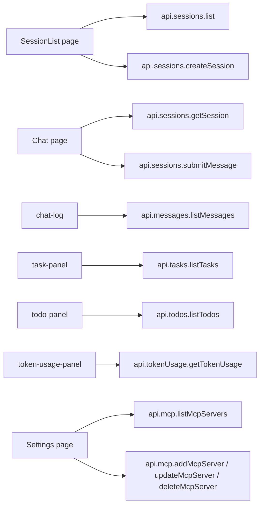
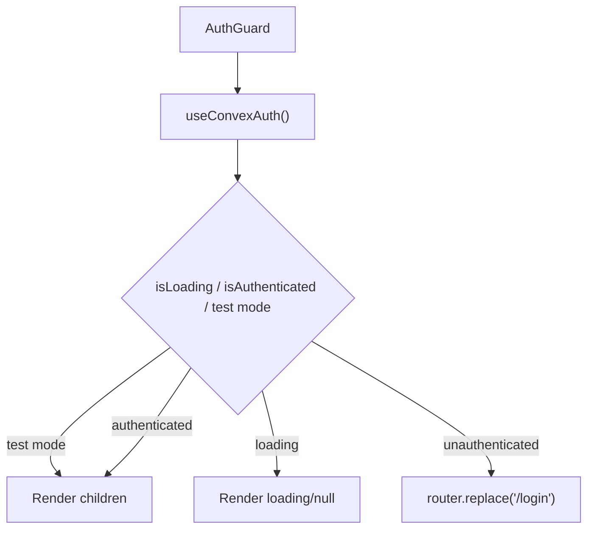

# Frontend Plan (`agent`)

## Scope and Constraints

- Build a standalone Next.js App Router frontend at `agent/` with its own Convex client and `NEXT_PUBLIC_CONVEX_URL`.
- Do not reuse demo-app Convex provider wiring from `web/cvx/*`; this app targets `backend/agent` only.
- `oh-my-openagent` is CLI-first; this web UI is original product surface and must define its own rendering/model-state contract.
- `@convex-dev/agent` UI hooks are removed from frontend usage. Use standard Convex React hooks (`useQuery`, `useMutation`).

References:

- Next.js App Router: https://nextjs.org/docs/app
- Convex React Client: https://docs.convex.dev/client/react

## Route Structure

- `/login`: authentication entry (Google OAuth handoff start).
- `/`: session list (owned sessions, create/new navigation).
- `/chat/[id]`: chat workspace (messages, composer, tasks/todos/tokens/sources).
- `/settings`: per-user MCP server CRUD.

## App and Provider Wiring

### Root Layout Contract

- `src/app/layout.tsx` is the root shell and wraps children with:
  - `AgentConvexProvider` (Convex + auth provider for this app’s deployment)
  - `TestLoginProvider` (test-mode bootstrap only)
  - `AuthGuard` for protected surfaces (either via protected segment layout or page-level wrapper)
- `AuthGuard` applies to `/`, `/chat/[id]`, `/settings`; `/login` remains public.

### Middleware

- `middleware.ts` uses `createProxy()` only.
- No auth middleware in Next.js layer; auth state is managed client-side by `ConvexAuthNextjsProvider` + `useConvexAuth`.

## Page Specifications

### `/` Session List

- Query sessions reactively with `useQuery(api.sessions.list, {})`.
- Create session with `useMutation(api.sessions.createSession)` and navigate to `/chat/[id]`.
- Show explicit loading, empty, and error states.

### `/chat/[id]` Chat Page

- Resolve session with `useQuery(api.sessions.getSession, { sessionId: id })`.
- Submit messages with `useMutation(api.sessions.submitMessage)`.
- Render chat timeline from `useQuery(api.messages.listMessages, { threadId })`.

### `/settings` MCP Management

- List with `useQuery(api.mcp.listMcpServers, {})`.
- Mutate with `addMcpServer`, `updateMcpServer`, `deleteMcpServer`.

### `/login`

- Trigger Google sign-in via auth client actions.
- Redirect authenticated users to `/`.

## DIY Streaming UI (Standard Convex Hooks)

The frontend streaming model is based on reactive query updates from `api.messages.listMessages`:

- Query returns ordered messages for the thread.
- While generation is in progress, the latest assistant message is partial:
  - `isComplete: false`
  - `streamingContent` updates in real time
- When streaming finalizes:
  - `isComplete: true`
  - `content` contains finalized message
- UI rendering rule:
  - if `isComplete === false`, render `streamingContent`
  - else render `content`

## Chat Component Specifications

### Core Rendering Components

- `chat-log.tsx`
  - Scrollable transcript container.
  - Reads thread messages from `useQuery(api.messages.listMessages, { threadId })`.
  - Renders `MessageRow` entries in stable order.
- `message-row.tsx`
  - Renders role, timestamp, and body.
  - Delegates specialized parts to child components.
- `reasoning-block.tsx`
  - Collapsible reasoning display.
  - Supports streaming updates and keyboard toggling.
- `tool-call-card.tsx`
  - Displays tool name, status, inputs/outputs, and error payloads.
  - Status enum from backend: pending/success/error.
  - Frontend maps these to display labels: `pending` -> ‘Running’, `success` -> ‘Completed’, `error` -> ‘Error’.
- `source-card.tsx`
  - Displays source title, URL, snippet.
  - External links open in new tab.

### Side Panels

- `task-panel.tsx`: `useQuery(api.tasks.listTasks, { sessionId })`.
- `todo-panel.tsx`: `useQuery(api.todos.listTodos, { sessionId })`.
- `token-usage-panel.tsx`: `useQuery(api.tokenUsage.getTokenUsage, { sessionId })`.

## Frontend–Backend Contract Map

## Protected Route Flow

## Accessibility Requirements

- Chat transcript uses `role="log"` and preserves chronological reading order.
- Streaming assistant output uses `aria-live="polite"` so updates are announced without interruption.
- Reasoning/tool expandable controls are native `button` elements with keyboard support and visible focus states.
- Focus returns to composer after submit and after modal/drawer close.
- Status is never color-only; include text labels (`Running`, `Completed`, `Error`, etc.).
- Interactive cards and controls must meet minimum hit-target and contrast requirements across mobile and desktop breakpoints.

## Tests

Tests for this module are defined in [testing.md](./testing.md). Key test areas:

### convex-test

- Frontend contract validation is covered indirectly by backend ownership/tool/runtime tests in supporting modules.

### E2E (Playwright)

- Session Management: #1-5
- Chat & Streaming: #1-5
- Tool Execution: #1-6
- Settings (MCP): #1-5
- Error States: #1-5
- Accessibility (E2E): #1-6

### Edge Cases

- Edge Cases surfaced in UI paths: #10-12
