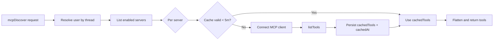
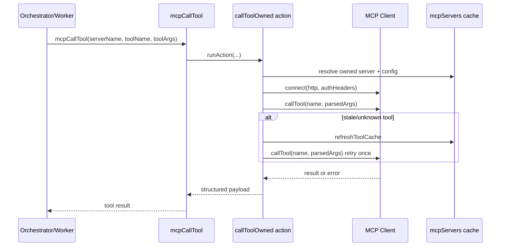
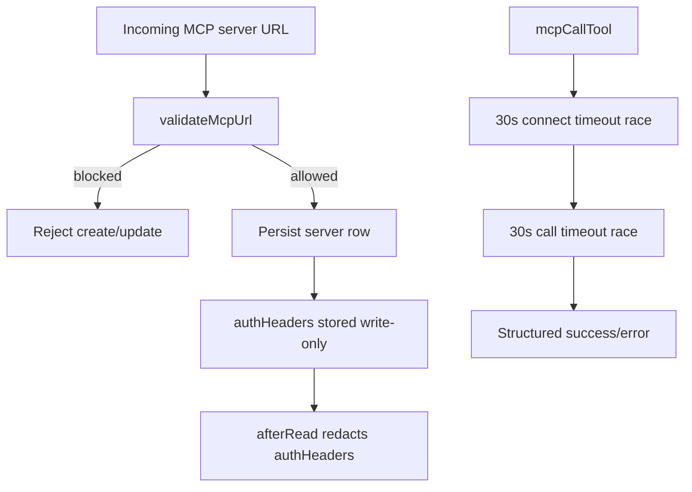
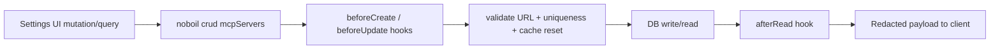

# MCP Integration

## Scope

This document extracts and rewrites the MCP integration plan for the agent app. Reference docs and code:

- MCP spec: https://modelcontextprotocol.io
- oh-my-openagent MCP references: `src/mcp/`

## Architecture

- User-owned MCP server configs only (per-user CRUD in settings).
- Transport is HTTP-only via `StreamableHTTPClientTransport`.
- Runtime model uses generic bridge + discovery:
  - `mcpDiscover` for planning visibility
  - `mcpCallTool` for invocation
- Dynamic conversion of discovered MCP tools into local function tools is deferred.

## Discovery + Cache

Discovery flow:

1. Resolve requesting user from thread ownership.
2. List enabled servers for that user.
3. For each server, call `ensureServerToolsCache`.
4. Return flattened tool list (`serverName`, `toolName`, `description`, `inputSchema`) plus per-server errors. Cache policy:

- `cachedTools` + `cachedAt` are persisted on each server row.
- TTL is 5 minutes.
- Cache hit returns immediately.
- Cache miss/expired entry reconnects and refreshes with `listTools`.

## `mcpCallTool` Runtime

Call flow:

1. Resolve owner user from requester thread (session thread or worker thread mapped back to session).
2. Resolve named server under that user.
3. Parse `authHeaders` JSON for request headers.
4. Connect MCP client with HTTP transport.
5. Parse `toolArgs` JSON.
6. Call `client.callTool({ name, arguments })`.
7. On `tool_not_found` or `schema_mismatch`, refresh cache and retry once.
8. Return structured success or structured error payload. Retry behavior:

- Single retry is cache-refresh driven.
- Retry uses active live connection after refresh.
- If retry fails, return deterministic `ok: false` payload.

## Security Boundaries

### SSRF Protection

`validateMcpUrl` is applied in CRUD hooks:

- Allow only `http:` and `https:` protocols.
- Block local/metadata/private targets, including:
  - `localhost`, `127.0.0.1`, `0.0.0.0`, `[::1]`
  - `169.254.169.254`, `metadata.google.internal`
  - `*.internal`
  - private ranges (`10.*`, `192.168.*`, and `172.*`)

### Call-Time SSRF Enforcement

Save-time hostname validation (`validateMcpUrl`) is a first line of defense but insufficient alone. A public hostname can resolve to private IPs after save, or redirect to internal targets at call time. Call-time checks resolve A/AAAA records before connecting, block private/loopback/link-local/ULA/metadata IPs, and disable HTTP redirects.

- If `http:` (non-TLS) is allowed for local dev, disallow `authHeaders` on `http:` URLs outside test mode This hardens the SSRF boundary from “hostname string check” to “resolved IP check at connection time.”

### Auth Header Redaction

- `authHeaders` is stored server-side only.
- Public reads use hook redaction:
  - `authHeaders` removed from returned payload
  - `hasAuthHeaders: boolean` returned for UI state
- Client never receives raw header values after create/update.

### Per-Call Timeout

- MCP operations use 30s budget with `Promise.race` wrappers:
  - `client.connect`
  - `client.listTools`
  - `client.callTool`
- Timeout failures are returned as structured errors (`mcp_connect_timeout`, `mcp_call_timeout`, etc.).

## MCP CRUD via `crud()` + Hooks

MCP server management is implemented with noboil `crud()` and hooks:

- Ownership enforcement handled by framework.
- `beforeCreate`:
  - URL validation
  - per-user name uniqueness
  - initialize `transport: 'http'`
  - reset cache fields
- `beforeUpdate`:
  - URL validation for changed URL
  - conflict check for renamed server
  - cache invalidation when URL/auth changes
- `afterRead`:
  - redact `authHeaders`
  - expose `hasAuthHeaders`

## Result Contract

All MCP tool calls return model-readable structured payloads:

- Success: `{ ok: true, content }`
- Failure: `{ ok: false, error, message?, retryable }` This keeps failures actionable for the model while preserving UI/debug visibility.

## Tests

Tests for this module are defined in [testing.md](./testing.md). Key test areas:

### convex-test

- MCP: #1-14

### E2E (Playwright)

- Settings (MCP): #1-5
- Error States: #3

### Edge Cases

- Edge Cases: #6
