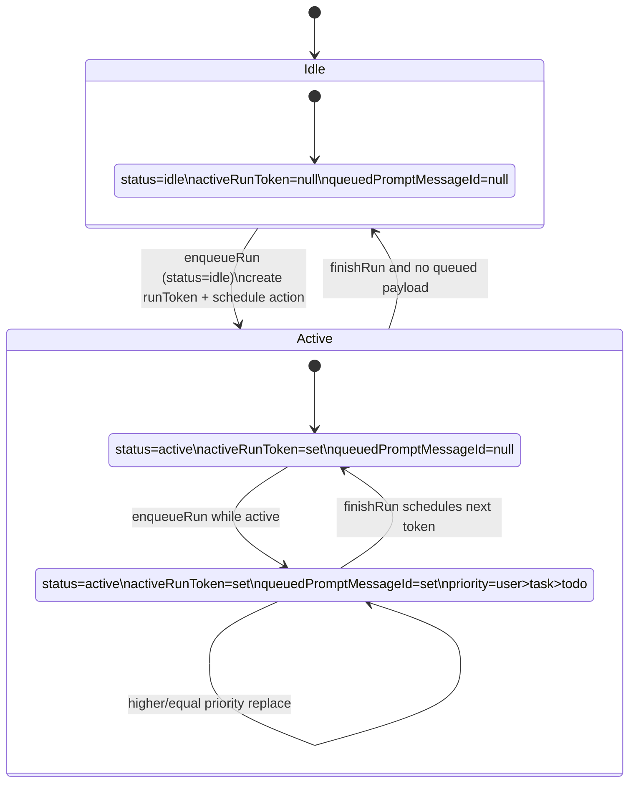
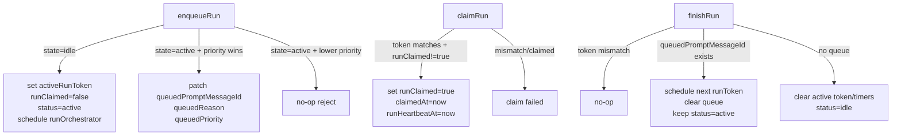
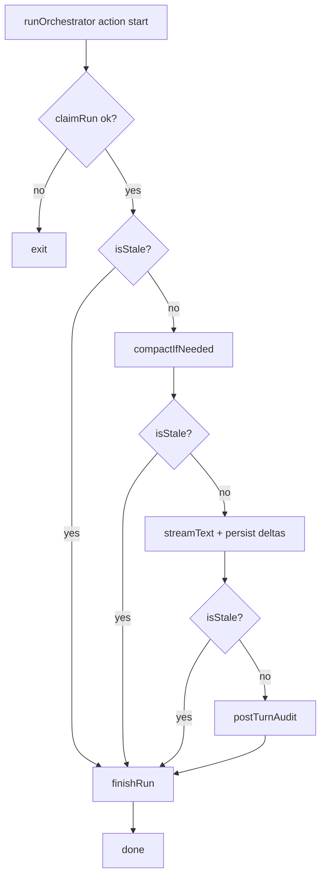
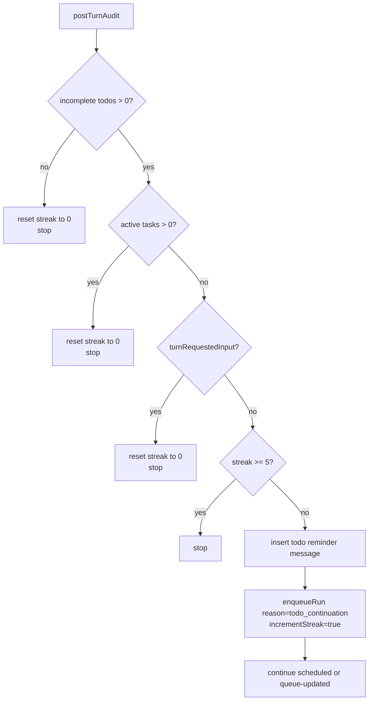
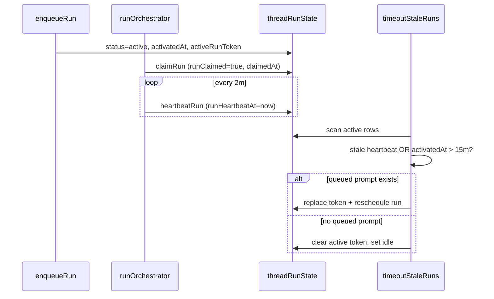

# Orchestrator Runtime (AI SDK v6)

The orchestrator runs directly in Convex actions with AI SDK `streamText()`. Message persistence, queueing, continuation, and recovery all use first-party tables in `backend/agent`.

## Scope and References

- AI SDK `streamText`: <https://ai-sdk.vercel.ai/docs/reference/ai-sdk-core/stream-text>
- Convex actions: <https://docs.convex.dev/functions/actions>
- OpenAgent loop reference: `oh-my-openagent/src/index.ts`

Implementation:

- `backend/agent/convex/orchestrator.ts`
- `backend/agent/convex/orchestratorNode.ts`
- `backend/agent/convex/messages.ts`
- `backend/agent/convex/compaction.ts`

## Queue-Per-Thread Concurrency Model

### Core table: `threadRunState`

One row per `threadId`, created lazily by `ensureRunState` and treated as a singleton.

Key fields:

- `status`: `idle | active`
- `activeRunToken`
- `runClaimed`
- `queuedPromptMessageId`
- `queuedReason`: `user_message | task_completion | todo_continuation`
- `queuedPriority`
- `autoContinueStreak`
- `activatedAt`, `claimedAt`, `runHeartbeatAt`
- `lastError`

### Priority queue policy

- One active run per thread and one queued slot.
- Priority: `user_message (2) > task_completion (1) > todo_continuation (0)`.
- Lower-priority enqueue cannot replace higher-priority queued payload.
- Equal priority replaces older queued payload.
- User-message enqueue resets continuation streak.

## CAS Transition Contracts

`enqueueRun`, `claimRun`, and `finishRun` are compare-and-set lifecycle mutations.

## `runOrchestrator` Action Flow

1. `claimRun(threadId, runToken)` consuming CAS claim.
2. Build stale guard from active token check.
3. Start heartbeat interval (`heartbeatRun`).
4. Run pre-generation compaction for closed prefix.
5. Stream turn with AI SDK `streamText()`.
6. Run `postTurnAudit` continuation logic.
7. Always call `finishRun` in `finally`.

## DIY Streaming Architecture

The orchestrator writes stream output directly to Convex message rows instead of relying on framework-managed message storage.

- The turn starts with `streamText()` in the Node action.
- Each text delta appends to an in-memory buffer and patches the assistant row’s `streamingContent` so the client can render partial output immediately.
- The frontend subscribes via `useQuery` to the thread messages list, so each patch re-renders in real time without a separate stream channel.
- On stream completion, the row is finalized by moving the full text into `content`, marking `isComplete: true`, and clearing transient streaming state.

Implementation: `backend/agent/convex/orchestratorNode.ts`

## Post-Turn Auto-Continue Audit

`postTurnAuditFenced` performs the continuation decision as one token-fenced mutation, so decision and side effects stay atomic and stale runs cannot schedule new work.

- Verify `activeRunToken === runToken` before doing any audit work.
- Evaluate stop conditions in order: incomplete todos, active background tasks, input requested, and streak cap.
- If any stop condition applies, reset continuation state and stop.
- If continuation is allowed, write a reminder system message and enqueue `todo_continuation` with streak increment.
- Update completion notification metadata inside the same fenced mutation when applicable.

## Heartbeat and Wall-Clock Timeout

`runOrchestrator` sends heartbeats while running so stale-run recovery can distinguish live execution from dead actions.

- `claimRun` initializes `runHeartbeatAt` when a token is consumed.
- While the action is alive, it updates `runHeartbeatAt` on a regular interval (about every two minutes).
- `timeoutStaleRuns` treats claimed runs as stale when heartbeat age exceeds 15 minutes (falling back to `claimedAt`), and unclaimed active runs as stale after 5 minutes from `activatedAt`.
- A hard wall-clock cap of 15 minutes from `activatedAt` is enforced even if heartbeats continue.

Recovery behavior:

- if queued payload exists, mint fresh token and reschedule,
- if no queued payload, reset run state to idle.

## Reliability Notes

- Queue transitions stay mutation-first and idempotent.
- Token fencing prevents stale runs from enqueueing new continuations.
- All terminal tool outcomes are serialized into model context so follow-up turns keep full tool history.
- Completion reminders and continuation enqueue remain separate operations, which preserves observability and retryability in operational recovery paths.

## Stagnation Detection

To avoid infinite continuation loops when todos are not changing, the runtime tracks a normalized todo snapshot between continuation cycles.

- The snapshot stores stable todo identity and status fields in a deterministic order.
- If two consecutive continuation checks see the same snapshot, `stagnationCount` increments.
- When the counter reaches the configured threshold, continuation stops and streak state resets.
- Any real progress (status transitions, completed-count increase, or reduced incomplete set) resets stagnation tracking.

Reference: `oh-my-openagent/src/hooks/todo-continuation-enforcer/stagnation-detection.ts`

## Continuation Cooldown

Continuation failures are rate-limited with exponential backoff so repeated failures do not thrash the queue.

- The runtime tracks consecutive continuation failures and timestamp of the latest attempt.
- Cooldown duration grows as `5000ms * 2^min(consecutiveFailures, 5)`.
- After repeated failures at the cap, continuation is paused until the reset window elapses.
- A successful continuation resets the failure counter.

Reference: `oh-my-openagent/src/hooks/todo-continuation-enforcer/idle-event.ts`

## Lifecycle Summary

The orchestrator run lifecycle is built from three compare-and-set mutations that fence each stage of execution and keep scheduling idempotent.

- `enqueueRun` is the entry mutation for user turns and internal reminders; it either activates an idle thread by minting a run token and scheduling `runOrchestrator`, or updates the single queued slot using persisted priority rules.
- `claimRun` is the consumption mutation for scheduled work; only the action instance that presents the matching active token and sees `runClaimed` unset can flip the claim bit and proceed.
- `finishRun` is the terminal mutation; it closes the active token, schedules the next token if queued work exists, or returns the thread to `idle` when the queue is empty.

Together these mutations create a deterministic lifecycle: enqueue establishes intent, claim establishes a single executor, and finish resolves the run while safely draining queued follow-up work.

## Task Reminder Injection

The runtime tracks task-follow-up drift with a `turnsSinceTaskTool` counter in thread run state.

- The counter increments when turns complete without using task tools.
- It resets immediately when the model uses task-related tools (`delegate`, `taskStatus`, or `taskOutput`).
- At a threshold of `10`, the orchestrator injects a system reminder listing pending tasks so the model explicitly checks task progress or outputs.

This mechanism prevents long conversational runs from forgetting delegated background work while keeping reminder behavior deterministic and bounded.

## Tests

See `agent/plan/testing.md`.
