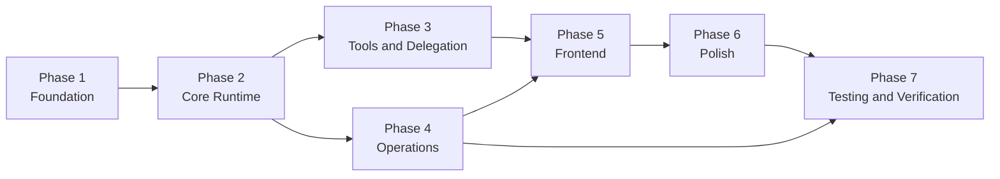

# Execution Phases

All delivery phases are complete. This document records scope, outcomes, and dependency flow.

## Phase 1: Foundation

Scope:

1. Schema and table design (`session`, `tasks`, `todos`, `mcpServers`, `tokenUsage`, `threadRunState`, rate-limit tables)
2. Backend configuration scaffolding and env validation
3. Ownership-safe query/mutation wrappers
4. Model selection abstraction with deterministic test fallback
5. Session creation and thread mapping

Outcome:

- Backend package is deployable, schema/type checks pass, and ownership boundaries are enforced.

## Phase 2: Core Runtime

Scope:

1. Orchestrator queue-per-thread state machine
2. CAS transitions for claim/enqueue/finish
3. Streaming execution path and prompt chaining
4. Message persistence and non-blocking queue behavior
5. Worker lifecycle primitives

Outcome:

- Active-run isolation, deterministic queue behavior, and resilient runtime guards are in place.

## Phase 3: Tools and Delegation

Scope:

1. Tool wiring (`delegate`, `todoRead`, `todoWrite`, `taskStatus`, `taskOutput`, `webSearch`, `mcpCall`, `mcpDiscover`)
2. Background worker execution chain
3. MCP discovery, invocation, cache refresh retry path
4. Structured tool-error payloads with ownership-safe execution

Outcome:

- Delegation and tool workflows execute end-to-end with stable result contracts.

## Phase 4: Operations

Scope:

1. Retention crons
2. Stale task/run recovery
3. Compaction lock and summary flow
4. Token usage recording and aggregation
5. Per-user rate limiting

Outcome:

- Retention, recovery, compaction, and limit enforcement run on schedule and preserve runtime invariants.

## Phase 5: Frontend

Scope:

1. Session list, chat view, and settings page
2. Streaming UI for text, reasoning, tools, and sources
3. Task/todo/token side panels with responsive behavior
4. Auth and test-mode wiring

Outcome:

- Core product flows are functional across narrow and wide breakpoints.

## Phase 6: Polish

Scope:

1. Loading/error/empty states
2. Accessibility constraints
3. UX hardening across session/chat/settings flows
4. Failure-path and performance hardening

Outcome:

- UX states are consistent and resilient under degraded conditions.

## Phase 7: Testing and Verification

Scope:

1. Backend convex-test coverage across runtime, ownership, and cron paths
2. E2E infrastructure and Playwright suites
3. Pre-E2E deployment workflow
4. Final quality gates

Outcome:

- Backend and E2E suites pass with documented totals in `testing.md`.

## Phase Dependency Graph

## Phase Timeline

```mermaid
gantt
  title Delivery timeline (sequential baseline)
  dateFormat  X
  axisFormat  %L
  section Build
  Phase 1 Foundation              :done, p1, 0, 1
  Phase 2 Core Runtime            :done, p2, 1, 1
  Phase 3 Tools and Delegation    :done, p3, 2, 1
  Phase 4 Operations              :done, p4, 3, 1
  Phase 5 Frontend                :done, p5, 4, 1
  Phase 6 Polish                  :done, p6, 5, 1
  Phase 7 Testing and Verification:done, p7, 6, 1
```

## Delivery Dependencies

- AI SDK v6 streaming and tool APIs
- Convex schema/functions/scheduler primitives
- Convex auth for ownership-safe APIs
- `convex-helpers` rate limiting
- MCP client stack
- Next.js App Router runtime
- Playwright E2E tooling
