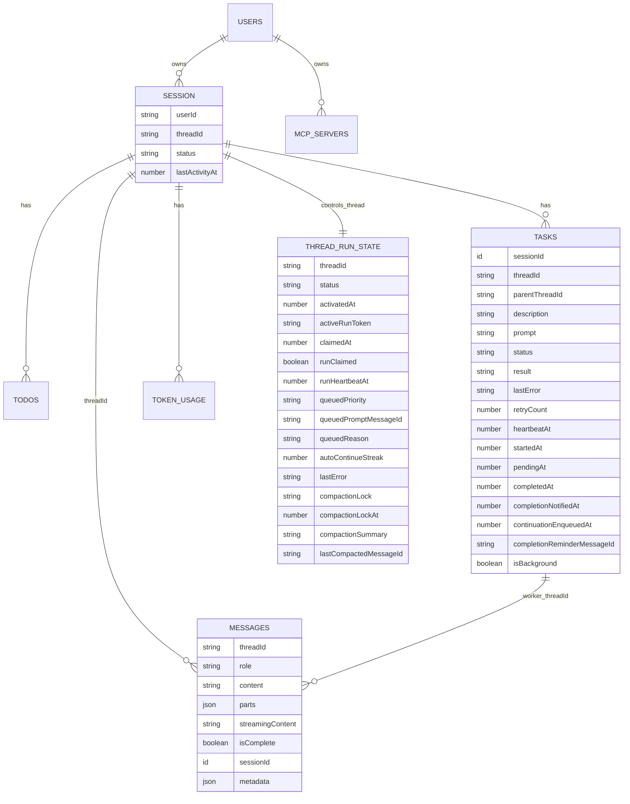
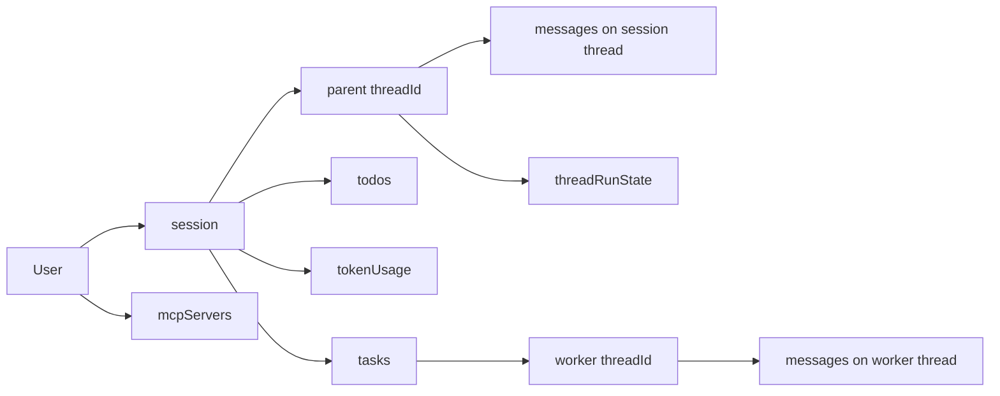

# Schema

This module defines the first-party Convex schema for the web agent harness. It replaces all prior component-backed message storage with native application tables.

## Reference Sources

- Convex schema/index docs: https://docs.convex.dev/database/schemas
- Convex indexes/query docs: https://docs.convex.dev/database/reading-data/indexes
- noboil schema helpers (`ownedTable`, `makeBase`, `makeOwned`) patterns from `backend/convex`
- AI SDK message-part reference: https://ai-sdk.vercel.ai/docs/reference/ai-sdk-core/stream-text
- oh-my-openagent inspiration paths:
  - `src/agents/`
  - `src/features/background-agent/`
  - `src/hooks/todo-continuation-enforcer/`

## Schema Construction Pattern

The backend keeps noboil schema conventions:

- Model shapes in `t.ts` via `makeBase` and `makeOwned`.
- Convex tables in `convex/schema.ts` using `ownedTable` for ownership-bound entities.
- Operational tables (`tasks`, `messages`, `threadRunState`, `tokenUsage`, `mcpServers`) defined with explicit indexes for deterministic query plans.

## Tables

### `messages` (new, replaces component storage)

- Purpose: canonical thread transcript for user, assistant, and system records.
- Fields:
  - `threadId`
  - `role` (`user | assistant | system`)
  - `content`
  - `parts` (JSON array for tool calls, reasoning, sources, and structured content)
  - `streamingContent` (mutable partial text during active streaming)
  - `isComplete`
  - `sessionId` (optional)
  - `metadata` (optional JSON)
- Canonical ordering key: Convex `_creationTime` system field (monotonic and unique, set by DB engine).
- Message ordering uses Convex’s built-in `_creationTime` system field which is monotonic and unique — no manual `createdAt` needed. All ordering, prompt bounding, and compaction boundary checks use `_creationTime` for strict total order with no same-millisecond ambiguity.
- Worker-thread messages omit `sessionId` - ownership resolves through `tasks.threadId -> tasks.sessionId`. Orchestrator-thread messages always include `sessionId`.
- Indexes:
  - `by_threadId` — Convex implicitly sorts by `_creationTime` within any index prefix, so a single `by_threadId` index covers both `by_threadId` and `by_thread_creationTime` (they would be duplicate indexes). All ordering queries use this single index.

### `session`

- User-owned conversation containers.
- Fields: threadId (string), status (active|idle|archived), title (string, optional), lastActivityAt (number), archivedAt (number, optional)
- Indexes: by_threadId [threadId], by_user_status [userId, status], by_user_threadId [userId, threadId], by_status [status]

### `tasks`

- Delegated worker lifecycle records and completion notification state.
- Links worker thread back to parent thread and session.
- Fields:
  - `sessionId`
  - `threadId`
  - `parentThreadId`
  - `description`
  - `prompt`
  - `status`
  - `result`
  - `lastError`
  - `retryCount`
  - `heartbeatAt`
  - `startedAt`
  - `pendingAt`
  - `completedAt`
  - `completionNotifiedAt`
  - `continuationEnqueuedAt`
  - `completionReminderMessageId`
  - `isBackground`

### `todos`

- Ordered task checklist per session.
- Fields: content (string), position (number), priority (low|medium|high), sessionId (id), status (pending|in_progress|completed|cancelled)
- Indexes: by_session_position [sessionId, position]

### `tokenUsage`

- Per-run usage ledger keyed by session/thread for aggregation.
- Fields: agentName (string), inputTokens (number), model (string), outputTokens (number), provider (string), sessionId (id), threadId (string), totalTokens (number)
- Indexes: by_session [sessionId], by_threadId [threadId]

### `mcpServers`

- User-owned MCP endpoint configs and optional discovery cache.
- Fields: name (string), url (string), transport (http), isEnabled (boolean), authHeaders (string, optional), cachedAt (number, optional), cachedTools (string, optional)
- Indexes: by_user_enabled [userId, isEnabled], by_user_name [userId, name]

### `threadRunState`

- Per-thread singleton run/queue/compaction coordination state.
- Fields: threadId (string), status (idle|active), activatedAt (number, optional), activeRunToken (string, optional), claimedAt (number, optional), runClaimed (boolean, optional), runHeartbeatAt (number, optional), queuedPriority (user_message|task_completion|todo_continuation, optional), queuedPromptMessageId (string, optional), queuedReason (string, optional), autoContinueStreak (number), lastError (string, optional), compactionLock (string, optional), compactionLockAt (number, optional), compactionSummary (string, optional), lastCompactedMessageId (string, optional), consecutiveFailures (number, optional), stagnationCount (number, optional), turnsSinceTaskTool (number, optional)
- Indexes: by_threadId [threadId], by_status [status]

## ER Diagram

## Ownership Chain

Ownership and visibility are derived through session mapping and thread lineage.

## Index Coverage

All major query paths are covered with explicit indexes.

| Query Pattern                          | Index                                  |
| -------------------------------------- | -------------------------------------- |
| list messages by thread                | `messages.by_threadId`                 |
| read latest message for thread checks  | `messages.by_threadId`                 |
| resolve session from thread            | `session.by_threadId`                  |
| resolve owned session by user+thread   | `session.by_user_threadId`             |
| list sessions for user                 | `session.by_user_status`               |
| list tasks by session                  | `tasks.by_session`                     |
| list tasks by parent thread and status | `tasks.by_parentThreadId_status`       |
| resolve task by worker thread          | `tasks.by_threadId`                    |
| detect completion reminder linkage     | `tasks.by_completionReminderMessageId` |
| list todos ordered in session          | `todos.by_session_position`            |
| aggregate token usage by session       | `tokenUsage.by_session`                |
| aggregate token usage by thread        | `tokenUsage.by_threadId`               |
| list enabled MCP servers by user       | `mcpServers.by_user_enabled`           |
| resolve MCP server by user+name        | `mcpServers.by_user_name`              |
| resolve run state by thread            | `threadRunState.by_threadId`           |
| scan active runs for timeout cleanup   | `threadRunState.by_status`             |

```mermaid
flowchart TB
    subgraph Messages
      I1[by_threadId]
    end
    subgraph Session
      I3[by_threadId]
      I4[by_user_threadId]
      I5[by_user_status]
      I6[by_status]
    end
    subgraph Tasks
      I7[by_session]
      I8[by_parentThreadId_status]
      I9[by_threadId]
      I10[by_completionReminderMessageId]
      I11[by_status]
    end
    subgraph Runtime
      I12[threadRunState.by_threadId]
      I13[threadRunState.by_status]
    end
    Q1[list thread transcript] --> I1
    Q2[get latest message] --> I1
    Q3[owned session lookup] --> I4
    Q4[session list] --> I5
    Q5[task panel list] --> I7
    Q6[active task count] --> I8
    Q7[worker thread resolve] --> I9
    Q8[continuation reminder gating] --> I10
    Q9[stale task sweeps] --> I11
    Q10[run CAS operations] --> I12
    Q11[stale run sweeps] --> I13
```

## Migration Rule

- No component-backed message storage.
- No agent-component helper APIs.
- No `threads` table; thread identity is a UUID string referenced across tables.
- All message persistence and streaming state are represented directly in `messages`.
- Frontend real-time updates rely on normal Convex query reactivity over first-party tables.

## Tests

Tests for this module are defined in [testing.md](./testing.md). Key test areas:

### convex-test

- Auth & Ownership: #11-12

### E2E (Playwright)

- Chat & Streaming: #4

### Edge Cases

- Edge Cases: #1
