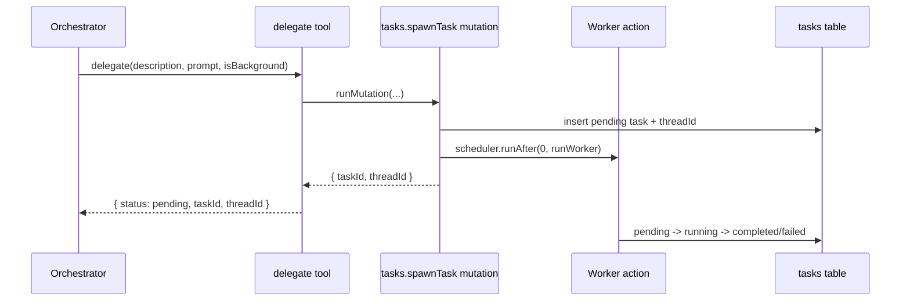

# Tool Definitions

## Scope

Tools are defined with AI SDK `tool()` + Zod schemas and executed from Convex actions with action context. References:

- AI SDK tool API: https://ai-sdk.vercel.ai/docs/reference/ai-sdk-core/tool
- oh-my-openagent delegate reference: `src/tools/delegate-task/`
- oh-my-openagent background task reference: `src/tools/background-task/` Implementation:
- `backend/agent/convex/toolFactories.ts`
- `backend/agent/convex/tasks.ts`
- `backend/agent/convex/todos.ts`
- `backend/agent/convex/webSearch.ts`
- `backend/agent/convex/mcp.ts`

## Tool Architecture

Execution model:

1. `streamText` receives a tool map from factory functions.
2. The model emits a tool call.
3. Tool handler executes in Convex action runtime.
4. Handler calls internal mutations/queries/actions.
5. Tool returns normalized JSON for model continuation.

```mermaid
flowchart LR
  A[Orchestrator streamText] --> B[AI SDK v6 tool call]
  B --> C[tool execute(input)]
  C --> D{Convex operation}
  D -->|runMutation| E[Internal mutation]
  D -->|runQuery| F[Internal query]
  D -->|runAction| G[Internal action]
  E --> H[Tool result]
  F --> H
  G --> H
  H --> I[Model continues response]
```

## Orchestrator Tool Set

- `delegate`: spawn worker task and return identifiers.
- `taskStatus`: poll task status by `taskId`.
- `taskOutput`: retrieve final output and status-aware fallback payload.
- `todoRead`: list ordered session todos.
- `todoWrite`: upsert todos by optional `id` (merge-by-id behavior).
- `webSearch`: grounded search bridge returning `{ summary, sources }`.
- `mcpCall`: invoke configured MCP tool with structured response.
- `mcpDiscover`: enumerate enabled MCP tool inventory.

## Worker Tool Set

- `webSearch`
- `mcpCall`
- `mcpDiscover` Workers do not re-delegate and do not manage todos.

## `delegate` Flow

`delegate` calls `internal.tasks.spawnTask` and returns task/thread identifiers.



## `webSearch` Isolation Rule

Grounding search runs in a dedicated action so provider-defined tools do not mix with function tools in the same generation call.

```mermaid
flowchart LR
  A[Orchestrator or Worker] --> B[webSearch tool execute]
  B --> C[internal.search.groundWithGemini]
  C --> D[Gemini generateText with googleSearch only]
  D --> E[normalizeGrounding]
  E --> F[{ summary, sources }]
  F --> A
```

## Contracts and Error Shape

- Tool outputs are model-readable and deterministic.
- Non-terminal task output uses explicit status payload, not thrown errors.
- MCP and search failures return structured error objects suitable for follow-up reasoning.

## Per-Tool Definitions

### `delegate`

Description: delegates independent work to a worker thread and returns task identifiers for follow-up. Args:

- `description` (string): concise task label shown in task tracking and reminders.
- `prompt` (string): worker instruction payload.
- `isBackground` (boolean): whether delegation should run as background work. What it does:
- Creates a pending task bound to the parent thread/session.
- Generates a worker thread id and schedules worker execution.
- Returns normalized task metadata so the model can poll or fetch output later. Implementation: `backend/agent/convex/agents.ts`

### `taskStatus`

Description: reads current lifecycle status for a delegated task. Args:

- `taskId` (string): delegated task identifier. What it does:
- Resolves ownership from requester thread/session before exposing task state.
- Returns status-centric metadata such as retry count, completion timing, and latest error when present. Implementation: `backend/agent/convex/agents.ts`

### `taskOutput`

Description: retrieves terminal worker output for a delegated task. Args:

- `taskId` (string): delegated task identifier. What it does:
- Returns final task result for completed tasks.
- Returns a structured non-terminal payload for pending/running tasks so orchestration can continue without thrown errors. Implementation: `backend/agent/convex/agents.ts`

### `todoWrite`

Description: writes or updates todo items for the active session. Args:

- `todos` (array): todo records with optional `id`, plus `content`, `status`, and `priority`. What it does:
- Updates existing todos when `id` is present.
- Inserts new todos when `id` is omitted.
- Preserves omitted existing rows unless explicitly updated by id. Implementation: `backend/agent/convex/agents.ts`

### `todoRead`

Description: reads ordered todo state for the active session/thread. Args:

- no arguments. What it does:
- Resolves owned session by thread.
- Returns todos in deterministic session position order. Implementation: `backend/agent/convex/agents.ts`

### `webSearch`

Description: runs grounded web search and returns model-usable summary plus source references. Args:

- `query` (string): search request. What it does:
- Calls the dedicated grounding action.
- Normalizes provider output into `{ summary, sources }`.
- Returns structured failures when grounding call errors. Implementation: `backend/agent/convex/agents.ts`

## Search Integration

Gemini grounding search is isolated into a separate Convex action because provider-defined tools cannot be safely mixed with function tools in the same generation call.

- Orchestrator and worker turns run with function tools such as `delegate`, task tools, todo tools, and MCP tools.
- Grounding calls run in a dedicated action that enables only provider grounding support, then returns normalized results.
- This separation prevents provider tool preparation from suppressing function-tool execution and keeps tool contracts deterministic.

## Delegate Retry Guidance

Delegate failures are inspected for known error signatures and transformed into actionable hints instead of opaque raw failures.

- `missing_run_in_background`: include `run_in_background` in the delegated task payload.
- `missing_load_skills`: include explicit `load_skills` list.
- `unknown_category`: use a valid category from the supported delegation categories.
- `unknown_agent`: use a valid target agent name from configured agents. This guidance lets the model correct malformed delegate calls on the next turn without requiring manual debugging.

## Tests

See `agent/plan/testing.md`.
