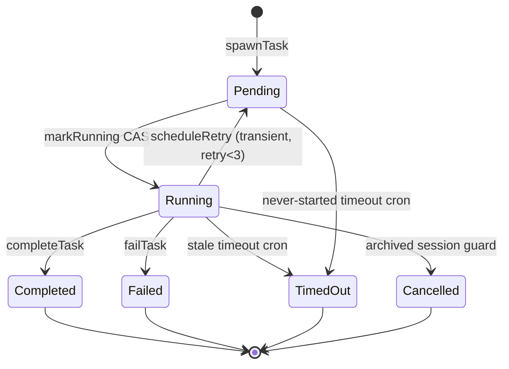
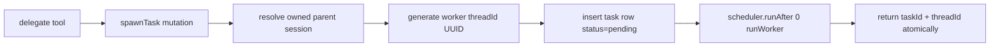
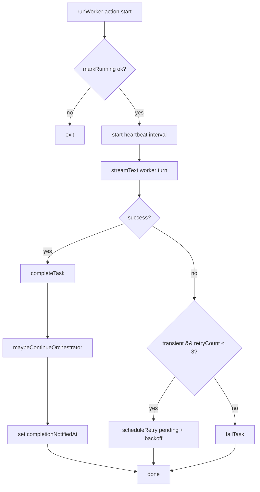
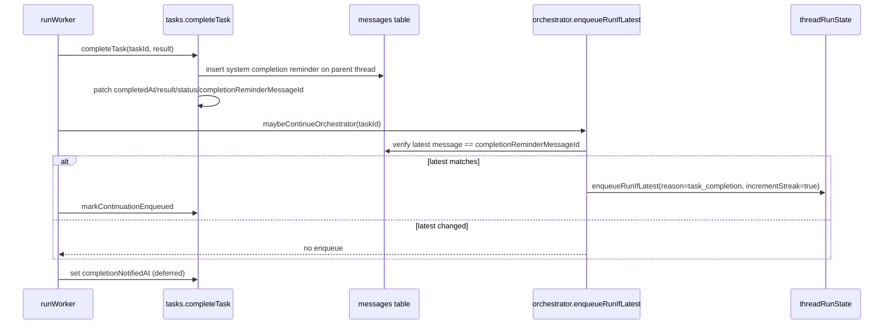

# Worker Runtime (Delegation + Background Tasks)

Worker execution uses Convex actions and first-party task/message tables. Delegated work runs on worker threads and reports completion back to parent orchestrator threads.

## Scope and References

- OpenAgent references:
  - `oh-my-openagent/src/features/background-agent/`
  - `oh-my-openagent/src/features/claude-tasks/` Implementation:
- `backend/agent/convex/tasks.ts`
- `backend/agent/convex/agentsNode.ts`
- `backend/agent/convex/messages.ts`

## Task State Machine

Canonical task statuses:

- `pending`
- `running`
- terminal: `completed | failed | timed_out | cancelled`
- retry loop: `running -> pending` (bounded retries)

## `spawnTask` Mutation (Atomic spawn + schedule)

`spawnTask` performs delegation bootstrapping in one mutation boundary:

1. Resolve parent session ownership from `parentThreadId` and user.
2. Generate worker thread with `crypto.randomUUID()`.
3. Insert `tasks` row as `pending`.
4. Schedule `runWorker` action.
5. Return `{ taskId, threadId }`.

## `runWorker` Action Flow

1. `markRunning(taskId)` CAS (`pending -> running` only).
2. Start heartbeat interval (`updateHeartbeat` every 30s).
3. Build worker prompt context from task prompt and worker thread messages.
4. Stream worker output to worker thread message rows.
5. On success: `completeTask(taskId, result)`.
6. On error: retry for transient failures up to cap, otherwise fail task.
7. Clear heartbeat timer in `finally`.

## Completion Reminder Chain

Worker completion persists a parent-thread reminder and then conditionally enqueues orchestrator continuation. Sequence:

1. `completeTask` validates `status === 'running'`.
2. Save completion/terminal reminder message in parent thread.
3. Patch terminal task fields and `completionReminderMessageId`.
4. Run `maybeContinueOrchestrator(taskId)`.
5. Use latest-message gate (`enqueueRunIfLatest`) before queueing continuation.
6. Mark `continuationEnqueuedAt` only on successful enqueue.
7. Mark `completionNotifiedAt` after notification attempt.

## Heartbeat, Timeout, and Retry

- Heartbeat while running: every 30 seconds.
- Running timeout: 10 minutes from latest heartbeat/start.
- Pending timeout: 5 minutes from pending timestamp/create time.
- Retry backoff: `min(1000 * 2^retryCount, 30000)`.
- Archived-session guard converts retries to `cancelled`. Terminal reminders are emitted for `completed`, `failed`, and `timed_out`. `cancelled` does not emit a reminder because cancellation is user/session-driven.

## Reliability Notes

- Worker thread messages omit `sessionId`; ownership resolves via `tasks.threadId -> tasks.sessionId`.
- Completion notification marker is deferred so interrupted notification paths stay recoverable.
- Final worker output transition is fenced to avoid TOCTOU between timeout/cancel checks and final write.

## Retry Policy

Worker retries use transient-error classification with bounded exponential backoff.

- Backoff delay uses `min(1000 * 2^retryCount, 30000)` milliseconds.
- Retries are capped at `3`; once the cap is reached, subsequent transient failures resolve to terminal failure instead of another pending cycle.
- Before requeueing, retry logic checks whether the parent session is archived; archived parents convert the task directly to `cancelled` and skip rescheduling. This keeps retry behavior fast for short disruptions, bounded under repeated failures, and safe against replaying work after session archival.

## Terminal State Reminders

Terminal reminder emission is explicit by status.

- `completed` emits a completion reminder to the parent thread.
- `failed` emits a failure reminder to the parent thread.
- `timed_out` emits a timeout reminder to the parent thread.
- `cancelled` does not emit an automatic reminder because cancellation is session/user-driven, not an unexpected runtime terminal event. This contract ensures orchestrator follow-up is triggered for meaningful runtime terminal outcomes while avoiding noise for intentional cancellation paths.

## Tests

See `agent/plan/testing.md`.
