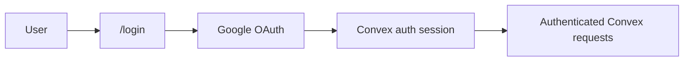
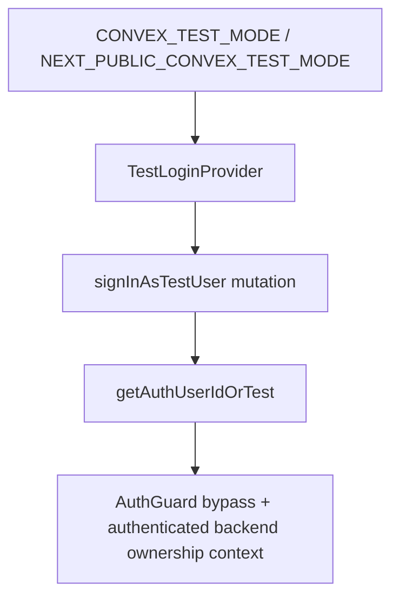
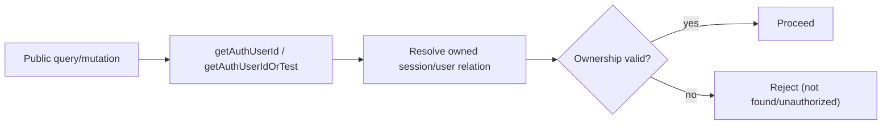

# Auth and Ownership

## Scope

- Production auth uses `@convex-dev/auth` with Google OAuth.
- Frontend auth state uses `ConvexAuthNextjsProvider`.
- Test mode uses deterministic backend test identity via `makeTestAuth`.
- Ownership is always derived server-side from auth context.

References:

- `@convex-dev/auth` docs: https://labs.convex.dev/auth

Implementation:

- `packages/be-agent/convex/auth.ts`
- `packages/be-agent/convex/auth.config.ts`
- `packages/be-agent/convex/testauth.ts`
- `packages/be-agent/convex/sessions.ts`
- `packages/be-agent/convex/messages.ts`
- `packages/be-agent/convex/tasks.ts`
- `packages/be-agent/convex/todos.ts`
- `packages/be-agent/convex/tokenUsage.ts`
- `packages/be-agent/convex/mcp.ts`
- `apps/agent/src/components/auth-guard.tsx`
- `apps/agent/src/components/test-login-provider.tsx`

## Production Auth Model

- Backend exports `auth`, `signIn`, `signOut`, and guards from Convex auth module.
- `/login` starts OAuth flow.
- Protected app routes require authenticated Convex session.

## Runtime Auth Flow

1. User loads `/login`.
2. User signs in with Google.
3. Callback finalizes Convex auth session.
4. `useConvexAuth()` exposes authenticated state.
5. Protected routes render only when authenticated.

## AuthGuard and Test Mode

- `AuthGuard` protects `/`, `/chat/[id]`, and `/settings`.
- In test mode, guard bypasses OAuth UX and backend identity is supplied by test auth.
- `TestLoginProvider` coordinates test-mode bootstrap flow used by E2E.

## Test Auth Model

Test mode uses backend-issued deterministic identity so public handlers still execute ownership checks against a real `userId`, without requiring OAuth during E2E runs.

- `signInAsTestUser` is callable only when test mode is enabled.
- `getAuthUserIdOrTest` first attempts normal auth, then allows test-user fallback only when `isTestMode()` is true.
- Public handlers call `getAuthUserIdOrTest` instead of raw `getAuthUserId`, so test mode bypasses external login but preserves server-side ownership enforcement.
- Frontend `TestLoginProvider` bootstraps this flow before protected UI renders.

## Ownership Boundary Rule

- Public handlers derive `userId` from auth context only.
- Client-provided user identifiers are not trusted.
- Access to `sessionId`, `threadId`, `taskId`, and MCP rows always resolves through owned-record chains.

## Full Ownership Audit

| Public endpoint             | Ownership check                                                                                           |
| --------------------------- | --------------------------------------------------------------------------------------------------------- |
| `sessions.list`             | Filters by authenticated `userId` via `by_user_status`.                                                   |
| `sessions.createSession`    | Writes session row with authenticated `userId`.                                                           |
| `sessions.getSession`       | Loads session and verifies `session.userId === authUserId`.                                               |
| `sessions.submitMessage`    | Resolves `sessionId`, verifies ownership, then writes message/enqueue.                                    |
| `sessions.archiveSession`   | Verifies owned session before archive mutation.                                                           |
| `sessions.getRunState`      | Resolves owned session by `threadId` before returning run state.                                          |
| `messages.listMessages`     | Resolves ownership via `session.by_user_threadId`; for worker threads resolves `task -> session -> user`. |
| `tasks.listTasks`           | Verifies `sessionId` ownership before listing task rows.                                                  |
| `tasks.getOwnedTaskStatus`  | Verifies requester owns `requesterThreadId` session, then verifies `task.sessionId` matches.              |
| `todos.listTodos`           | Verifies session ownership before listing todos.                                                          |
| `tokenUsage.getTokenUsage`  | Verifies session ownership before aggregation; unauthorized access returns zeroed counters.               |
| `mcp.listMcpServers`        | User-scoped row ownership enforced by CRUD ownership layer.                                               |
| `mcp.addMcpServer`          | Create path is user-scoped; server row is owned by authenticated user.                                    |
| `mcp.updateMcpServer`       | Update path is user-scoped by CRUD ownership resolution.                                                  |
| `mcp.deleteMcpServer`       | Delete path is user-scoped by CRUD ownership resolution.                                                  |
| `testauth.signInAsTestUser` | Enabled only in test mode; unavailable in production mode.                                                |

## Detailed Endpoint Ownership Reference

| Endpoint                    | Ownership check performed                                                                                                                                                 |
| --------------------------- | ------------------------------------------------------------------------------------------------------------------------------------------------------------------------- |
| `sessions.createSession`    | Uses authenticated identity from auth context and stamps `session.userId` server-side; never accepts client ownership input.                                              |
| `sessions.list`             | Queries sessions by authenticated `userId` using `by_user_status`, so only caller-owned sessions are returned.                                                            |
| `sessions.getSession`       | Loads by `sessionId` and requires `session.userId === authUserId`.                                                                                                        |
| `sessions.submitMessage`    | Resolves target session, verifies owner match, then inserts message and enqueues run only for that owned session.                                                         |
| `sessions.archiveSession`   | Requires owned session before archive write; also clears queued run payload for that owned thread.                                                                        |
| `sessions.getRunState`      | Resolves session ownership by `threadId` and caller identity before exposing run-state row.                                                                               |
| `messages.listMessages`     | Validates ownership via session thread chain (`session.by_user_threadId`); worker threads additionally require `task.threadId -> task.sessionId -> session.userId` match. |
| `tasks.listTasks`           | Requires session ownership on `sessionId` before listing task rows.                                                                                                       |
| `tasks.getOwnedTaskStatus`  | Requires caller ownership of requester thread session, then requires `task.sessionId` to match that owned session.                                                        |
| `todos.listTodos`           | Requires owned session before listing todos.                                                                                                                              |
| `tokenUsage.getTokenUsage`  | Requires owned session before aggregation; unauthorized requests return zeroed counters.                                                                                  |
| `mcp.listMcpServers`        | Ownership enforced by user-scoped CRUD layer, returning only caller-owned MCP server rows.                                                                                |
| `mcp.addMcpServer`          | Creates MCP row under authenticated user scope; ownership is bound at write time.                                                                                         |
| `mcp.updateMcpServer`       | Resolves row through user-scoped CRUD ownership before applying patch.                                                                                                    |
| `mcp.deleteMcpServer`       | Resolves row through user-scoped CRUD ownership before delete.                                                                                                            |
| `testauth.signInAsTestUser` | Callable only when test mode gate is active; unavailable in production mode.                                                                                              |

## Production Safety

- Runtime fuse: `getAuthUserIdOrTest` checks `isTestMode()` at call time before allowing test identity fallback.
- Deployment-stage fuse: backend env validation fails module load if production `CONVEX_CLOUD_URL` is detected while `CONVEX_TEST_MODE` is set.
- Defense-in-depth: keep `CONVEX_TEST_MODE` defined only in non-production env groups, and enforce CI/CD assertions that production deploys do not carry test-mode variables.
- Production auth secrets (`AUTH_SECRET`, `AUTH_GOOGLE_ID`, `AUTH_GOOGLE_SECRET`) are validated early so misconfiguration fails fast.

## Tests

See `apps/agent/plan/testing.md`.
