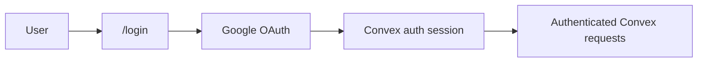
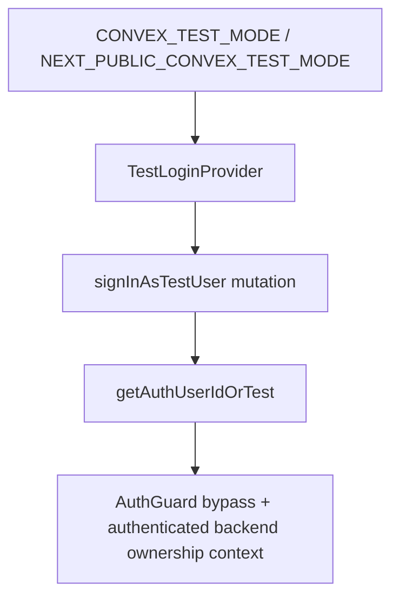
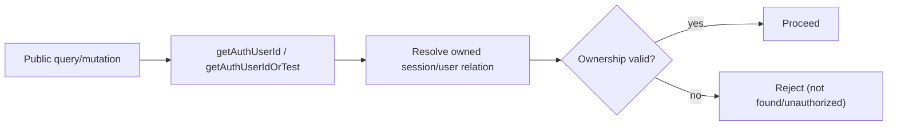

# Auth and Ownership Plan

## Scope

- Production auth is handled by `@convex-dev/auth` with Google OAuth.
- Frontend session state is managed by `ConvexAuthNextjsProvider`.
- Test/E2E mode uses `makeTestAuth` + deterministic test user bootstrap.
- `oh-my-openagent` is CLI-based and does not provide a reusable web-auth baseline, so web auth is first-class in this app.

References:

- `@convex-dev/auth` docs: https://labs.convex.dev/auth

## Production Auth Model

- Backend auth module defines `convexAuth({ providers: [Google] })` and exports `auth`, `signIn`, `signOut`, `isAuthenticated`, `store`.
- Frontend uses `ConvexAuthNextjsProvider` to maintain auth session and attach credentials to Convex requests.
- Login route starts Google OAuth; after success, user returns to authenticated app routes.



## Runtime Auth Flow

1. User reaches `/login`.
2. User clicks Google sign-in.
3. OAuth callback finalizes session via `@convex-dev/auth` backend routes.
4. `ConvexAuthNextjsProvider` exposes authenticated state to client via `useConvexAuth`.
5. Protected routes render only when authenticated.

## AuthGuard and Protected Routes

- `AuthGuard` wraps protected routes (`/`, `/chat/[id]`, `/settings`).
- It reads `useConvexAuth()` and enforces redirect to `/login` when unauthenticated.
- In test mode, it bypasses auth checks.

### Required Guard Logic

- If `NEXT_PUBLIC_CONVEX_TEST_MODE === 'true'`, render children directly.
- Else if `isLoading`, render loading/null placeholder.
- Else if `!isAuthenticated`, `router.replace('/login')`.
- Else render children.

## Test Auth Model

- Backend test identity helpers are built with `makeTestAuth`.
- Public mutation `signInAsTestUser` ensures deterministic test user exists.
- All public backend handlers use `getAuthUserIdOrTest`, not raw `getAuthUserId`.
- Frontend `TestLoginProvider` calls `signInAsTestUser` on mount in test mode before rendering children.



## Ownership Boundary Rule

- Every public endpoint derives `userId` from auth (`getAuthUserIdOrTest`) inside the handler.
- Client-provided `userId` is never accepted for ownership decisions.
- Any `sessionId`, `threadId`, `taskId`, or `mcpServer` access is resolved through an owned record chain.

### Enforcement Chain



## Full Ownership Audit (Public Endpoints)

### Sessions

- `sessions.list`: filters by authenticated `userId` via `by_user_status`.
- `sessions.createSession`: session row written with authenticated `userId`.
- `sessions.getSession`: verifies `session.userId === authUserId`.
- `sessions.submitMessage`: loads `sessionId`, verifies ownership, then writes message/enqueue.
- `sessions.archiveSession`: verifies session ownership before archive mutation.
- `sessions.getRunState`: resolves owned session by `threadId` before returning run state.

### Messages

- `messages.list` (or equivalent public message list):
  - resolves authenticated user,
  - validates thread ownership through `session.by_user_threadId`,
  - for worker threads, resolves `task -> session -> user` chain before return.

### Tasks

- `tasks.listTasks`: verifies `sessionId` ownership before listing tasks.
- `tasks.getOwnedTaskStatus`: resolves requester owned session by `threadId`, then checks `task.sessionId` matches.

### Todos

- `todos.listTodos`: verifies session ownership before listing todos.

### Token Usage

- `tokenUsage.getTokenUsage`: verifies session ownership before aggregation; returns zeroed payload for unauthorized access.

### MCP Servers

- `mcp.listMcpServers`, `mcp.addMcpServer`, `mcp.updateMcpServer`, `mcp.deleteMcpServer`:
  - ownership enforced by CRUD layer (`userId`-scoped rows),
  - uniqueness and URL safety enforced in hooks,
  - secrets redacted on read.

### Test Auth Endpoint

- `testauth.signInAsTestUser`:
  - callable only when test mode is enabled,
  - creates/returns deterministic test user,
  - never enabled in production mode.

## Production Safety Requirements

- `CONVEX_TEST_MODE` must never be set in production deployments.
- Runtime fuse: `getAuthUserIdOrTest` checks `isTestMode()` at call time. In addition to the env-var guard, backend `env.ts` validation includes a deployment-stage check: if `CONVEX_CLOUD_URL` contains `production` and `CONVEX_TEST_MODE` is set, validation throws at module load. This hard-fails deployment instead of silently allowing test auth in production.
- Defense-in-depth: the `CONVEX_CLOUD_URL` substring check is one layer. Deployments SHOULD also use Convex environment variable groups (production vs staging) where `CONVEX_TEST_MODE` is only defined in the staging/test group and physically absent from production. The CI/CD pipeline MUST assert `CONVEX_TEST_MODE` is not set in the production deployment before pushing. These three layers (runtime fuse + env groups + CI assertion) make accidental test-auth-in-production a triple-failure scenario.
- CI/CD should enforce explicit guardrails:
  - fail deploy if `CONVEX_TEST_MODE=true` in production env set,
  - verify Google OAuth secrets are present for production,
  - verify test-only frontend env (`NEXT_PUBLIC_CONVEX_TEST_MODE`) is absent in production build.
- `env.ts` validates production auth variables (`AUTH_SECRET`, OAuth credentials) so missing secrets fail early.

## Recovered: Public API Endpoints (Frontend)

Not all public endpoints are consumed by the v1 frontend. `archiveSession` is exposed for programmatic use and future UI integration (for example swipe-to-archive on session cards). `getOwnedTaskStatus` is exposed for external polling use cases. `getRunState` provides thread activity status for the chat page typing indicator. These endpoints are intentionally public even without explicit v1 UI bindings.

`sessions.list` returns session rows for v1 card rendering (`title`, `status`, `lastActivityAt`) sorted descending by activity.

`enqueueRunInline` mirrors `internal.orchestrator.enqueueRun` CAS logic for mutation-boundary safety in `submitMessage`; keep both implementations aligned because actions call the standalone internal mutation while `submitMessage` must stay inside one mutation boundary.

```typescript
const createSession = m({
  args: { title: v.optional(v.string()) },
  handler: async c => {
    const title = c.args.title ?? 'New Session'
    const threadId = crypto.randomUUID()
    const sessionId = await c.ctx.db.insert('session', {
      lastActivityAt: Date.now(),
      status: 'active',
      threadId,
      title,
      userId: c.userId
    })
    return { sessionId, threadId }
  }
})

const list = q({
  args: {},
  handler: async c => {
    const sessions = await c.ctx.db
      .query('session')
      .withIndex('by_user_status', q => q.eq('userId', c.userId))
      .collect()
    return sessions
      .filter(s => s.status !== 'archived')
      .sort((a, b) => b.lastActivityAt - a.lastActivityAt)
  }
})

const getSession = q({
  args: { sessionId: v.id('session') },
  handler: async c => {
    const session = await c.ctx.db.get(c.args.sessionId)
    if (!session || session.userId !== c.userId) throw new Error('session_not_found')
    return session
  }
})

const enqueueRunInline = async ({ ctx, promptMessageId, reason, threadId, incrementStreak }) => {
  let state = await ctx.db
    .query('threadRunState')
    .withIndex('by_threadId', q => q.eq('threadId', threadId))
    .unique()
  if (!state) {
    try {
      const id = await ctx.db.insert('threadRunState', {
        autoContinueStreak: 0,
        status: 'idle',
        threadId
      })
      state = await ctx.db.get(id)
    } catch (error) {
      state = await ctx.db
        .query('threadRunState')
        .withIndex('by_threadId', q => q.eq('threadId', threadId))
        .unique()
      if (!state) throw error
    }
  }
  if (!state) throw new Error('run_state_not_found')

  const shouldIncrement = incrementStreak === true
  if (shouldIncrement && state.autoContinueStreak >= 5) {
    return { ok: false, reason: 'streak_cap' }
  }

  let nextStreak = state.autoContinueStreak
  if (reason === 'user_message') nextStreak = 0
  if (shouldIncrement) nextStreak += 1

  if (state.status === 'idle') {
    const runToken = crypto.randomUUID()
    await ctx.scheduler.runAfter(0, internal.agents.runOrchestrator, {
      promptMessageId,
      runToken,
      threadId
    })
    await ctx.db.patch(state._id, {
      activatedAt: Date.now(),
      activeRunToken: runToken,
      autoContinueStreak: nextStreak,
      claimedAt: undefined,
      queuedPriority: undefined,
      queuedPromptMessageId: undefined,
      queuedReason: undefined,
      runClaimed: false,
      status: 'active'
    })
    return { ok: true, scheduled: true }
  }

  const priority = { task_completion: 1, todo_continuation: 0, user_message: 2 }
  const queuedPriority = priority[state.queuedPriority ?? state.queuedReason ?? 'todo_continuation']
  const incomingPriority = priority[reason]
  if (incomingPriority < queuedPriority) return { ok: false, reason: 'lower_priority' }

  await ctx.db.patch(state._id, {
    autoContinueStreak: nextStreak,
    queuedPriority: reason,
    queuedPromptMessageId: promptMessageId,
    queuedReason: reason
  })
  return { ok: true, scheduled: false }
}

const submitMessage = m({
  args: { content: v.string(), sessionId: v.id('session') },
  handler: async c => {
    const session = await c.ctx.db.get(c.args.sessionId)
    if (!session || session.userId !== c.userId) throw new Error('session_not_found')
    if (session.status === 'archived') throw new Error('session_archived')

     const messageId = await c.ctx.db.insert('messages', {
       content: c.args.content,
       role: 'user',
       sessionId: session._id,
       threadId: session.threadId,
       userId: c.userId
     })

    await c.ctx.db.patch(c.args.sessionId, {
      lastActivityAt: Date.now(),
      status: session.status === 'idle' ? 'active' : session.status
    })

    await enqueueRunInline({
      ctx: c.ctx,
      incrementStreak: false,
      promptMessageId: String(messageId),
      reason: 'user_message',
      threadId: session.threadId
    })
    return { messageId }
  }
})

`submitMessage` is a single mutation transaction: message insert and `enqueueRunInline` execute atomically. If any step fails, the entire mutation rolls back.

Implementation note: `submitMessage` inlines the queue CAS logic rather than calling `enqueueRun` because it atomically saves the message and enqueues in one mutation. During implementation, extract the shared CAS logic into a helper function used by both `submitMessage` and `enqueueRun` to avoid divergence.

const archiveSession = m({
  args: { sessionId: v.id('session') },
  handler: async c => {
    const session = await c.ctx.db.get(c.args.sessionId)
    if (!session || session.userId !== c.userId) throw new Error('session_not_found')
    await c.ctx.db.patch(c.args.sessionId, { archivedAt: Date.now(), status: 'archived' })
    const runState = await c.ctx.db
      .query('threadRunState')
      .withIndex('by_threadId', q => q.eq('threadId', session.threadId))
      .unique()
    if (runState) {
      await c.ctx.db.patch(runState._id, {
        queuedPriority: undefined,
        queuedPromptMessageId: undefined,
        queuedReason: undefined
      })
    }
  }
})

Archiving a session while an orchestrator run is in-flight does not abort the active run. The run finishes its current turn. `finishRun` checks archived status and will not schedule queued payloads, and `maybeContinueOrchestrator` checks archived status before enqueuing continuation. Worker `completeTask` may still write a completion reminder to an archived thread, but `maybeContinueOrchestrator` skips continuation because it checks `session?.status === 'archived'`. This is an accepted v1 trade-off.

Session state-skip: manual `archiveSession` transitions directly from `active` or `idle` to `archived`, bypassing the normal `active -> idle -> archived` cron progression. This is intentional. The cron retention path (`archiveIdleSessions`) enforces the graduated `active -> idle` (1 day) then `idle -> archived` (7 days) timeline. Both paths converge on `archived` status with `archivedAt` timestamp for the 180-day hard-delete clock.

const getRunState = q({
  args: { threadId: v.string() },
  handler: async c => {
    const session = await c.ctx.db
      .query('session')
      .withIndex('by_user_threadId', q => q.eq('userId', c.userId).eq('threadId', c.args.threadId))
      .unique()
    if (!session) return null
    return await c.ctx.db
      .query('threadRunState')
      .withIndex('by_threadId', q => q.eq('threadId', c.args.threadId))
      .unique()
  }
})

const listTasks = q({
  args: { sessionId: v.id('session') },
  handler: async c => {
    const session = await c.ctx.db.get(c.args.sessionId)
    if (!session || session.userId !== c.userId) return []
    return await c.ctx.db
      .query('tasks')
      .withIndex('by_session', q => q.eq('sessionId', c.args.sessionId))
      .collect()
  }
})

const getOwnedTaskStatus = q({
  args: { requesterThreadId: v.string(), taskId: v.id('tasks') },
  handler: async c => {
    const session = await c.ctx.db
      .query('session')
      .withIndex('by_user_threadId', q => q.eq('userId', c.userId).eq('threadId', c.args.requesterThreadId))
      .unique()
    if (!session) return null
    const task = await c.ctx.db.get(c.args.taskId)
    if (!task || task.sessionId !== session._id) return null
    return {
      completedAt: task.completedAt,
      lastError: task.lastError,
      retryCount: task.retryCount,
      status: task.status,
      threadId: task.threadId
    }
  }
})

const listTodos = q({
  args: { sessionId: v.id('session') },
  handler: async c => {
    const session = await c.ctx.db.get(c.args.sessionId)
    if (!session || session.userId !== c.userId) return []
    return await c.ctx.db
      .query('todos')
      .withIndex('by_session_position', q => q.eq('sessionId', c.args.sessionId))
      .collect()
  }
})

const getTokenUsage = q({
  args: { sessionId: v.id('session') },
  handler: async c => {
    const session = await c.ctx.db.get(c.args.sessionId)
    if (!session || session.userId !== c.userId) {
      return { inputTokens: 0, outputTokens: 0, totalTokens: 0 }
    }
    const usage = await c.ctx.db
      .query('tokenUsage')
      .withIndex('by_session', q => q.eq('sessionId', c.args.sessionId))
      .collect()
    let pt = 0
    let ct = 0
    let tt = 0
    for (const u of usage) {
      pt += u.inputTokens
      ct += u.outputTokens
      tt += u.totalTokens
    }
    return { inputTokens: pt, outputTokens: ct, totalTokens: tt }
  }
})

const listMessages = q({
  args: {
    paginationOpts: paginationOptsValidator,
    threadId: v.string()
  },
  handler: async c => {
    const session = await c.ctx.db
      .query('session')
      .withIndex('by_user_threadId', q => q.eq('userId', c.userId).eq('threadId', c.args.threadId))
      .unique()

    if (!session) {
      const task = await c.ctx.db
        .query('tasks')
        .withIndex('by_threadId', q => q.eq('threadId', c.args.threadId))
        .unique()
      if (!task) throw new Error('thread_not_found')
      const ownerSession = await c.ctx.db.get(task.sessionId)
      if (!ownerSession || ownerSession.userId !== c.userId) throw new Error('thread_not_found')
    }

     return await c.ctx.db
       .query('messages')
       .withIndex('by_thread_creationTime', q => q.eq('threadId', c.args.threadId))
       .order('desc')
       .paginate(c.args.paginationOpts)
  }
})

const validateMcpUrl = (url: string) => {
  const parsed = new URL(url)
  if (parsed.protocol !== 'https:' && parsed.protocol !== 'http:') throw new Error('invalid_url_protocol')
  const hostname = parsed.hostname.toLowerCase()
  const blocked = ['localhost', '127.0.0.1', '0.0.0.0', '169.254.169.254', '[::1]', 'metadata.google.internal']
  if (blocked.includes(hostname) || hostname.endsWith('.internal') || hostname.startsWith('10.') || hostname.startsWith('192.168.') || hostname.startsWith('172.')) throw new Error('blocked_url')
}

const {
  create: addMcpServer,
  list: listMcpServers,
  rm: deleteMcpServer,
  update: updateMcpServer
} = crud('mcpServers', owned.mcpServer, {
  hooks: {
    afterRead: (_ctx, { doc }) => ({ ...doc, authHeaders: undefined, hasAuthHeaders: Boolean(doc.authHeaders) }),
    beforeCreate: async (ctx, { data }) => {
      validateMcpUrl(data.url)
      const existing = await ctx.db
        .query('mcpServers')
        .withIndex('by_user_name', q => q.eq('userId', ctx.userId).eq('name', data.name))
        .unique()
      if (existing) throw new Error('server_name_taken')
      return { ...data, cachedAt: undefined, cachedTools: undefined, isEnabled: data.isEnabled ?? true, transport: 'http' }
    },
    beforeUpdate: async (ctx, { id, patch }) => {
      if (patch.url) validateMcpUrl(patch.url)
      if (patch.name) {
        const server = await ctx.db.get(id)
        if (patch.name !== server?.name) {
          const conflict = await ctx.db
            .query('mcpServers')
            .withIndex('by_user_name', q => q.eq('userId', ctx.userId).eq('name', patch.name))
            .unique()
          if (conflict) throw new Error('server_name_taken')
        }
      }
      if (patch.url || patch.authHeaders) {
        return { ...patch, cachedAt: undefined, cachedTools: undefined }
      }
      return patch
    }
  }
})
```

MCP CRUD uses noboil `crud()` with hooks. Ownership enforcement (`userId` checks), `list`/`read` filtering, and `create`/`update`/`rm` are handled by the framework. Custom hooks add URL SSRF validation (`validateMcpUrl`), name uniqueness checks, cache invalidation on URL/auth changes, and `authHeaders` redaction via `afterRead` (returned as `hasAuthHeaders: boolean` instead of raw value).

### Ownership Audit for Public Endpoints

- `sessions.createSession`: write path stamps authenticated `userId` on new `session`.
- `sessions.list`: query filtered by authenticated `userId` via `by_user_status`.
- `sessions.getSession`: explicit `session.userId === currentUser` check.
- `sessions.submitMessage`: load `session` by id, reject unless `session.userId === currentUser`.
- `sessions.archiveSession`: load `session` by id, reject unless `session.userId === currentUser`.
- `sessions.getRunState`: resolve `session` through `by_user_threadId` before returning `threadRunState`.
- `tasks.listTasks`: verify `sessionId` ownership before listing rows.
- `tasks.getOwnedTaskStatus`: verify requester owns `requesterThreadId` session, then verify `task.sessionId` matches that session.
- `todos.listTodos`: verify session ownership before list.
- `tokenUsage.getTokenUsage`: verify session ownership before aggregation; unauthorized returns zeroed counters.
- `messages.listMessages`: resolve ownership through either owned session thread or owned task -> session chain before reading `messages` rows.
- `mcp.listMcpServers` / `mcp.addMcpServer` / `mcp.updateMcpServer` / `mcp.deleteMcpServer`: ownership scoped by `crud('mcpServers', owned.mcpServer, ...)` and enforced for all CRUD operations.

### Recovered Orphan Endpoint Notes

- Endpoints intentionally exposed without direct v1 UI usage: `archiveSession`, `getOwnedTaskStatus`, `getRunState`.
- Retention orphan note for DIY message storage: hard-delete must remove `messages` rows by `sessionId` or `threadId` together with `session`, `tasks`, `todos`, `tokenUsage`, and `threadRunState` to avoid orphaned conversation history after TTL cleanup.

## Tests

Tests for this module are defined in [testing.md](./testing.md). Key test areas:

### convex-test
- Auth & Ownership: #1-12

### E2E (Playwright)
- Session Management: #1, #5
- Error States: #4

### Edge Cases
- Edge Cases: #7, #10
