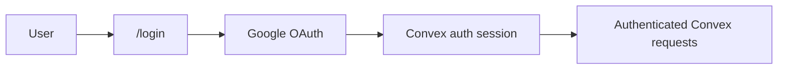
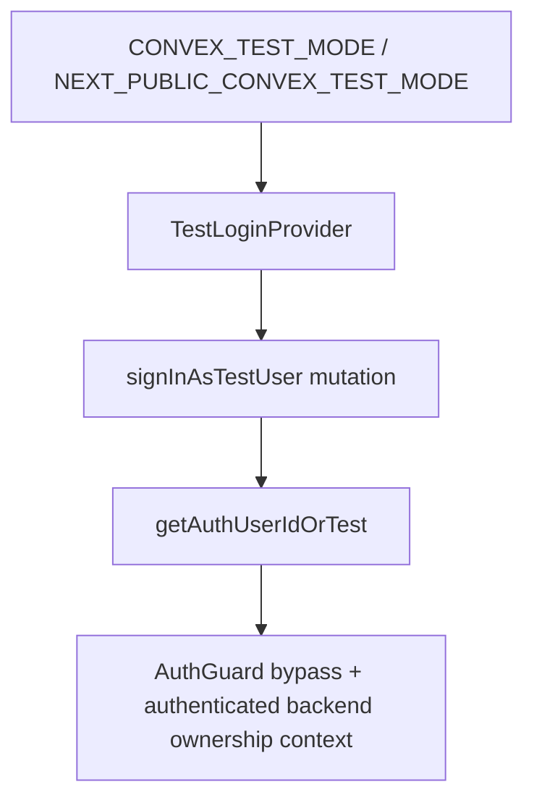
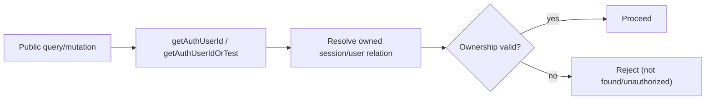

# Auth and Ownership

## Scope

- Production auth uses `@convex-dev/auth` with Google OAuth.
- Frontend auth state uses `ConvexAuthNextjsProvider`.
- Test mode uses deterministic backend test identity via `makeTestAuth`.
- Ownership is always derived server-side from auth context.

References:

- `@convex-dev/auth` docs: https://labs.convex.dev/auth

Implementation:
- `packages/be-agent/convex/auth.ts`
- `packages/be-agent/convex/auth.config.ts`
- `packages/be-agent/convex/testauth.ts`
- `packages/be-agent/convex/sessions.ts`
- `packages/be-agent/convex/messages.ts`
- `packages/be-agent/convex/tasks.ts`
- `packages/be-agent/convex/todos.ts`
- `packages/be-agent/convex/tokenUsage.ts`
- `packages/be-agent/convex/mcp.ts`
- `apps/agent/src/components/auth-guard.tsx`
- `apps/agent/src/components/test-login-provider.tsx`

## Production Auth Model

- Backend exports `auth`, `signIn`, `signOut`, and guards from Convex auth module.
- `/login` starts OAuth flow.
- Protected app routes require authenticated Convex session.

## Runtime Auth Flow

1. User loads `/login`.
2. User signs in with Google.
3. Callback finalizes Convex auth session.
4. `useConvexAuth()` exposes authenticated state.
5. Protected routes render only when authenticated.

## AuthGuard and Test Mode

- `AuthGuard` protects `/`, `/chat/[id]`, and `/settings`.
- In test mode, guard bypasses OAuth UX and backend identity is supplied by test auth.
- `TestLoginProvider` coordinates test-mode bootstrap flow used by E2E.

## Ownership Boundary Rule

- Public handlers derive `userId` from auth context only.
- Client-provided user identifiers are not trusted.
- Access to `sessionId`, `threadId`, `taskId`, and MCP rows always resolves through owned-record chains.

## Endpoint Ownership Coverage

- Sessions: list/create/get/submit/archive/run-state all ownership-gated.
- Messages: parent-thread and worker-thread reads gated through session/task ownership chain.
- Tasks: list/status/output gated by owned session lineage.
- Todos and token usage: session ownership required.
- MCP CRUD: user-scoped ownership enforced by CRUD layer and hooks.

## Production Safety

- `CONVEX_TEST_MODE` is forbidden in production deployment.
- Environment validation hard-fails unsafe auth/test combinations at module load.
- CI and deployment environment groups enforce test-only variables outside production.

## Tests

See `apps/agent/plan/testing.md`.
