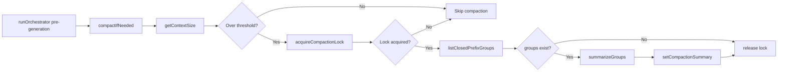
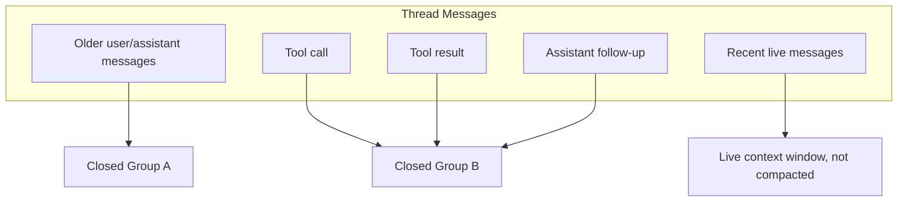
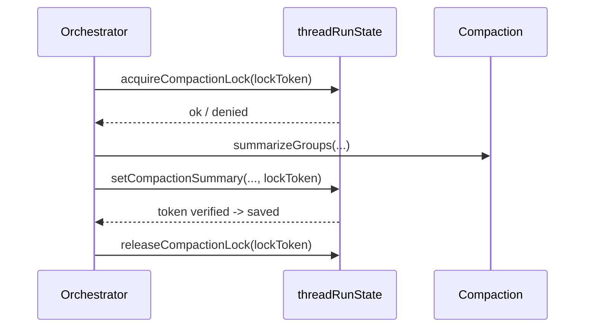
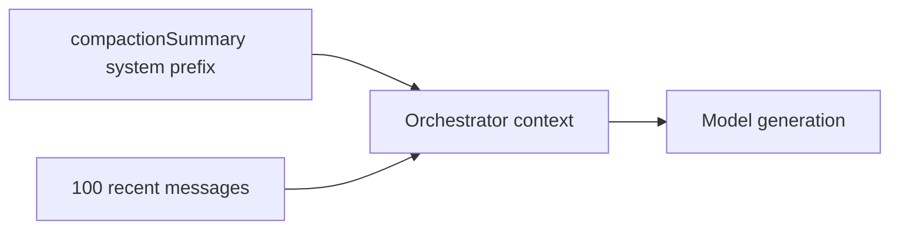

# Compaction

## Scope

This document extracts and rewrites the compaction plan for context management in the agent harness.

Reference test coverage:

- oh-my-openagent compaction behavior test: `src/index.compaction-model-agnostic.static.test.ts`

## Why Compaction Exists

v1 uses bounded live context to keep orchestrator runs stable:

- Live window keeps the most recent 100 messages in active model context.
- Older closed conversation segments are summarized into `compactionSummary`.
- The summary is injected as a system prefix so key decisions remain available.

Goal:

- Preserve long-term context quality while preventing unbounded prompt growth.

## Compaction Trigger

Compaction runs before generation starts.

Trigger source:

- `getContextSize` over thread messages + existing summary size.
- Trigger if either threshold is exceeded:
  - `messageCount > 200`
  - `charCount > 100_000`

Threshold checks run before every orchestrator turn via `getContextSize`. Values are tunable backend config constants.

Canonical flow:

1. `compactIfNeeded`
2. `getContextSize`
3. `acquireCompactionLock`
4. `listClosedPrefixGroups`
5. `summarizeGroups`
6. `setCompactionSummary`

### Cumulative Summary Requirement

Compaction MUST be cumulative: each new summary is built from `previous compactionSummary + newly compacted message groups`. The `summarizeGroups` call receives the existing `compactionSummary` (if any) as a preamble, and the model generates a combined summary covering all previously compacted history plus the new groups. `setCompactionSummary` validates that `args.lastCompactedMessageId > state.lastCompactedMessageId` by `_creationTime` comparison before writing (monotonic guard); regressive or equal-boundary writes return `{ ok: false }`.

This prevents context loss across multiple compaction rounds: without cumulative carry-forward, the second compaction would overwrite the first summary and lose the earlier compacted history from future model context.

## Closed-Prefix Grouping

Safety rule:

- Compaction only summarizes closed prefixes.
- Tool-call/result pairs must remain intact within grouping boundaries.
- No partial in-flight segment is compacted.

Since tools live inside assistant `parts` (not separate rows), a message is eligible for compaction only if: (1) `isComplete === true` AND (2) all `tool-call` parts (if any) have reached terminal status (`success` or `error`). Both conditions are required — a crashed partial assistant message with no tool calls but `isComplete === false` must NOT be compacted, even if it has no pending tool parts. The stale-message janitor (`cleanupStaleMessages`) repairs orphaned messages by setting `isComplete: true` and terminalizing tool parts, making them compaction-eligible.

Grouping behavior:

- Start from oldest uncompacted message boundary.
- Build contiguous ranges that are fully resolved.
- Exclude unresolved tool-call regions and active tail.

## Locking and Lease

Compaction lock model:

- Lock token is generated per attempt.
- Lock state is stored on thread run state.
- Lease expiry allows stale-lock recovery.
- Save operation validates token ownership before write.

Lifecycle:

1. Acquire token lock.
2. Summarize eligible groups.
3. Save summary with token check.
4. Release lock.

## Context Injection Model

`compactionSummary` is injected as system prefix in orchestrator calls:

- Prefix: compacted historical context.
- Live tail: 100 recent messages.
- Combined payload forms model context for generation.

## v1 Limitations

Documented limitations retained for v1:

- 500-message working scan window can miss older segments if a thread advances beyond that span between compaction runs.
- Stale-stream overlap can include partially written content during race conditions; stale-run checks reduce impact but do not fully eliminate side effects.

Planned direction:

- Page forward from `lastCompactedMessageId` for full coverage.
- Tighten active-stream exclusion to remove stale overlap risk.

## Tests

Tests for this module are defined in [testing.md](./testing.md). Key test areas:

### convex-test
- Compaction: #1-13

### E2E (Playwright)
- Error States: #1

### Edge Cases
- Edge Cases: #5, #12
