# Infrastructure and Configuration

## Model Selection Pattern

Gemini 2.5 Flash stays fixed for v1, while test environments switch to a deterministic mock model so CI and E2E are stable.

- The model module validates environment configuration on import before any model is constructed.
- `getModel()` memoizes the selected model instance so repeated calls reuse a single initialized model.
- In test-mode signals (`PLAYWRIGHT`, `TEST_MODE`, or `CONVEX_TEST_MODE`), `getModel()` returns the mock model.
- Outside test mode, `getModel()` lazily initializes the Vertex provider and returns the real Gemini model.

Implementation: `packages/be-agent/ai.ts`

## Backend Structure

Backend runs as an independent Convex package under `packages/be-agent`.

File tree:

- `packages/be-agent/`
- `packages/be-agent/convex/`
- `packages/be-agent/convex/_generated/`
- `packages/be-agent/convex/convex.config.ts`
- `packages/be-agent/convex/schema.ts`
- `packages/be-agent/convex/auth.ts`
- `packages/be-agent/convex/auth.config.ts`
- `packages/be-agent/convex/testauth.ts`
- `packages/be-agent/convex/http.ts`
- `packages/be-agent/convex/crons.ts`
- `packages/be-agent/convex/sessions.ts`
- `packages/be-agent/convex/messages.ts`
- `packages/be-agent/convex/orchestrator.ts`
- `packages/be-agent/convex/orchestratorNode.ts`
- `packages/be-agent/convex/agentsNode.ts`
- `packages/be-agent/convex/tasks.ts`
- `packages/be-agent/convex/todos.ts`
- `packages/be-agent/convex/mcp.ts`
- `packages/be-agent/convex/search.ts`
- `packages/be-agent/convex/tokenUsage.ts`
- `packages/be-agent/convex/compaction.ts`
- `packages/be-agent/convex/rateLimit.ts`
- `packages/be-agent/convex/staleTaskCleanup.ts`
- `packages/be-agent/convex/retention.ts`
- `packages/be-agent/ai.ts`
- `packages/be-agent/env.ts`
- `packages/be-agent/lazy.ts`
- `packages/be-agent/prompts.ts`
- `packages/be-agent/t.ts`
- `packages/be-agent/models.mock.ts`
- `packages/be-agent/check-schema.ts`
- `packages/be-agent/SOURCES.md`
- `packages/be-agent/package.json`
- `packages/be-agent/tsconfig.json`

```mermaid
flowchart TD
  A["packages/be-agent/"]
  A --> B["convex/"]
  A --> C["ai.ts"]
  A --> D["env.ts"]
  A --> E["lazy.ts"]
  A --> F["prompts.ts"]
  A --> G["t.ts"]
  A --> H["models.mock.ts"]
  A --> I["check-schema.ts"]
  A --> J["SOURCES.md"]
  A --> K["package.json"]
  A --> L["tsconfig.json"]

  B --> B1["schema.ts"]
  B --> B2["auth.ts"]
  B --> B3["testauth.ts"]
  B --> B4["http.ts"]
  B --> B5["crons.ts"]
  B --> B6["sessions.ts"]
  B --> B7["messages.ts"]
  B --> B8["orchestrator.ts"]
  B --> B9["orchestratorNode.ts"]
  B --> B10["agentsNode.ts"]
  B --> B11["tasks.ts"]
  B --> B12["todos.ts"]
  B --> B13["mcp.ts"]
  B --> B14["search.ts"]
  B --> B15["tokenUsage.ts"]
  B --> B16["compaction.ts"]
  B --> B17["rateLimit.ts"]
  B --> B18["staleTaskCleanup.ts"]
  B --> B19["retention.ts"]
```

## Implementation Notes

- `m()` and `q()` handler signatures use `(ctx, args)` with Zod validators; they do not use the old `(c)` shape with `c.ctx`/`c.args`.
- `ctx.user._id` is typed as a string in noboil handlers while Convex indexes/inserts expect `Id<'users'>`; the implementation uses explicit casts at the boundary.
- Action files that depend on Node-only SDK internals are split into `*Node.ts` modules with `'use node'`.
- Convex scheduler module references cannot include dotted names; action files use camelCase modules like `orchestratorNode`.
- Cross-file action/mutation calls rely on Convex function references for `*.ts` <-> `*Node.ts` boundaries.
- `@ai-sdk/google-vertex` initialization uses the provider option shape expected by the current SDK runtime.
- Test mode auth keeps backend ownership intact via `getAuthUserIdOrTest`, while frontend test mode bypasses OAuth UX.
- Environment validation executes at module load and includes production-safety fuses for test-mode variables.

## Configuration Files

Implementation:
- `packages/be-agent/convex/convex.config.ts`
- `packages/be-agent/convex/auth.ts`
- `packages/be-agent/convex/testauth.ts`
- `packages/be-agent/convex/auth.config.ts`
- `packages/be-agent/convex/http.ts`
- `packages/be-agent/convex/crons.ts`
- `packages/be-agent/env.ts`
- `packages/be-agent/check-schema.ts`
- `packages/be-agent/tsconfig.json`
- `apps/agent/tsconfig.json`

## File Attachments

File uploads are not included in this product scope. Text input/paste is supported.

## Environment Variables

### Frontend env (`apps/agent/.env.local`)

| Variable | Dev | Test | Prod | Notes |
| --- | --- | --- | --- | --- |
| `NEXT_PUBLIC_CONVEX_URL` | optional (falls back to `http://127.0.0.1:3210`) | required | required | Agent app Convex URL, separate from demo apps |
| `NEXT_PUBLIC_CONVEX_TEST_MODE` | omit | `true` | omit | Enables `TestLoginProvider` bypass of Google OAuth |

### Backend env (`packages/be-agent`, set via `convex env set`)

| Variable | Dev | Test | Prod | Notes |
| --- | --- | --- | --- | --- |
| `CONVEX_DEPLOYMENT` | local deployment | test deployment | production deployment | Convex target for dev/deploy scripts |
| `AUTH_SECRET` | required | required | required | Auth.js signing/encryption secret used by Convex auth |
| `AUTH_GOOGLE_ID` | required when Google auth enabled | optional | required | OAuth client id for `@convex-dev/auth` |
| `AUTH_GOOGLE_SECRET` | required when Google auth enabled | optional | required | OAuth client secret for `@convex-dev/auth` |
| `CONVEX_SITE_URL` | optional | optional | optional | Domain value for auth provider configuration |
| `GOOGLE_VERTEX_API_KEY` | required in non-mock runtime | mock or test key | required | Vertex AI Express mode API key |

Built-in Convex runtime URLs are platform-provided and not set through normal env var commands.

## Deployment

Backend and frontend deploy independently with separate environments and rollout cadence.

First-time setup:

1. Create or select the dedicated Convex project for `packages/be-agent`.
2. Configure backend env vars in that project with `convex env set`.
3. Push initial schema/functions with `bun --cwd packages/be-agent with-env convex dev --once`.
4. Start backend dev with `bun --cwd packages/be-agent with-env convex dev`.
5. Start frontend dev with `bun --cwd apps/agent dev`.

Incremental deploys:

1. Run `bun fix` at repo root.
2. Deploy backend updates using `bun --cwd packages/be-agent with-env convex deploy`.
3. Deploy frontend with `NEXT_PUBLIC_CONVEX_URL` targeting the agent backend deployment.
4. Verify cron schedules and environment settings in the deployed backend project.

Workspace scripts remain the primary entry points: `agent:convex:dev`, `agent:convex:deploy`, and `agent:dev`.

## Deployment Commands

### First-Time Setup

1. Generate auth/encryption material with `bash scripts/genkey.sh`.
2. Set required backend environment variables with `convex env set` in the be-agent backend project.
3. Push initial schema and functions with `convex dev --once` from `packages/be-agent`.

### Incremental Deploys

1. Apply backend changes with `convex deploy` in `packages/be-agent`.
2. Re-run `convex env set` only for changed secrets or config.
3. Deploy frontend with `NEXT_PUBLIC_CONVEX_URL` targeting the be-agent Convex deployment.

## Separate Convex Project

`packages/be-agent` runs in its own Convex project and deployment lifecycle, separate from `packages/be-convex`.

- Environment variables are managed independently per project.
- Cron schedules and retention behavior are owned by the be-agent deployment.
- Backend rollout cadence is independent from other monorepo Convex apps.

## Dependencies

Implementation manifests:
- `packages/be-agent/package.json`
- `apps/agent/package.json`

Core dependencies include Convex, AI SDK, Vertex provider, Convex auth, MCP client, and Playwright test stack.

## Tests

See `apps/agent/plan/testing.md`.
