```mermaid
flowchart TD
  A["packages/be-agent/"]
  A --> B["convex/"]
  A --> C["ai.ts"]
  A --> D["env.ts"]
  A --> E["lazy.ts"]
  A --> F["prompts.ts"]
  A --> G["t.ts"]
  A --> H["models.mock.ts"]
  A --> I["check-schema.ts"]
  A --> J["SOURCES.md"]
  A --> K["package.json"]
  A --> L["tsconfig.json"]

  B --> B1["_generated/"]
  B --> B2["convex.config.ts"]
  B --> B3["schema.ts"]
  B --> B4["auth.ts"]
  B --> B5["auth.config.ts"]
  B --> B6["testauth.ts"]
  B --> B7["http.ts"]
  B --> B8["crons.ts"]
  B --> B9["sessions.ts"]
  B --> B10["messages.ts"]
  B --> B11["orchestrator.ts"]
  B --> B12["agents.ts"]
  B --> B13["tasks.ts"]
  B --> B14["todos.ts"]
  B --> B15["mcp.ts"]
  B --> B16["search.ts"]
  B --> B17["tokenUsage.ts"]
  B --> B18["compaction.ts"]
  B --> B19["rateLimit.ts"]
  B --> B20["staleTaskCleanup.ts"]
  B --> B21["retention.ts"]
```

# Infrastructure & Configuration

## Model Selection Pattern

Gemini 2.5 Flash stays fixed for v1 while still supporting deterministic test mode.

```typescript
import type { LanguageModel } from 'ai'

import './env'
import { mockModel } from './models.mock'

const isTestEnvironment =
  typeof process !== 'undefined' &&
  Boolean(
    process.env.PLAYWRIGHT ||
    process.env.TEST_MODE ||
    process.env.CONVEX_TEST_MODE
  )

let cached: LanguageModel | undefined
const getModel = async (): Promise<LanguageModel> => {
  if (cached) return cached
  if (isTestEnvironment) {
    cached = mockModel
    return cached
  }
  const { google } = await import('@ai-sdk/google')
  cached = google('gemini-2.5-flash') as LanguageModel
  return cached
}

export { getModel }
```

`import './env'` ensures the `@t3-oss/env-core` validation runs when the module is first loaded. Since `ai.ts` is imported by agent definitions (`agents.ts`), validation is guaranteed to execute before any model access. `skipValidation` short-circuits validation in CI, lint, AND test mode environments. In test mode, Google OAuth credentials are not needed because `getAuthUserIdOrTest` bypasses real auth.

---

## Backend Structure

### New Backend Package (`packages/be-agent/`)

```
packages/be-agent/
├── convex/
│   ├── _generated/
│   ├── convex.config.ts
│   ├── schema.ts
│   ├── auth.ts
│   ├── auth.config.ts
│   ├── testauth.ts
│   ├── http.ts
│   ├── crons.ts
│   ├── sessions.ts
│   ├── messages.ts
│   ├── orchestrator.ts
│   ├── agents.ts
│   ├── tasks.ts
│   ├── todos.ts
│   ├── mcp.ts
│   ├── search.ts
│   ├── tokenUsage.ts
│   ├── compaction.ts
│   ├── rateLimit.ts
│   ├── staleTaskCleanup.ts
│   └── retention.ts
├── ai.ts
├── env.ts
├── lazy.ts
├── prompts.ts
├── t.ts
├── models.mock.ts
├── check-schema.ts
├── SOURCES.md
├── package.json
└── tsconfig.json
```



---

## Configuration Files

### `convex.config.ts`

```typescript
import { defineApp } from 'convex/server'

const app = defineApp()

export default app
```

### `packages/be-agent/convex/auth.ts`

```typescript
import Google from '@auth/core/providers/google'
import { convexAuth } from '@convex-dev/auth/server'

import '../env'

const { auth, isAuthenticated, signIn, signOut, store } = convexAuth({
  providers: [Google]
})

export { auth, isAuthenticated, signIn, signOut, store }
```

`import '../env'` ensures environment variable validation runs when the auth module loads. Auth depends on `AUTH_SECRET`, `AUTH_GOOGLE_ID`, and `AUTH_GOOGLE_SECRET` - validating early prevents opaque runtime errors from missing credentials.

### `packages/be-agent/convex/testauth.ts`

Test auth helpers following `packages/be-convex/convex/testauth.ts` pattern:

```typescript
import { getAuthUserId } from '@convex-dev/auth/server'
import { makeTestAuth } from '@noboil/convex/test'
import { mutation, query } from './_generated/server'

const testAuth = makeTestAuth({
  getAuthUserId: getAuthUserId as (ctx: unknown) => Promise<null | string>,
  mutation,
  query
})

const {
  createTestUser,
  ensureTestUser,
  getAuthUserIdOrTest,
  isTestMode,
  TEST_EMAIL
} = testAuth

const signInAsTestUser = mutation({
  handler: async ctx => {
    if (!isTestMode()) throw new Error('test_mode_only')
    const userId = await ensureTestUser(ctx)
    return { userId }
  }
})

export {
  createTestUser,
  ensureTestUser,
  getAuthUserIdOrTest,
  isTestMode,
  signInAsTestUser,
  TEST_EMAIL
}
```

Production safety: `getAuthUserIdOrTest` calls `isTestMode()` at runtime before enabling test identity fallback. `env.ts` also contains a deployment-stage fuse: if `CONVEX_CLOUD_URL` includes `production` and `CONVEX_TEST_MODE` is set, validation throws during module load so the deployment fails immediately.

### `packages/be-agent/convex/auth.config.ts`

```typescript
export default {
  providers: [
    {
      domain: process.env.CONVEX_SITE_URL ?? '',
      applicationID: 'convex'
    }
  ]
}
```

### `packages/be-agent/convex/http.ts`

```typescript
import { httpRouter } from 'convex/server'
import { auth } from './auth'

const http = httpRouter()
auth.addHttpRoutes(http)

export default http
```

### `packages/be-agent/convex/crons.ts`

```typescript
import { cronJobs } from 'convex/server'
import { internal } from './_generated/api'

const crons = cronJobs()

crons.interval(
  'timeout stale tasks',
  { minutes: 5 },
  internal.staleTaskCleanup.timeoutStaleTasks
)
crons.interval(
  'timeout stale orchestrator runs',
  { minutes: 5 },
  internal.staleTaskCleanup.timeoutStaleRuns
)
crons.interval(
  'cleanup stale messages',
  { minutes: 5 },
  internal.crons.cleanupStaleMessages
)
crons.interval(
  'archive idle sessions',
  { hours: 1 },
  internal.retention.archiveIdleSessions
)
crons.cron(
  'cleanup archived sessions',
  '0 3 * * *',
  internal.retention.cleanupArchivedSessions
)

export default crons
```

Schedule entry contract:

`{ handler: internal.crons.cleanupStaleMessages, schedule: { type: 'interval', ms: 300_000 } },`

### `packages/be-agent/env.ts`

```typescript
import { createEnv } from '@t3-oss/env-core'
import { z } from 'zod/v4'

const cloudUrl = process.env.CONVEX_CLOUD_URL ?? ''
if (cloudUrl.toLowerCase().includes('production') && process.env.CONVEX_TEST_MODE) {
  throw new Error('invalid_env: CONVEX_TEST_MODE must not be set for production deployments')
}

const env = createEnv({
  runtimeEnv: process.env,
  server: {
    AUTH_GOOGLE_ID: z.string().min(1),
    AUTH_GOOGLE_SECRET: z.string().min(1),
    AUTH_SECRET: z.string().min(1),
    CONVEX_SITE_URL: z.string().url(),
    CONVEX_CLOUD_URL: z.string(),
    CONVEX_TEST_MODE: z.string().optional(),
    GOOGLE_GENERATIVE_AI_API_KEY: z.string().min(1)
  },
  skipValidation: Boolean(process.env.LINT || process.env.CONVEX_TEST_MODE)
})

export { env }

`skipValidation` is `true` only for lint runs and test mode (`LINT` or `CONVEX_TEST_MODE`). `CI` is intentionally NOT included — CI deploys to staging/production must pass full validation. When `skipValidation` is false (production/staging/CI deploys), ALL fields except `CONVEX_TEST_MODE` are required: `AUTH_GOOGLE_ID`, `AUTH_GOOGLE_SECRET`, `AUTH_SECRET`, `CONVEX_SITE_URL`, `CONVEX_CLOUD_URL`, and `GOOGLE_GENERATIVE_AI_API_KEY`. Missing any of these throws at module load, preventing a deploy that boots successfully but fails at runtime on first sign-in or model call.
```

### `packages/be-agent/check-schema.ts`

```typescript
import { checkSchema } from '@noboil/convex/server'
import schema from './convex/schema'
import { owned } from './t'

checkSchema(schema, { owned })
```

### `packages/be-agent/models.mock.ts`

```typescript
import type { LanguageModel } from 'ai'

const mockModel = {
  doGenerate: async ({ tools }) => {
    if (tools && tools.length > 0) {
      const firstTool = tools[0]
      const mockArgs: Record<string, unknown> =
        firstTool.name === 'delegate'
          ? {
              description: 'Test task',
              isBackground: true,
              prompt: 'Test prompt'
            }
          : firstTool.name === 'webSearch'
            ? { query: 'test' }
            : firstTool.name === 'todoWrite'
              ? {
                  todos: [
                    {
                      content: 'Test task',
                      position: 0,
                      priority: 'medium',
                      status: 'pending'
                    }
                  ]
                }
              : firstTool.name === 'taskStatus' ||
                  firstTool.name === 'taskOutput'
                ? { taskId: 'mock-task-id' }
                : firstTool.name === 'mcpCall'
                  ? {
                      serverName: 'test-server',
                      toolArgs: '{}',
                      toolName: 'test-tool'
                    }
                  : firstTool.name === 'mcpDiscover' ||
                      firstTool.name === 'todoRead'
                    ? {}
                    : {}
      return {
        content: [
          {
            input: JSON.stringify(mockArgs),
            toolCallId: `mock-tc-${Date.now()}`,
            toolName: firstTool.name,
            type: 'tool-call' as const
          }
        ],
        finishReason: 'tool-calls' as const,
        usage: { inputTokens: 5, outputTokens: 10 },
        warnings: []
      }
    }
    return {
      content: [{ type: 'text' as const, text: 'Mock response for testing.' }],
      finishReason: 'stop' as const,
      usage: { inputTokens: 5, outputTokens: 10 },
      warnings: []
    }
  },
  doStream: async () => ({
    stream: new ReadableStream({
      start: c => {
        c.enqueue({ type: 'stream-start', warnings: [] })
        c.enqueue({ id: 'mock-text-0', type: 'text-start' })
        c.enqueue({ delta: 'Mock.', id: 'mock-text-0', type: 'text-delta' })
        c.enqueue({ id: 'mock-text-0', type: 'text-end' })
         c.enqueue({
           finishReason: 'stop',
           type: 'finish',
           usage: { inputTokens: 5, outputTokens: 10 }
         })
        c.close()
      }
    })
  }),
  modelId: 'mock-model',
  provider: 'mock',
  specificationVersion: 'v3'
} as unknown as LanguageModel

export { mockModel }
```

The mock model uses AI SDK v6 provider specification `v3`. `doGenerate` returns `{ content, finishReason, usage, warnings }` where `content` is an array of typed parts (`text`, `tool-call`, etc.). Tool calls use `{ type: 'tool-call', toolCallId, toolName, input }` where `input` is stringified JSON matching the tool’s `inputSchema`. `doStream` emits `text-start`/`text-delta`/`text-end` triplets following the v3 streaming protocol. The mock inspects the first available tool’s name and generates schema-compatible arguments. Specific test scenarios can intercept tool execution at the tool handler level.

### `packages/be-agent/tsconfig.json`

```json
{
  "compilerOptions": {
    "jsx": "preserve"
  },
  "exclude": ["node_modules"],
  "extends": "lintmax/tsconfig",
  "include": ["."]
}
```

### `apps/agent/tsconfig.json`

Standard Next.js app config extending monorepo base:

```json
{
  "extends": "../../tsconfig.json",
  "compilerOptions": {
    "allowJs": true,
    "incremental": true,
    "jsx": "preserve",
    "isolatedModules": true,
    "lib": ["dom", "dom.iterable", "esnext"],
    "moduleResolution": "bundler",
    "noEmit": true,
    "plugins": [{ "name": "next" }]
  },
  "exclude": ["node_modules"],
  "include": [
    "next-env.d.ts",
    "src/**/*.ts",
    "src/**/*.tsx",
    ".next/types/**/*.ts"
  ]
}
```

---

## File Attachments

### v1 Decision

File upload attachments are out of scope for v1.

- users can paste text
- users cannot upload files in this version
- file upload and retrieval is tracked as post-v1 enhancement

---

## Environment Variables

### Frontend env (`apps/agent/.env.local`)

| Variable                       | Dev                                              | Test     | Prod     | Notes                                              |
| ------------------------------ | ------------------------------------------------ | -------- | -------- | -------------------------------------------------- |
| `NEXT_PUBLIC_CONVEX_URL`       | optional (falls back to `http://127.0.0.1:3210`) | required | required | Agent app Convex URL, separate from demo apps      |
| `NEXT_PUBLIC_CONVEX_TEST_MODE` | omit                                             | `true`   | omit     | Enables `TestLoginProvider` bypass of Google OAuth |

`NEXT_PUBLIC_CONVEX_URL` follows Next.js `NEXT_PUBLIC_*` handling. In development, the provider falls back to `http://127.0.0.1:3210` when unset. In test and production, the variable must be set explicitly. No separate frontend `env.ts` is required for v1. `NEXT_PUBLIC_CONVEX_TEST_MODE` is only set in test/E2E environments to enable the `TestLoginProvider` auto-login flow.

### Backend env (`packages/be-agent`, set with `convex env set`)

| Variable                       | Dev                               | Test             | Prod                  | Notes                                                                |
| ------------------------------ | --------------------------------- | ---------------- | --------------------- | -------------------------------------------------------------------- |
| `CONVEX_DEPLOYMENT`            | local deployment                  | test deployment  | production deployment | Convex target for dev/deploy scripts                                 |
| `AUTH_SECRET`                  | required                          | required         | required              | Auth.js encryption/signing secret handled server-side in Convex auth |
| `AUTH_GOOGLE_ID`               | required when Google auth enabled | optional         | required              | OAuth client id used by `@convex-dev/auth` backend                   |
| `AUTH_GOOGLE_SECRET`           | required when Google auth enabled | optional         | required              | OAuth client secret used by `@convex-dev/auth` backend               |
| `CONVEX_SITE_URL`              | optional                          | optional         | optional              | Domain for auth provider configuration                               |
| `GOOGLE_GENERATIVE_AI_API_KEY` | required in production            | mock or test key | required              | Gemini direct API path                                               |

### Shared (both frontend and backend pipelines)

| Variable                       | Scope                                | Notes                                                  |
| ------------------------------ | ------------------------------------ | ------------------------------------------------------ |
| `CONVEX_DEPLOYMENT`            | turbo pass-through + backend runtime | Required for backend commands and deploy target wiring |
| `GOOGLE_GENERATIVE_AI_API_KEY` | turbo pass-through + backend runtime | Required for v1 model access                           |

Vertex AI support is deferred to v2. v1 uses the direct Google Generative AI API via `@ai-sdk/google`.

Auth secrets stay backend-only (`convex env set`) and are not frontend env vars.

---

## Deployment

### Separate Convex Project Commands

Local dev mirrors demo scripts but targets `packages/be-agent`:

```json
{
  "scripts": {
    "agent:convex:dev": "bun --cwd packages/be-agent with-env convex dev",
    "agent:convex:deploy": "bun --cwd packages/be-agent with-env convex deploy",
    "agent:dev": "bun --cwd apps/agent dev"
  }
}
```

### First-Time Setup

1. Create/select dedicated Convex project for `packages/be-agent`.
2. Set backend envs with `convex env set` in `packages/be-agent`.
3. Run `bun --cwd packages/be-agent with-env convex dev --once` to push schema/functions.
4. Start backend dev: `bun --cwd packages/be-agent with-env convex dev`.
5. Start frontend: `bun --cwd apps/agent dev`.

### Incremental Deploys

1. Run `bun fix` at repo root.
2. Deploy backend changes: `bun --cwd packages/be-agent with-env convex deploy`.
3. Deploy frontend app with `NEXT_PUBLIC_CONVEX_URL` for the agent deployment.
4. Verify cron jobs and rate-limit config in deployed environment.

### Deployment Notes

- no shared deployment with `packages/be-convex`
- independent env management
- independent migration rollout
- independent cron schedule

---

## Dependencies

### `packages/be-agent/package.json`

```json
{
  "name": "@a/be-agent",
  "private": true,
  "exports": {
    ".": "./convex/_generated/api.js",
    "./ai": "./ai.ts",
    "./lazy": "./lazy.ts",
    "./model": "./convex/_generated/dataModel.d.ts",
    "./server": "./convex/_generated/server.js",
    "./t": "./t.ts"
  },
  "scripts": {
    "build": "tsc",
    "check:schema": "bun ./check-schema.ts",
    "clean": "git clean -xdf .cache .turbo dist node_modules",
    "dev": "bun with-env convex dev",
    "lint": "eslint",
    "prod": "bun with-env convex deploy",
    "test": "CONVEX_TEST_MODE=true bun with-env bun test",
    "typecheck": "bun check:schema && tsc --noEmit",
    "with-env": "dotenv -e ../../.env --"
  },
  "dependencies": {
    "@auth/core": "latest",
    "@ai-sdk/google": "latest",
    "@convex-dev/auth": "latest",
    "@modelcontextprotocol/client": "latest",
    "@noboil/convex": "workspace:*",
    "@t3-oss/env-core": "latest",
    "ai": "latest",
    "convex": "latest",
    "convex-helpers": "latest",
    "zod": "latest"
  },
  "devDependencies": {
    "convex-test": "latest"
  }
}
```

### `apps/agent/package.json`

```json
{
  "name": "@a/agent",
  "type": "module",
  "scripts": {
    "build": "bun with-env next build --turbo",
    "clean": "git clean -xdf .cache .next .turbo node_modules",
    "dev": "PORT=3005 bun with-env next dev --turbo",
    "lint": "eslint",
    "start": "bun with-env next start",
    "test": "NEXT_PUBLIC_CONVEX_TEST_MODE=true CONVEX_TEST_MODE=true bun with-env playwright test --reporter=dot",
    "test:e2e": "NEXT_PUBLIC_CONVEX_TEST_MODE=true CONVEX_TEST_MODE=true bun --cwd ../../packages/be-agent with-env convex dev --once && bun with-env playwright test --reporter=list",
    "typecheck": "tsc --noEmit",
    "with-env": "dotenv -e ../../.env --"
  },
  "dependencies": {
    "@a/be-agent": "workspace:*",
    "@a/fe": "workspace:*",
    "@a/ui": "workspace:*",
    "@ai-sdk/react": "latest",
    "@convex-dev/auth": "latest",
    "@noboil/convex": "workspace:*",
    "ai": "latest",
    "convex": "latest",
    "lucide-react": "latest",
    "next": "latest",
    "react": "latest",
    "react-dom": "latest",
    "react-intersection-observer": "latest"
  },
  "devDependencies": {
    "@a/e2e": "workspace:*",
    "@playwright/test": "latest"
  }
}
```

---

## AGENTS.md Compliance Checklist

1. no unconstrained validators or loose typing in snippets
2. arrow functions only in snippets
3. no array callback aggregation shortcuts in snippets
4. no inline per-file source comments; use `SOURCES.md`
5. component co-location prioritized over global shared folders
