# Infrastructure and Configuration

## Model Selection

Gemini 2.5 Flash is the production model. Test mode uses a deterministic mock model.

Implementation:
- `packages/be-agent/ai.ts`
- `packages/be-agent/models.mock.ts`
- `packages/be-agent/env.ts`

## Backend Package Layout

Backend runs as an independent Convex package under `packages/be-agent`.

## Implementation Notes

- Action files that depend on Node-only SDK internals are split into `*Node.ts` modules.
- Cross-file action/mutation references use Convex function references.
- Test-mode auth path uses backend test identity while frontend can bypass OAuth guard flow in tests.
- Env validation runs at module load and blocks unsafe deployment combinations.

## Configuration Files

Implementation:
- `packages/be-agent/convex/convex.config.ts`
- `packages/be-agent/convex/auth.ts`
- `packages/be-agent/convex/testauth.ts`
- `packages/be-agent/convex/auth.config.ts`
- `packages/be-agent/convex/http.ts`
- `packages/be-agent/convex/crons.ts`
- `packages/be-agent/env.ts`
- `packages/be-agent/check-schema.ts`
- `packages/be-agent/tsconfig.json`

```mermaid
flowchart TD
  A["packages/be-agent/"]
  A --> B["convex/"]
  A --> C["ai.ts"]
  A --> D["env.ts"]
  A --> E["lazy.ts"]
  A --> F["prompts.ts"]
  A --> G["t.ts"]
  A --> H["models.mock.ts"]
  A --> I["check-schema.ts"]
  A --> J["SOURCES.md"]
  A --> K["package.json"]
  A --> L["tsconfig.json"]

  B --> B1["schema.ts"]
  B --> B2["auth.ts"]
  B --> B3["testauth.ts"]
  B --> B4["http.ts"]
  B --> B5["crons.ts"]
  B --> B6["sessions.ts"]
  B --> B7["messages.ts"]
  B --> B8["orchestrator.ts"]
  B --> B9["orchestratorNode.ts"]
  B --> B10["agentsNode.ts"]
  B --> B11["tasks.ts"]
  B --> B12["todos.ts"]
  B --> B13["mcp.ts"]
  B --> B14["search.ts"]
  B --> B15["tokenUsage.ts"]
  B --> B16["compaction.ts"]
  B --> B17["rateLimit.ts"]
  B --> B18["staleTaskCleanup.ts"]
  B --> B19["retention.ts"]
```

- `apps/agent/tsconfig.json`

## File Attachments

File uploads are not included in this product scope. Text input/paste is supported.

## Environment Variables

Frontend runtime variables:
- `NEXT_PUBLIC_CONVEX_URL`
- `NEXT_PUBLIC_CONVEX_TEST_MODE` (test only)

Backend runtime variables:
- `CONVEX_DEPLOYMENT`
- `AUTH_SECRET`
- `AUTH_GOOGLE_ID`
- `AUTH_GOOGLE_SECRET`
- `GOOGLE_VERTEX_API_KEY`

Built-in Convex runtime URLs are provided by platform runtime.

## Deployment

Backend and frontend deploy independently:

- Backend target: `packages/be-agent` Convex project.
- Frontend target: `apps/agent` with `NEXT_PUBLIC_CONVEX_URL` pointing to agent backend.
- Cron schedules and env management are maintained per backend deployment.

Implementation scripts:
- `package.json` workspace scripts for `agent:convex:dev`, `agent:convex:deploy`, and `agent:dev`.

## Dependencies

Implementation manifests:
- `packages/be-agent/package.json`
- `apps/agent/package.json`

Core dependencies include Convex, AI SDK, Vertex provider, Convex auth, MCP client, and Playwright test stack.

## Tests

See `apps/agent/plan/testing.md`.
