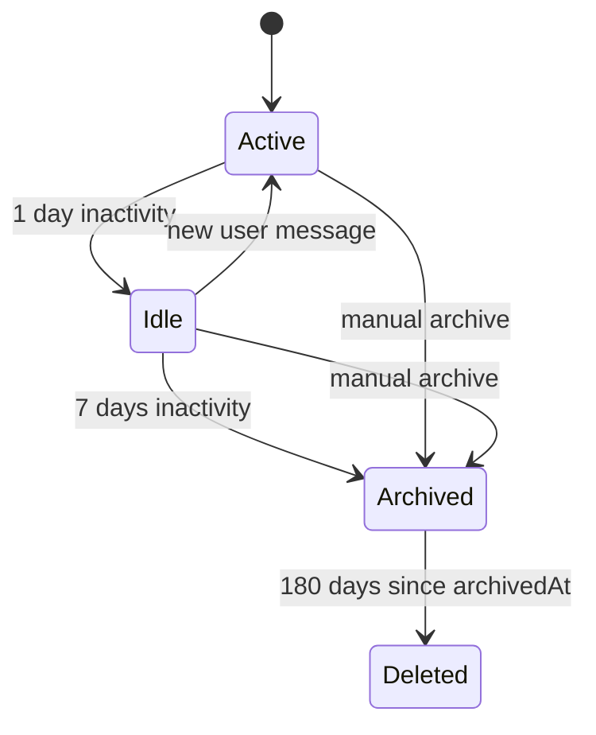
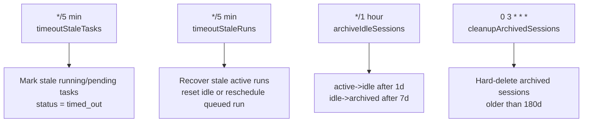
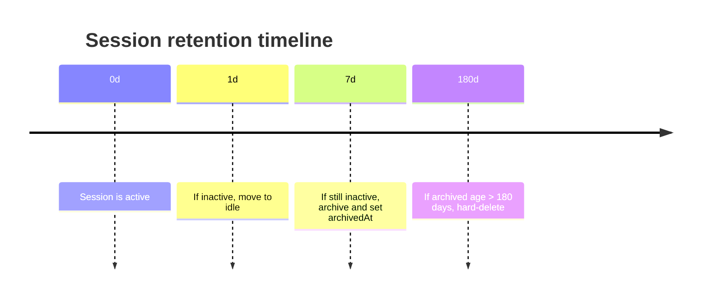
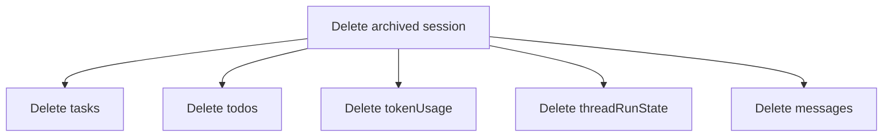

# Operations Plan

This document rewrites the operations portions of `PLAN.md` for retention, cleanup, stale recovery, and rate limiting.

## Session retention lifecycle

Session lifecycle policy is:

1. `active` -> `idle` after 1 day of inactivity
2. `idle` -> `archived` after 7 days of inactivity
3. `archived` -> hard-deleted after 180 days

Additional lifecycle behaviors:

- Manual archive is an explicit shortcut from `active` or `idle` directly to `archived`.
- Sending a message to an `idle` session reactivates it to `active`.
- Sending a message to an `archived` session is rejected.
- Auto-continuation logic skips archived sessions.

## Cron jobs and schedules

Retention and stale-recovery jobs are wired through Convex cron jobs (`cronJobs()`):

- Every 5 minutes: `timeoutStaleTasks` (from stale task cleanup module)
- Every 5 minutes: `timeoutStaleRuns`
- Every hour: `archiveIdleSessions`
- Daily at `03:00`: `cleanupArchivedSessions`

### Stale Message Janitor

`cleanupStaleMessages` runs every 5 minutes. It finds `messages` rows where `isComplete === false` AND the owning thread has no active run (`threadRunState.status === 'idle'`) AND the message's `createdAt` is older than 5 minutes. For each orphaned message:
1. Copy `streamingContent` to `content` (or set `content` to `[Message interrupted]` if empty)
2. Terminalize any `parts` entries with `status: 'pending'` → set `status: 'error'` and `result: 'Interrupted: agent run terminated before tool completion'`
3. Set `isComplete: true` and clear `streamingContent`

This prevents permanent ghost streaming messages AND ensures compaction can proceed (compaction requires all tool-call parts to be terminal). Without step 2, a crashed run's pending tool-call parts would block compaction forever and cause the UI to show permanent 'running' tool cards.

Operational ownership map:

- `archiveIdleSessions`: transitions session state (`active -> idle`, `idle -> archived`) and clears queued run payloads for newly archived sessions.
- `timeoutStaleRuns`: recovers stuck orchestrator run state, drains queued payload into a fresh run token when present, or resets to idle.
- `staleTaskCleanup` scope: running/pending worker task timeout transitions to `timed_out`.
- `cleanupArchivedSessions`: hard-deletes archived sessions older than retention TTL and cascades related rows.

## Retention timeline

## Stale run and wall-clock timeout policy

`timeoutStaleRuns` enforces two stale windows plus a hard cap:

- Claimed run stale window: 15 minutes (`runHeartbeatAt` fallback `claimedAt`)
- Unclaimed run stale window: 5 minutes (`activatedAt`)
- Wall-clock cap: 15 minutes max run duration regardless of heartbeat freshness

This cap prevents hung-but-heartbeating runs from monopolizing a thread forever.

## Rate limiting

Rate limiting uses `convex-helpers` `defineRateLimits` with token buckets:

- `submitMessage`: `20/min/user`
- `delegation`: `10/min/user`
- `searchCall`: `30/min/user`
- `mcpCall`: `20/min/user`

Implementation notes:

- Storage comes from `rateLimitTables` in schema.
- Enforcement uses `checkRateLimit` at mutation/tool entry points.
- Internal auto-continue scheduling, worker execution, and worker heartbeats are exempt.

Reference:

- Convex cron jobs: <https://docs.convex.dev/scheduling/cron-jobs>
- convex-helpers rate limiting: <https://github.com/get-convex/convex-helpers>

## Cleanup scope and cascade

Legacy v1 wording called out app-layer-only cleanup and component-layer orphans. For the DIY-owned agent stack, that limitation is removed: cleanup is full-stack and deletes all session-owned data.

Deletion cascade for hard-delete:

The hard-delete cascade includes worker-thread artifacts: for each deleted task, all `messages` rows on the task's `threadId` are also deleted. Since worker threads have no `session` row (they are task-owned), the cleanup resolves through `tasks.threadId` -> `messages.by_threadId`, not through `session`. The deletion order is: `tokenUsage` -> `todos` -> `messages` (both session and worker threads) -> `tasks` -> `threadRunState` -> `session`.

1. Session root record
2. Child rows: `tasks`, `todos`, `tokenUsage`, `threadRunState`
3. Thread/message records associated with the session

