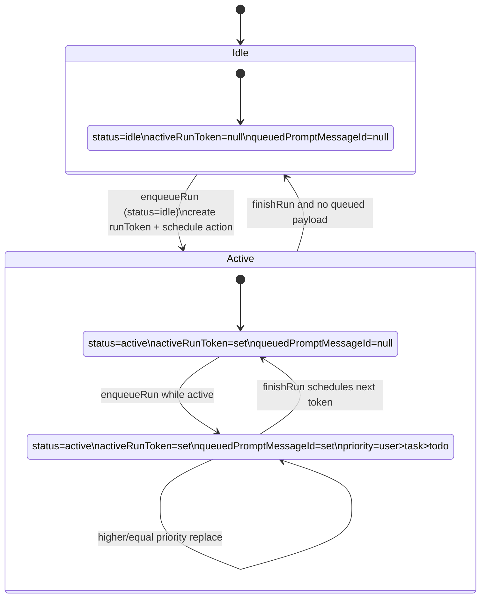
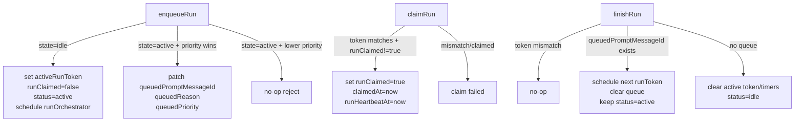
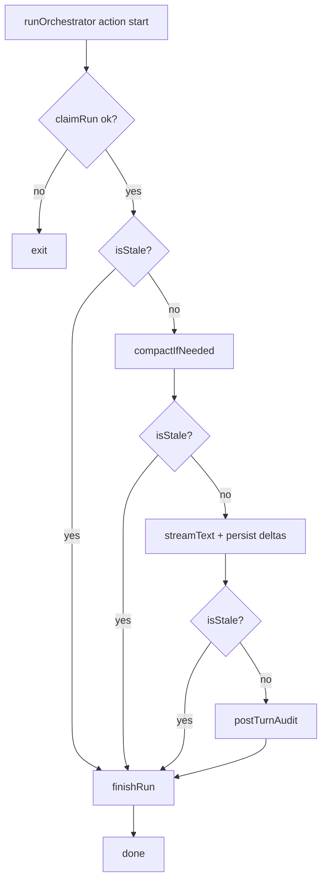
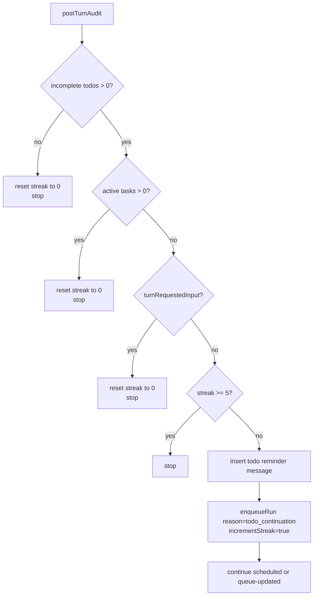
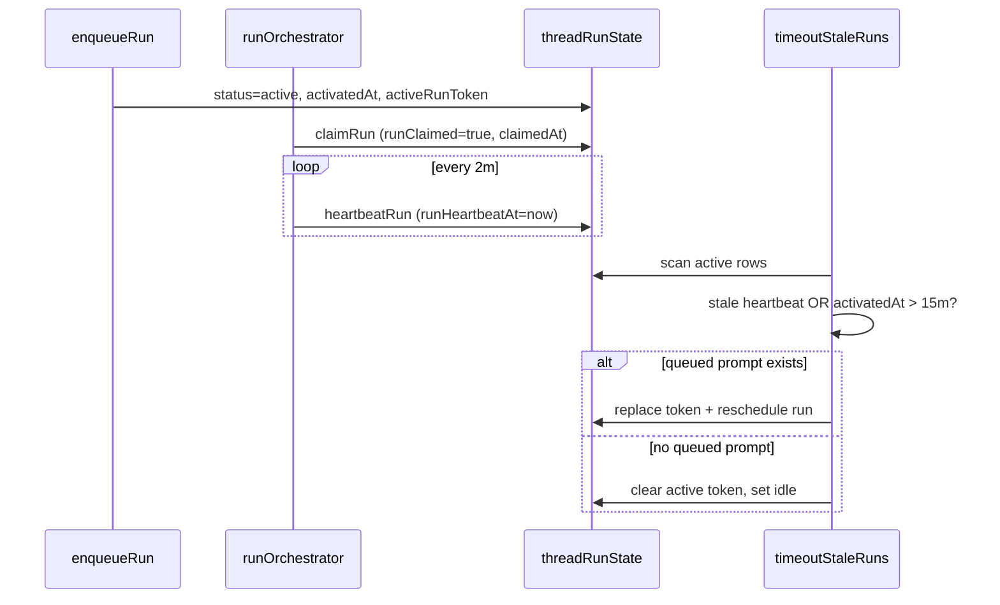

# Orchestrator Runtime (AI SDK v6)

The orchestrator runs directly in Convex actions with AI SDK `streamText()`. Message persistence, queueing, continuation, and recovery all use first-party tables in `packages/be-agent`.

## Scope and References

- AI SDK `streamText`: <https://ai-sdk.vercel.ai/docs/reference/ai-sdk-core/stream-text>
- Convex actions: <https://docs.convex.dev/functions/actions>
- OpenAgent loop reference: `oh-my-openagent/src/index.ts`

Implementation:
- `packages/be-agent/convex/orchestrator.ts`
- `packages/be-agent/convex/orchestratorNode.ts`
- `packages/be-agent/convex/messages.ts`
- `packages/be-agent/convex/compaction.ts`

## Queue-Per-Thread Concurrency Model

### Core table: `threadRunState`

One row per `threadId`, created lazily by `ensureRunState` and treated as a singleton.

Key fields:

- `status`: `idle | active`
- `activeRunToken`
- `runClaimed`
- `queuedPromptMessageId`
- `queuedReason`: `user_message | task_completion | todo_continuation`
- `queuedPriority`
- `autoContinueStreak`
- `activatedAt`, `claimedAt`, `runHeartbeatAt`
- `lastError`

### Priority queue policy

- One active run per thread and one queued slot.
- Priority: `user_message (2) > task_completion (1) > todo_continuation (0)`.
- Lower-priority enqueue cannot replace higher-priority queued payload.
- Equal priority replaces older queued payload.
- User-message enqueue resets continuation streak.

## CAS Transition Contracts

`enqueueRun`, `claimRun`, and `finishRun` are compare-and-set lifecycle mutations.

## `runOrchestrator` Action Flow

1. `claimRun(threadId, runToken)` consuming CAS claim.
2. Build stale guard from active token check.
3. Start heartbeat interval (`heartbeatRun`).
4. Run pre-generation compaction for closed prefix.
5. Stream turn with AI SDK `streamText()`.
6. Run `postTurnAudit` continuation logic.
7. Always call `finishRun` in `finally`.

## Streaming Write Model

- Create assistant row with `isComplete: false`, empty `content`, empty `streamingContent`, and `parts: []`.
- Patch `streamingContent` during deltas.
- On completion, set final `content`/`parts`, clear streaming field, set `isComplete: true`.
- Frontend renders reactively from `api.messages.listMessages`.

## Post-Turn Continuation Audit

`postTurnAuditFenced` performs token-fenced continuation decisions in one mutation:

- verify active token still matches run token,
- evaluate todo/task/input stop conditions,
- write reminder when continuation is needed,
- enqueue `todo_continuation` with streak increment,
- reset streak when continuation should stop.

## Heartbeat and Timeout Recovery

- Runtime heartbeat every ~2 minutes while action is alive.
- Claimed stale run threshold: 15 minutes from latest heartbeat (fallback `claimedAt`).
- Unclaimed stale run threshold: 5 minutes from `activatedAt`.
- Wall-clock cap: 15 minutes from `activatedAt`.

Recovery behavior:

- if queued payload exists, mint fresh token and reschedule,
- if no queued payload, reset run state to idle.

## Reliability Notes

- Queue transitions stay mutation-first and idempotent.
- Token fencing prevents stale runs from enqueueing new continuations.
- All terminal tool outcomes are serialized into model context so follow-up turns keep full tool history.
- Completion reminders and continuation enqueue remain separate operations, which preserves observability and retryability in operational recovery paths.

## Tests

See `apps/agent/plan/testing.md`.
