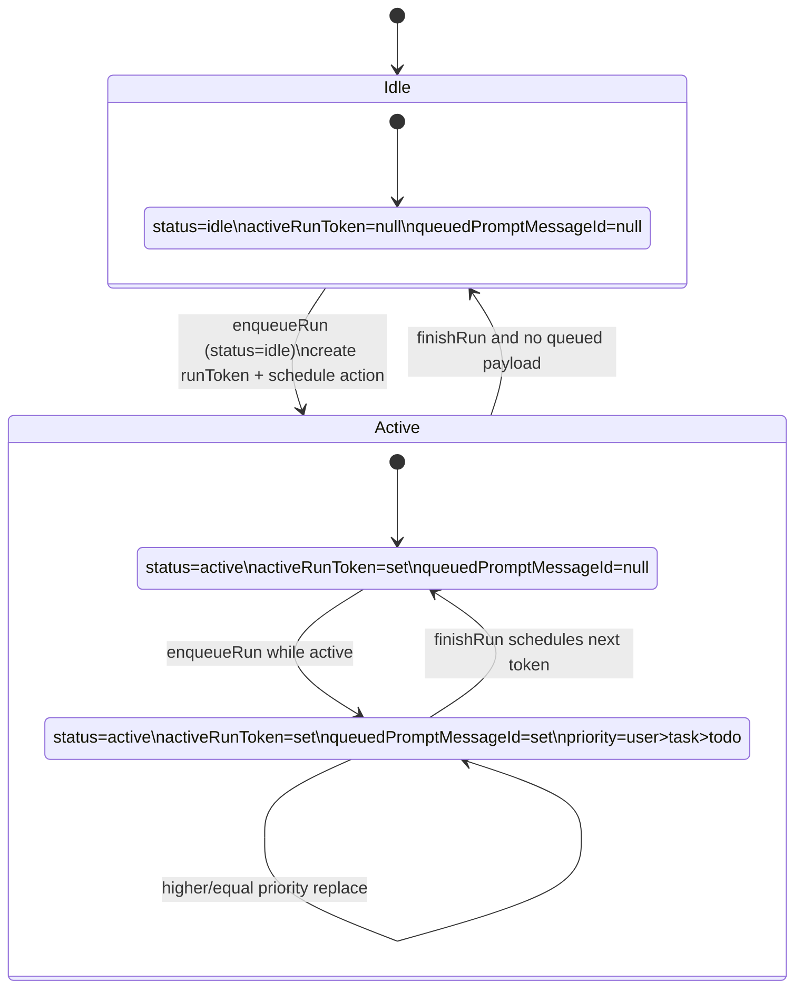
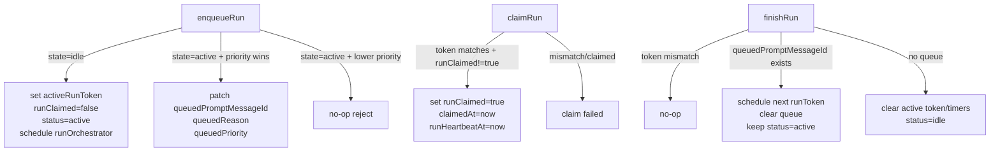
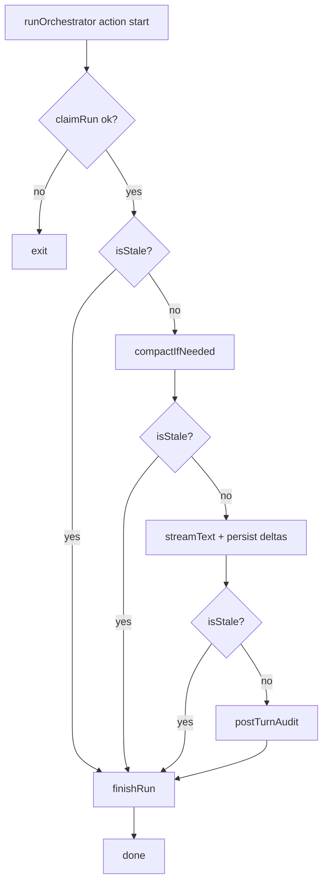
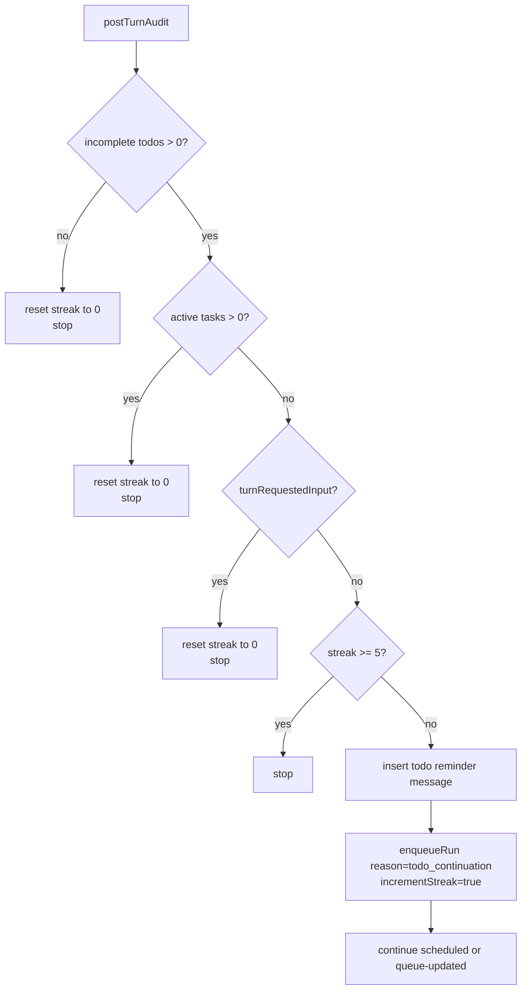
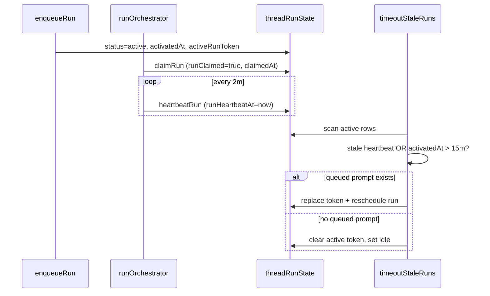

# Orchestrator Runtime (DIY AI SDK v6)

This document extracts and rewrites the runtime plan from `PLAN.md` for a **DIY orchestrator**: no agent component, no framework-managed message store. We run AI SDK v6 `streamText()` directly inside Convex actions and persist all message state in our own Convex `messages` table.

## Scope and References

- PLAN sections: Agent Runtime Flow, Concurrency Policy, Streaming Architecture, Auto-Continue Streak Rules
- AI SDK `streamText`: <https://ai-sdk.vercel.ai/docs/reference/ai-sdk-core/stream-text>
- Convex actions: <https://docs.convex.dev/functions/actions>
- OpenAgent loop reference: `oh-my-openagent/src/index.ts`

## Queue-Per-Thread Concurrency Model

### Core table: `threadRunState`

One row per `threadId`, created lazily by `ensureRunState`. v1 enforces singleton behavior (`by_threadId` unique invariant).

Key fields:

- `status`: `idle | active`
- `activeRunToken`: currently active run token
- `runClaimed`: consuming claim bit for scheduled action delivery dedupe
- `queuedPromptMessageId`: optional single queued payload while active
- `queuedReason`: `user_message | task_completion | todo_continuation`
- `queuedPriority`: explicit persisted priority marker
- `autoContinueStreak`: continuation safety counter (cap `5`)
- `activatedAt`, `claimedAt`, `runHeartbeatAt`: timing and stale-run recovery
- `lastError`: last orchestrator error

### Priority queue policy (single queued slot)

- One active run per thread, plus at most one queued prompt slot.
- Priority order: `user_message (2) > task_completion (1) > todo_continuation (0)`.
- Lower-priority enqueue cannot replace higher queued payload.
- Equal priority replaces older queued payload (newer event wins).
- `user_message` reset behavior: streak resets to `0` when enqueued.



## CAS Transition Contracts

`enqueueRun`, `claimRun`, and `finishRun` are compare-and-set lifecycle mutations.



## `runOrchestrator` Action Flow

v1 action pattern:

1. `claimRun(threadId, runToken)` consuming CAS claim.
2. Build stale guard `isStale()` (token mismatch check).
3. Start heartbeat interval (`heartbeatRun`) while action is alive.
4. Pre-generation compaction for closed prefix.
5. Stream model turn with AI SDK `streamText()` (DIY integration).
6. Run `postTurnAudit` (todo/task/streak continuation logic).
7. Always `finishRun` in `finally`.



## DIY Streaming Architecture (`streamText` + `messages` table)

We do not rely on component message storage. The action writes directly to app tables.

### Write model

- Before stream: insert assistant message row with
  - `isComplete: false`
  - `content: ''`
  - `streamingContent: ''`
  - `role: 'assistant'`
  - `threadId`, `sessionId`
- During stream: append text deltas to in-memory buffer and patch
  - `messages.streamingContent = <latest partial text>`
  - optional throttle (for write pressure)
- On stream completion:
  - `messages.content = finalText`
  - `messages.isComplete = true`
  - `messages.streamingContent = undefined` (or empty string)
- On stream error:
  - keep partial text if needed
  - set `isComplete: true` + error metadata, or leave incomplete for timeout janitor (team choice)

This provides reactive frontend streaming via normal Convex queries on `messages`.

## Post-Turn Auto-Continue Audit

`postTurnAudit` runs after successful turn streaming and evaluates:

- incomplete todos (`pending` or `in_progress`)
- active background work (`tasks` in `pending` or `running`)
- `turnRequestedInput` (v1 always `false`, documented limitation)
- `autoContinueStreak < 5`

If continue is allowed:

1. Save system reminder message in `messages` table.
2. Call `enqueueRun({ reason: 'todo_continuation', incrementStreak: true, promptMessageId: reminderMessageId })`.

Implementation: `postTurnAuditFenced` is a single `internalMutation` that receives `{ runToken, threadId, turnRequestedInput }` and executes ALL side effects atomically: (1) verify `activeRunToken === runToken`, (2) compute stop/continue decision, (3) reset streak if stopping, (4) write reminder if needed, (5) enqueue continuation if needed, (6) update `completionNotifiedAt` if applicable. The standalone `resetAutoContinueStreak` function is NOT called separately - it is inlined into this fenced mutation.



## Heartbeat and Wall-Clock Timeout

### Runtime heartbeat

- `runOrchestrator` sends `heartbeatRun` every ~2 minutes while alive.
- `claimRun` initializes `runHeartbeatAt`.

### Recovery cron (`timeoutStaleRuns`)

- Claimed run stale threshold: 15 minutes from latest `runHeartbeatAt` (fallback `claimedAt`).
- Unclaimed scheduled run stale threshold: 5 minutes from `activatedAt`.
- Hard wall-clock cap: 15 minutes from `activatedAt` even if heartbeat continues.
- Recovery behavior:
  - if queued payload exists: mint new run token, schedule next action, clear queue fields
  - if no queued payload: reset to `idle`



## Lifecycle Summary

### `enqueueRun`

- Entry point for user turns and internal continuations.
- Creates active run when idle; otherwise mutates single queued slot with priority rules.
- Owns atomic streak updates (`incrementStreak`).

### `claimRun`

- Consuming claim CAS to absorb duplicate scheduler deliveries.
- Only action instance with matching token and unclaimed slot can proceed.

### `finishRun`

- Finalizes active token.
- Drains queued payload into next scheduled token when present.
- Returns thread to idle when queue is empty.

## Documented v1 Limitations

- Crash gap: if action crashes after reminder write but before continuation enqueue, thread may remain idle until next user input.
- Lost-turn case: if active run dies before answer and no queued payload exists, stale cleanup resets idle without replaying original prompt.
- `turnRequestedInput` is always `false` in v1; input-request detection is deferred.
- Mid-stream stale overlap can still persist partial writes/tool side effects before stale check after `consumeStream()`.

---

## Implementation Reference Snippets

The sections below contain pseudocode snippets recovered from an earlier planning phase. They are **illustrative, not authoritative** — the architectural specs above (buildModelMessages, token-fenced postTurnAudit, parts-only tool model, explicit desc+reverse ordering) are the source of truth. During implementation, these snippets will be replaced by actual verified TypeScript code. Where a snippet contradicts an architectural spec above, the spec takes precedence.

## Recovered: Agent Definitions

`components.agent` has been removed. v1 configuration survives as plain runtime config consumed by direct AI SDK calls (`streamText` for orchestrator turns, `generateText` for worker single-shot turns).

```typescript
const ORCHESTRATOR_RUNTIME_CONFIG = {
  callSettings: {
    temperature: 0.7
  },
  contextOptions: {
    excludeToolMessages: false,
    recentMessages: 100
  },
  instructions: ORCHESTRATOR_SYSTEM_PROMPT,
  languageModel: getModel,
  maxSteps: 25,
  name: 'Orchestrator',
  tools: {
    delegate: delegateTool,
    mcpCall: mcpCallTool,
    mcpDiscover: mcpDiscoverTool,
    taskOutput: taskOutputTool,
    taskStatus: taskStatusTool,
    todoRead: todoReadTool,
    todoWrite: todoWriteTool,
    webSearch: webSearchTool
  },
  usageHandler: usageHandlerByThread
} as const

const usageHandlerByThread = async (
  ctx,
  { userId, threadId, agentName, usage, providerMetadata, model, provider }
) => {
  await ctx.runMutation(internal.tokenUsage.recordModelUsage, {
    agentName: agentName ?? 'unknown',
    outputTokens: usage.outputTokens,
    model,
    inputTokens: usage.inputTokens,
    provider,
    threadId,
    totalTokens: usage.totalTokens
  })
}

const recordModelUsage = internalMutation({
  args: {
    agentName: v.optional(v.string()),
    outputTokens: v.number(),
    model: v.string(),
    inputTokens: v.number(),
    provider: v.string(),
    threadId: v.string(),
    totalTokens: v.number()
  },
  handler: async (ctx, args) => {
    const session = await ctx.db
      .query('session')
      .withIndex('by_threadId', q => q.eq('threadId', args.threadId))
      .first()
    if (session) {
      await ctx.db.insert('tokenUsage', {
        agentName: args.agentName,
        outputTokens: args.outputTokens,
        model: args.model,
        inputTokens: args.inputTokens,
        provider: args.provider,
        sessionId: session._id,
        threadId: args.threadId,
        totalTokens: args.totalTokens,
        userId: session.userId
      })
      return
    }

    const task = await ctx.db
      .query('tasks')
      .withIndex('by_threadId', q => q.eq('threadId', args.threadId))
      .first()
    if (!task) return
    const ownerSession = await ctx.db.get(task.sessionId)
    if (!ownerSession) return

    await ctx.db.insert('tokenUsage', {
      agentName: args.agentName,
      outputTokens: args.outputTokens,
      model: args.model,
      inputTokens: args.inputTokens,
      provider: args.provider,
      sessionId: ownerSession._id,
      threadId: args.threadId,
      totalTokens: args.totalTokens,
      userId: ownerSession.userId
    })
  }
})
```

## Recovered: System Prompts

```typescript
const ORCHESTRATOR_SYSTEM_PROMPT = [
  'You are a web-based AI assistant with background task and tool capabilities.',
  '',
  'Available tools:',
  '- delegate: Spawn background tasks for independent work. Use for research, analysis, or any work that can run in parallel.',
  '- webSearch: Search the web for current information. Returns summary and source URLs.',
  '- todoWrite: Track multi-step work. Mark in_progress before starting, completed after finishing. Only one task in_progress at a time.',
  '- taskStatus: Check the status of a background task by ID.',
  '- taskOutput: Retrieve the full result of a completed background task.',
  '- mcpCall: Call a tool on a configured MCP server.',
  '- mcpDiscover: List available tools from configured MCP servers.',
  '',
  'When system reminders arrive about completed tasks, use taskOutput to retrieve results.',
  'Be direct and concise. No preamble or filler.',
  'You cannot access files, execute code, or run CLI commands.'
].join('\n')

const WORKER_SYSTEM_PROMPT = [
  'You are a focused worker agent handling a delegated task.',
  'Complete the specific task described in your prompt. Do not deviate.',
  'Use webSearch for research if needed. Use mcpCall/mcpDiscover for MCP tools if relevant.',
  'Provide a clear, concise result with relevant data and findings.',
  'You cannot delegate further or manage todos.'
].join('\n')

export { ORCHESTRATOR_SYSTEM_PROMPT, WORKER_SYSTEM_PROMPT }
```

## Recovered: Helper Functions

`threadRunState` is treated as a singleton per thread. `by_threadId` is a unique application-level invariant, enforced by querying with `.unique()` and failing fast if duplicates ever appear. Under Convex serializable transactions, concurrent first-callers for the same `threadId` are serialized: one insert wins and retried callers read the existing row.

```typescript
const ensureRunState = async ({ ctx, threadId }) => {
  const existing = await ctx.db
    .query('threadRunState')
    .withIndex('by_threadId', q => q.eq('threadId', threadId))
    .unique()
  if (existing) return existing
  try {
    const id = await ctx.db.insert('threadRunState', {
      autoContinueStreak: 0,
      status: 'idle',
      threadId
    })
    return await ctx.db.get(id)
  } catch (error) {
    const retried = await ctx.db
      .query('threadRunState')
      .withIndex('by_threadId', q => q.eq('threadId', threadId))
      .unique()
    if (retried) return retried
    throw error
  }
}

const resolveOwnedSession = async ({ ctx, sessionId, userId }) => {
  const session = await ctx.db.get(sessionId)
  if (!session || session.userId !== userId)
    throw new Error('session_not_found')
  return session
}

const resolveOwnedSessionByThread = async ({ ctx, threadId, userId }) => {
  const session = await ctx.db
    .query('session')
    .withIndex('by_user_threadId', q =>
      q.eq('userId', userId).eq('threadId', threadId)
    )
    .unique()
  if (!session) {
    const task = await ctx.db
      .query('tasks')
      .withIndex('by_threadId', q => q.eq('threadId', threadId))
      .unique()
    if (!task) throw new Error('session_not_found')
    const ownerSession = await ctx.db.get(task.sessionId)
    if (!ownerSession || ownerSession.userId !== userId)
      throw new Error('session_not_found')
    return ownerSession
  }
  return session
}

const buildTaskCompletionReminder = ({ taskId, description }) => {
  return [
    '<system-reminder>',
    '[BACKGROUND TASK COMPLETED]',
    `Task ID: ${taskId}`,
    `Description: ${description}`,
    '',
    'Use taskOutput tool with this taskId to retrieve full results.',
    '</system-reminder>'
  ].join('\n')
}

const buildTodoReminder = ({ todos }) => {
  const lines = [
    '<system-reminder>',
    '[TODO CONTINUATION]',
    'Incomplete tasks remain:',
    ''
  ]
  for (const t of todos) {
    if (t.status === 'completed' || t.status === 'cancelled') continue
    lines.push(`- [${t.status}] (${t.priority}) ${t.content}`)
  }
  lines.push(
    '',
    'Continue working on the next pending task.',
    '</system-reminder>'
  )
  return lines.join('\n')
}

const getRunStateByThreadId = internalQuery({
  args: { threadId: v.string() },
  handler: async (ctx, { threadId }) => {
    return await ctx.db
      .query('threadRunState')
      .withIndex('by_threadId', q => q.eq('threadId', threadId))
      .unique()
  }
})
```

## Recovered: Agent Runtime Flow

### Stream Wrapper (single-object call shape)

All stream entry points use a local wrapper that accepts a single object argument. In DIY mode this wrapper builds model, instructions, tools, and context from our own tables, then calls AI SDK `streamText` directly.

```typescript
const runOrchestratorStream = async ({
  ctx,
  threadId,
  promptMessageId,
  systemPrefix
}) => {
  const { streamText } = await import('ai')
  const model = await getModel()

  const dbMessages = await ctx.runQuery(internal.messages.listMessages, {
    paginationOpts: {
      cursor: null,
      numItems: ORCHESTRATOR_RUNTIME_CONFIG.contextOptions.recentMessages
    },
    threadId
  })

  const messages = []
  if (systemPrefix)
    messages.push({ content: systemPrefix, role: 'system' as const })
  for (const m of dbMessages.page) {
    messages.push({ content: m.content, role: m.role }) // (Note: this snippet uses the simplified `m.content` mapping. The actual implementation MUST use `buildModelMessages` which includes `parts` — see architecture.md canonical serializer spec.)
  }

  // Context is built via `buildModelMessages(messages, compactionSummary)` which serializes stored message rows into AI SDK `CoreMessage` format including `parts` — see `architecture.md` for the canonical serializer spec.

  // The orchestrator uses `promptMessageId` (from the queued payload) as a hard upper bound when loading context. The query fetches messages where `createdAt <= promptMessage.createdAt` from `by_thread_createdAt` descending, takes the latest 100, and reverses to chronological order. This prevents the active run from seeing messages that arrived after its prompt — those belong to the next queued run. Without this boundary, an active run could process a newer user message, and then the queued follow-up run would process it again, causing duplicate responses.

  const result = await streamText({
    maxSteps: ORCHESTRATOR_RUNTIME_CONFIG.maxSteps,
    messages,
    model,
    system: ORCHESTRATOR_RUNTIME_CONFIG.instructions,
    temperature: ORCHESTRATOR_RUNTIME_CONFIG.callSettings.temperature,
    tools: ORCHESTRATOR_RUNTIME_CONFIG.tools,
    onFinish: async ({ response, usage, providerMetadata }) => {
      await usageHandlerByThread(ctx, {
        agentName: ORCHESTRATOR_RUNTIME_CONFIG.name,
        model: model.modelId,
        provider: model.provider ?? 'unknown',
        providerMetadata,
        threadId,
        usage,
        userId: undefined
      })
    }
  })

  return result
}
```

### Save Message and Prompt Chaining

System reminders are saved as `messages` rows and their inserted id is reused as next prompt anchor.

All message inserts include `createdAt: Date.now()`. This is the canonical ordering field used by `by_thread_createdAt` index.

```typescript
const reminderMessageId = await ctx.db.insert('messages', {
  content: reminderText,
  createdAt: Date.now(),
  isComplete: true,
  role: 'system',
  sessionId,
  threadId
})

const result = await runOrchestratorStream({
  ctx,
  promptMessageId: String(reminderMessageId),
  threadId
})
await result.consumeStream()
```

### Post-Turn Todo Continuation Audit

There is no hook system; continuation enforcement runs in orchestrator action after streaming completes.

```typescript
const postTurnAudit = async ({ ctx, runToken, threadId, turnRequestedInput }) => {
  const session = await ctx.runQuery(internal.sessions.getByThreadIdInternal, {
    threadId
  })
  if (session?.status === 'archived') return

  const audited = await ctx.runMutation(
    internal.orchestrator.postTurnAuditFenced,
    {
      runToken,
      threadId,
      turnRequestedInput
    }
  )
  if (!audited.ok) return { shouldContinue: false }
  return { shouldContinue: audited.shouldContinue }
}
```

`turnRequestedInput` remains in the signature for v2 extensibility even though v1 orchestrator currently passes `false`.

### Auto-Continue Streak Rules

- Reset to `0` on new user message (`enqueueRun` with `reason='user_message'`).
- Reset to `0` when turn ends for task-wait or user-input stop conditions.
- Reset to `0` when all todos are terminal (`completed`/`cancelled`).
- Resets happen inside token-fenced `postTurnAuditFenced`, not through a standalone reset mutation.
- Increment by `1` only through `enqueueRun({ incrementStreak: true, ... })` so queue and streak updates are atomic.
- Hard cap: `5`; `enqueueRun` rejects auto-continue scheduling once cap is reached.
- Streak is incremented at enqueue time (inside the atomic `enqueueRun` / `enqueueRunIfLatest` mutation), not when the continuation run actually starts. If multiple task completions race and each calls `enqueueRun({ incrementStreak: true })`, only the one that wins the queue slot (equal-or-higher priority) increments the counter — lower-priority enqueues that are rejected do not consume a streak slot. However, a burst of equal-priority `task_completion` events can burn the cap (each replaces the prior queued payload and increments streak). This is an accepted v1 trade-off: the cap is a safety bound, not a precision counter. v2 can move streak increment to `claimRun` (when the run actually starts) for exact counting.

### Detailed `runOrchestrator` pseudocode

```typescript
const runOrchestrator = internalAction({
  args: {
    promptMessageId: v.optional(v.string()),
    runToken: v.string(),
    threadId: v.string()
  },
  handler: async (ctx, args) => {
    const claimed = await ctx.runMutation(internal.orchestrator.claimRun, {
      runToken: args.runToken,
      threadId: args.threadId
    })
    if (!claimed.ok) return

    const isStale = async () => {
      const state = await ctx.runQuery(
        internal.orchestrator.getRunStateByThreadId,
        {
          threadId: args.threadId
        }
      )
      return !state || state.activeRunToken !== args.runToken
    }

    const heartbeatInterval = setInterval(
      async () => {
        try {
          await ctx.runMutation(internal.orchestrator.heartbeatRun, {
            runToken: args.runToken,
            threadId: args.threadId
          })
        } catch (_error) {}
      },
      2 * 60 * 1000
    )

    try {
      if (await isStale()) return

      try {
        await compactIfNeeded({ ctx, threadId: args.threadId })
      } catch (_error) {}

      if (await isStale()) return
      const state = await ctx.runQuery(
        internal.orchestrator.getRunStateByThreadId,
        {
          threadId: args.threadId
        }
      )
      const systemPrefix = state?.compactionSummary
        ? `Compaction summary:\n${state.compactionSummary}`
        : undefined

      const result = await runOrchestratorStream({
        ctx,
        promptMessageId: args.promptMessageId,
        systemPrefix,
        threadId: args.threadId
      })

      await result.consumeStream()

      if (await isStale()) return

      await postTurnAudit({
        ctx,
        runToken: args.runToken,
        threadId: args.threadId,
        turnRequestedInput: false
      })
    } catch (error) {
      await ctx.runMutation(internal.orchestrator.recordRunError, {
        error: String(error),
        threadId: args.threadId
      })
    } finally {
      clearInterval(heartbeatInterval)
      await ctx.runMutation(internal.orchestrator.finishRun, {
        runToken: args.runToken,
        threadId: args.threadId
      })
    }
  }
})
```

v1 limitation note: requested-user-input inference is deferred. `runOrchestrator` currently passes `turnRequestedInput: false` on every turn, so the guard is intentionally dormant in v1.

The same crash-gap limitation applies to todo auto-continuation in `postTurnAudit`: if the action crashes between saving the system reminder and enqueuing `todo_continuation`, the reminder is persisted but no continuation is enqueued. On retry, duplicate enqueue is prevented by `postTurnAudit` re-checking whether a `todo_continuation` is already queued (the `enqueueRun` call with `todo_continuation` reason succeeds only if no equal-or-higher-priority payload is already queued). The user must send a new message to re-engage the orchestrator if the crash-gap scenario occurs.

## Recovered: Error Recovery

```typescript
const isTransientError = msg => {
  const transient = [
    'ECONNRESET',
    'ETIMEDOUT',
    'rate_limit',
    '503',
    '429',
    'overloaded'
  ]
  const lower = msg.toLowerCase()
  for (const t of transient) {
    if (lower.includes(t.toLowerCase())) return true
  }
  return false
}
```

Runtime guardrails:

- Wrap orchestrator and worker actions in `try/catch/finally`.
- Persist error state on task and thread-level metadata.
- Always finalize `threadRunState` transitions and compaction locks in `finally`.

LLM failure mid-stream:

- mark task `failed`
- set `lastError`
- increment `retryCount`
- retry if transient and `retryCount < 3`

Action timeout recovery:

- worker timeout target: 10 minutes
- cron scans running tasks
- if no heartbeat within timeout threshold, mark `timed_out`
- stale orchestrator-run recovery: if `threadRunState` is `active` and the latest heartbeat (`runHeartbeatAt`, falling back to `claimedAt`) is older than 15 minutes for claimed runs, or older than 5 minutes for unclaimed runs, recover to idle or immediately drain queued payload into a fresh run token

MCP failure recovery returns model-readable structured error payloads instead of raw thrown exceptions.

Terminal states:

- `failed`
- `timed_out`
- `cancelled`

## Recovered: Internal Functions (Orchestrator-Related)

Use `getRunStateByThreadId` consistently as the canonical query name.

For compaction write safety, `setCompactionSummary` must reject regressive boundaries: it verifies `args.lastCompactedMessageId > state.lastCompactedMessageId` by message `createdAt`, and returns `{ ok: false }` for equal or older boundaries.

```typescript
const enqueueRun = internalMutation({
  args: {
    incrementStreak: v.optional(v.boolean()),
    promptMessageId: v.optional(v.string()),
    reason: v.union(
      v.literal('user_message'),
      v.literal('task_completion'),
      v.literal('todo_continuation')
    ),
    threadId: v.string()
  },
  handler: async (ctx, args) => {
    const state = await ensureRunState({ ctx, threadId: args.threadId })
    const shouldIncrement = args.incrementStreak === true

    if (shouldIncrement && state.autoContinueStreak >= 5) {
      return { ok: false, reason: 'streak_cap' }
    }

    let nextStreak = state.autoContinueStreak
    if (args.reason === 'user_message') nextStreak = 0
    if (shouldIncrement) nextStreak += 1

    if (state.status === 'idle') {
      const runToken = crypto.randomUUID()
      await ctx.scheduler.runAfter(0, internal.agents.runOrchestrator, {
        promptMessageId: args.promptMessageId,
        runToken,
        threadId: args.threadId
      })
      await ctx.db.patch(state._id, {
        activatedAt: Date.now(),
        activeRunToken: runToken,
        autoContinueStreak: nextStreak,
        claimedAt: undefined,
        queuedPriority: undefined,
        queuedPromptMessageId: undefined,
        queuedReason: undefined,
        runClaimed: false,
        status: 'active'
      })
      return { ok: true, scheduled: true }
    }

    const priority = {
      task_completion: 1,
      todo_continuation: 0,
      user_message: 2
    }
    const queuedPriority =
      priority[
        state.queuedPriority ?? state.queuedReason ?? 'todo_continuation'
      ]
    const incomingPriority = priority[args.reason]
    if (incomingPriority < queuedPriority)
      return { ok: false, reason: 'lower_priority' }

    await ctx.db.patch(state._id, {
      autoContinueStreak: nextStreak,
      queuedPriority: args.reason,
      queuedPromptMessageId: args.promptMessageId,
      queuedReason: args.reason
    })
    return { ok: true, scheduled: false }
  }
})

const enqueueRunIfLatest = internalMutation({
  args: {
    expectedLatestMessageId: v.string(),
    incrementStreak: v.optional(v.boolean()),
    promptMessageId: v.optional(v.string()),
    reason: v.union(
      v.literal('user_message'),
      v.literal('task_completion'),
      v.literal('todo_continuation')
    ),
    threadId: v.string()
  },
  handler: async (ctx, args) => {
    const latest = await ctx.db
      .query('messages')
      .withIndex('by_thread_createdAt', q => q.eq('threadId', args.threadId))
      .order('desc')
      .first()
    const latestMessageId = latest ? String(latest._id) : null
    if (latestMessageId !== args.expectedLatestMessageId)
      return { ok: false, reason: 'not_latest' }

    const state = await ensureRunState({ ctx, threadId: args.threadId })
    const shouldIncrement = args.incrementStreak === true

    if (shouldIncrement && state.autoContinueStreak >= 5) {
      return { ok: false, reason: 'streak_cap' }
    }

    let nextStreak = state.autoContinueStreak
    if (args.reason === 'user_message') nextStreak = 0
    if (shouldIncrement) nextStreak += 1

    if (state.status === 'idle') {
      const runToken = crypto.randomUUID()
      await ctx.scheduler.runAfter(0, internal.agents.runOrchestrator, {
        promptMessageId: args.promptMessageId,
        runToken,
        threadId: args.threadId
      })
      await ctx.db.patch(state._id, {
        activatedAt: Date.now(),
        activeRunToken: runToken,
        autoContinueStreak: nextStreak,
        claimedAt: undefined,
        queuedPriority: undefined,
        queuedPromptMessageId: undefined,
        queuedReason: undefined,
        runClaimed: false,
        status: 'active'
      })
      return { ok: true, scheduled: true }
    }

    const priority = {
      task_completion: 1,
      todo_continuation: 0,
      user_message: 2
    }
    const queuedPriority =
      priority[
        state.queuedPriority ?? state.queuedReason ?? 'todo_continuation'
      ]
    const incomingPriority = priority[args.reason]
    if (incomingPriority < queuedPriority)
      return { ok: false, reason: 'lower_priority' }

    await ctx.db.patch(state._id, {
      autoContinueStreak: nextStreak,
      queuedPriority: args.reason,
      queuedPromptMessageId: args.promptMessageId,
      queuedReason: args.reason
    })
    return { ok: true, scheduled: false }
  }
})

const claimRun = internalMutation({
  args: { runToken: v.string(), threadId: v.string() },
  handler: async (ctx, { runToken, threadId }) => {
    const state = await ensureRunState({ ctx, threadId })
    if (state.status !== 'active') return { ok: false }
    if (state.activeRunToken !== runToken) return { ok: false }
    if (state.runClaimed) return { ok: false }
    await ctx.db.patch(state._id, {
      claimedAt: Date.now(),
      runClaimed: true,
      runHeartbeatAt: Date.now()
    })
    return { ok: true }
  }
})

const finishRun = internalMutation({
  args: { runToken: v.string(), threadId: v.string() },
  handler: async (ctx, { runToken, threadId }) => {
    const state = await ensureRunState({ ctx, threadId })
    if (state.activeRunToken !== runToken) return { scheduled: false }

    if (state.queuedPromptMessageId) {
      const session = await ctx.db
        .query('session')
        .withIndex('by_threadId', q => q.eq('threadId', threadId))
        .first()
      if (session?.status === 'archived') {
        await ctx.db.patch(state._id, {
          activatedAt: undefined,
          activeRunToken: undefined,
          claimedAt: undefined,
          queuedPriority: undefined,
          queuedPromptMessageId: undefined,
          queuedReason: undefined,
          runClaimed: undefined,
          runHeartbeatAt: undefined,
          status: 'idle'
        })
        return { scheduled: false }
      }
      const nextRunToken = crypto.randomUUID()
      await ctx.scheduler.runAfter(0, internal.agents.runOrchestrator, {
        promptMessageId: state.queuedPromptMessageId,
        runToken: nextRunToken,
        threadId
      })
      await ctx.db.patch(state._id, {
        activatedAt: Date.now(),
        activeRunToken: nextRunToken,
        claimedAt: undefined,
        queuedPriority: undefined,
        queuedPromptMessageId: undefined,
        queuedReason: undefined,
        runClaimed: false,
        runHeartbeatAt: undefined
      })
      return { scheduled: true }
    }
    await ctx.db.patch(state._id, {
      activatedAt: undefined,
      activeRunToken: undefined,
      claimedAt: undefined,
      runClaimed: undefined,
      runHeartbeatAt: undefined,
      status: 'idle'
    })
    return { scheduled: false }
  }
})

const heartbeatRun = internalMutation({
  args: { runToken: v.string(), threadId: v.string() },
  handler: async (ctx, { runToken, threadId }) => {
    const state = await ctx.db
      .query('threadRunState')
      .withIndex('by_threadId', q => q.eq('threadId', threadId))
      .unique()
    if (!state || state.activeRunToken !== runToken) return
    await ctx.db.patch(state._id, { runHeartbeatAt: Date.now() })
  }
})

const recordRunError = internalMutation({
  args: { error: v.string(), threadId: v.string() },
  handler: async (ctx, { error, threadId }) => {
    const state = await ensureRunState({ ctx, threadId })
    await ctx.db.patch(state._id, { lastError: error })
  }
})

const resetAutoContinueStreak = internalMutation({
  args: { threadId: v.string() },
  handler: async (ctx, { threadId }) => {
    const state = await ensureRunState({ ctx, threadId })
    await ctx.db.patch(state._id, { autoContinueStreak: 0 })
  }
})

const getContextSize = internalQuery({
  args: { threadId: v.string() },
  handler: async (ctx, { threadId }) => {
    // Query `messages.by_thread_createdAt` with `order('desc')`, take the first 100 (most recent), then reverse the array to chronological order before passing to `buildModelMessages`. This ensures the model always sees the latest context window in correct temporal order.
    const messages = await ctx.db
      .query('messages')
      .withIndex('by_thread_createdAt', q => q.eq('threadId', threadId))
      .order('desc')
      .take(500)
    const hasMore = messages.length >= 500
    let charCount = 0
    for (const m of messages) {
      charCount += JSON.stringify(m).length
    }
    const runState = await ctx.db
      .query('threadRunState')
      .withIndex('by_threadId', q => q.eq('threadId', threadId))
      .unique()
    if (runState?.compactionSummary) {
      charCount += runState.compactionSummary.length
    }
    return { charCount, hasMore, messageCount: messages.length }
  }
})

const listMessages = query({
  args: {
    paginationOpts: paginationOptsValidator,
    threadId: v.string()
  },
  handler: async (ctx, args) => {
    const userId = await getAuthUserIdOrTest(ctx)
    if (!userId) throw new Error('unauthenticated')

    await resolveOwnedSessionByThread({ ctx, threadId: args.threadId, userId })

    // Query `messages.by_thread_createdAt` with `order('desc')`, take the first 100 (most recent), then reverse the array to chronological order before passing to `buildModelMessages`. This ensures the model always sees the latest context window in correct temporal order.
    return await ctx.db
      .query('messages')
      .withIndex('by_thread_createdAt', q => q.eq('threadId', args.threadId))
      .paginate(args.paginationOpts)
  }
})

const acquireCompactionLock = internalMutation({
  args: { lockToken: v.string(), threadId: v.string() },
  handler: async (ctx, { lockToken, threadId }) => {
    const state = await ensureRunState({ ctx, threadId })
    const now = Date.now()
    const LEASE_MS = 10 * 60 * 1000
    const leaseExpired = Boolean(
      state.compactionLock &&
      state.compactionLockAt &&
      now - state.compactionLockAt > LEASE_MS
    )
    if (state.compactionLock && !leaseExpired) return { ok: false }
    await ctx.db.patch(state._id, {
      compactionLock: lockToken,
      compactionLockAt: now
    })
    return { ok: true }
  }
})

const releaseCompactionLock = internalMutation({
  args: { lockToken: v.string(), threadId: v.string() },
  handler: async (ctx, { lockToken, threadId }) => {
    const state = await ensureRunState({ ctx, threadId })
    if (state.compactionLock !== lockToken) return { ok: false }
    await ctx.db.patch(state._id, {
      compactionLock: undefined,
      compactionLockAt: undefined
    })
    return { ok: true }
  }
})

const setCompactionSummary = internalMutation({
  args: {
    compactionSummary: v.string(),
    lastCompactedMessageId: v.string(),
    lockToken: v.string(),
    threadId: v.string()
  },
  handler: async (
    ctx,
    { compactionSummary, lastCompactedMessageId, lockToken, threadId }
  ) => {
    const state = await ensureRunState({ ctx, threadId })
    if (state.compactionLock !== lockToken) return { ok: false }
    if (state.lastCompactedMessageId) {
      const prev = await ctx.db.get(state.lastCompactedMessageId as Id<'messages'>)
      const next = await ctx.db.get(lastCompactedMessageId as Id<'messages'>)
      if (!next) return { ok: false }
      if (prev && next.createdAt <= prev.createdAt) return { ok: false }
    }
    await ctx.db.patch(state._id, { compactionSummary, lastCompactedMessageId })
    return { ok: true }
  }
})

const enqueueRunInline = async ({
  ctx,
  promptMessageId,
  reason,
  threadId,
  incrementStreak
}) => {
  let state = await ctx.db
    .query('threadRunState')
    .withIndex('by_threadId', q => q.eq('threadId', threadId))
    .unique()
  if (!state) {
    try {
      const id = await ctx.db.insert('threadRunState', {
        autoContinueStreak: 0,
        status: 'idle',
        threadId
      })
      state = await ctx.db.get(id)
    } catch (error) {
      state = await ctx.db
        .query('threadRunState')
        .withIndex('by_threadId', q => q.eq('threadId', threadId))
        .unique()
      if (!state) throw error
    }
  }
  if (!state) throw new Error('run_state_not_found')

  const shouldIncrement = incrementStreak === true
  if (shouldIncrement && state.autoContinueStreak >= 5) {
    return { ok: false, reason: 'streak_cap' }
  }

  let nextStreak = state.autoContinueStreak
  if (reason === 'user_message') nextStreak = 0
  if (shouldIncrement) nextStreak += 1

  if (state.status === 'idle') {
    const runToken = crypto.randomUUID()
    await ctx.scheduler.runAfter(0, internal.agents.runOrchestrator, {
      promptMessageId,
      runToken,
      threadId
    })
    await ctx.db.patch(state._id, {
      activatedAt: Date.now(),
      activeRunToken: runToken,
      autoContinueStreak: nextStreak,
      claimedAt: undefined,
      queuedPriority: undefined,
      queuedPromptMessageId: undefined,
      queuedReason: undefined,
      runClaimed: false,
      status: 'active'
    })
    return { ok: true, scheduled: true }
  }

  const priority = { task_completion: 1, todo_continuation: 0, user_message: 2 }
  const queuedPriority =
    priority[state.queuedPriority ?? state.queuedReason ?? 'todo_continuation']
  const incomingPriority = priority[reason]
  if (incomingPriority < queuedPriority)
    return { ok: false, reason: 'lower_priority' }

  await ctx.db.patch(state._id, {
    autoContinueStreak: nextStreak,
    queuedPriority: reason,
    queuedPromptMessageId: promptMessageId,
    queuedReason: reason
  })
  return { ok: true, scheduled: false }
}

const submitMessage = mutation({
  args: { content: v.string(), sessionId: v.id('session') },
  handler: async (ctx, args) => {
    const userId = await getAuthUserIdOrTest(ctx)
    if (!userId) throw new Error('unauthenticated')
    const session = await resolveOwnedSession({
      ctx,
      sessionId: args.sessionId,
      userId
    })
    if (session.status === 'archived') throw new Error('session_archived')

    const messageId = await ctx.db.insert('messages', {
      content: args.content,
      createdAt: Date.now(),
      isComplete: true,
      role: 'user',
      sessionId: session._id,
      threadId: session.threadId,
      userId
    })

    await ctx.db.patch(session._id, {
      lastActivityAt: Date.now(),
      status: session.status === 'idle' ? 'active' : session.status
    })

    await enqueueRunInline({
      ctx,
      incrementStreak: false,
      promptMessageId: String(messageId),
      reason: 'user_message',
      threadId: session.threadId
    })

    return { messageId: String(messageId) }
  }
})
```

`submitMessage` remains a single mutation transaction: message insert and `enqueueRunInline` execute atomically. If any step fails, the mutation rolls back.

## Recovered: Concurrency Policy

### `enqueueRunIfLatest` with latest-message gating

```typescript
const enqueueRunIfLatest = internalMutation({
  args: {
    expectedLatestMessageId: v.id('messages'),
    incrementStreak: v.optional(v.boolean()),
    promptMessageId: v.optional(v.id('messages')),
    reason: v.union(
      v.literal('user_message'),
      v.literal('task_completion'),
      v.literal('todo_continuation')
    ),
    threadId: v.string()
  },
  handler: async (ctx, args) => {
    const latest = await ctx.db
      .query('messages')
      .withIndex('by_thread_createdAt', q => q.eq('threadId', args.threadId))
      .order('desc')
      .first()
    if (!latest || latest._id !== args.expectedLatestMessageId)
      return { ok: false, reason: 'not_latest' }

    const state = await ensureRunState({ ctx, threadId: args.threadId })
    const shouldIncrement = args.incrementStreak === true

    if (shouldIncrement && state.autoContinueStreak >= 5) {
      return { ok: false, reason: 'streak_cap' }
    }

    let nextStreak = state.autoContinueStreak
    if (args.reason === 'user_message') nextStreak = 0
    if (shouldIncrement) nextStreak += 1

    if (state.status === 'idle') {
      const runToken = crypto.randomUUID()
      await ctx.scheduler.runAfter(0, internal.agents.runOrchestrator, {
        promptMessageId: args.promptMessageId,
        runToken,
        threadId: args.threadId
      })
      await ctx.db.patch(state._id, {
        activatedAt: Date.now(),
        activeRunToken: runToken,
        autoContinueStreak: nextStreak,
        claimedAt: undefined,
        queuedPriority: undefined,
        queuedPromptMessageId: undefined,
        queuedReason: undefined,
        runClaimed: false,
        status: 'active'
      })
      return { ok: true, scheduled: true }
    }

    const priority = {
      task_completion: 1,
      todo_continuation: 0,
      user_message: 2
    }
    const queuedPriority =
      priority[
        state.queuedPriority ?? state.queuedReason ?? 'todo_continuation'
      ]
    const incomingPriority = priority[args.reason]
    if (incomingPriority < queuedPriority)
      return { ok: false, reason: 'lower_priority' }

    await ctx.db.patch(state._id, {
      autoContinueStreak: nextStreak,
      queuedPriority: args.reason,
      queuedPromptMessageId: args.promptMessageId,
      queuedReason: args.reason
    })
    return { ok: true, scheduled: false }
  }
})
```

### Recovered Priority Queue Semantics

- Persisted state machine is `threadRunState` keyed by `threadId`.
- Two states only: `idle` and `active`; no `queued` status.
- Queued payload is represented by `queuedPromptMessageId` while status is `active`.
- One active orchestrator run per thread, at most one queued continuation payload.
- `claimRun` is a consuming CAS write (`runClaimed: true`); duplicate scheduler deliveries fail claim.
- New user messages persist immediately, then `enqueueRun` atomically updates queue state.
- Queue priority is strict: `user_message` (2) > `task_completion` (1) > `todo_continuation` (0).
- Lower-priority enqueues never overwrite higher-priority queued payloads.
- Equal-priority enqueues replace older payloads.

### Recovered Auto-Continue Streak Rules

- Reset to `0` on new user message (`reason='user_message'`).
- Reset to `0` when turn ends for task-wait or user-input stop conditions.
- Reset to `0` when all todos are terminal (`completed` or `cancelled`).
- Increment by `1` only through `enqueueRun({ incrementStreak: true, ... })` or `enqueueRunIfLatest({ incrementStreak: true, ... })` so queue and streak updates are atomic.
- Hard cap is `5`; enqueue rejects auto-continue scheduling once cap is reached.

Streak accounting detail:

- Streak increments at enqueue time inside the atomic enqueue mutation, not at run start.
- If multiple task completions race, only enqueues that successfully win or replace the queue slot increment the counter.
- Lower-priority rejected enqueues do not consume streak.
- Bursts of equal-priority `task_completion` events can consume the cap because each can replace the prior queued payload and increment streak.
- This is an accepted v1 trade-off; v2 can move streak increment to claim-time for exact counting.

### Recovered `submitMessage` Inline Enqueue Spec

```typescript
const submitMessage = m({
  args: { content: v.string(), sessionId: v.id('session') },
  handler: async c => {
    const session = await c.ctx.db.get(c.args.sessionId)
    if (!session || session.userId !== c.userId)
      throw new Error('session_not_found')
    if (session.status === 'archived') throw new Error('session_archived')

    const messageId = await c.ctx.db.insert('messages', {
      content: c.args.content,
      createdAt: Date.now(),
      role: 'user',
      sessionId: session._id,
      threadId: session.threadId,
      userId: c.userId
    })

    await c.ctx.db.patch(c.args.sessionId, {
      lastActivityAt: Date.now(),
      status: session.status === 'idle' ? 'active' : session.status
    })

    await enqueueRunInline({
      ctx: c.ctx,
      incrementStreak: false,
      promptMessageId: String(messageId),
      reason: 'user_message',
      threadId: session.threadId
    })
    return { messageId }
  }
})
```

`submitMessage` is one mutation transaction: user message write and `enqueueRunInline` execute atomically and either both commit or both roll back.

### Recovered `enqueueRunInline` Consolidation Note

`enqueueRunInline` mirrors `internal.orchestrator.enqueueRun` CAS logic for mutation-boundary safety in `submitMessage`; keep both implementations aligned because actions call the standalone internal mutation while `submitMessage` must stay inside a single mutation boundary.

During implementation, extract the shared CAS transition logic into one helper used by both `enqueueRunInline` and `enqueueRun` to avoid behavioral drift.
