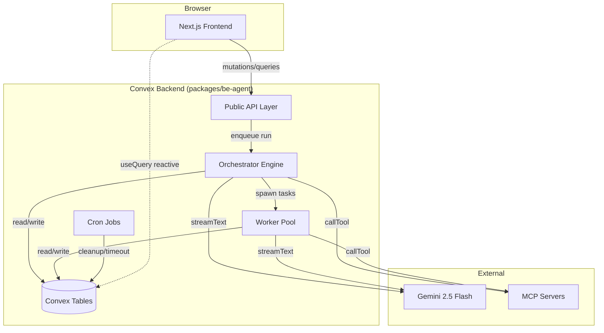
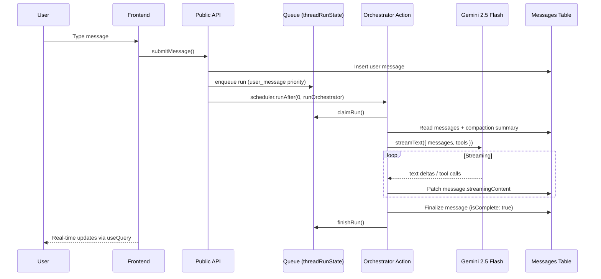

# Agent Harness Plan

A web-based agent harness inspired by oh-my-openagent (reference commit `5073efe`), implemented in the noboil monorepo with Convex, AI SDK v6, and Gemini 2.5 Flash. Runtime logic uses first-party tables and actions in `packages/be-agent`.

## #1 Priority: Real-Time Streaming

Real-time streaming is the top product requirement. Orchestrator and worker outputs stream continuously to the UI, including text deltas, tool lifecycle, reasoning parts, and background task progress.

## Motivation

The project keeps the reliability patterns that matter in oh-my-openagent (delegation, task lifecycle, continuation reminders, compaction, MCP), but implements them for web infrastructure with direct ownership of data model, auth boundaries, and deployment lifecycle.

## Table of Contents

| #   | Document                          | Description                                                               |
| --- | --------------------------------- | ------------------------------------------------------------------------- |
| 1   | [Architecture](./architecture.md) | System topology, data flows, streaming design, DIY vs component rationale |
| 2   | [Schema](./schema.md)             | Data model, ER diagram, indexes, ownership chain                          |
| 3   | [Orchestrator](./orchestrator.md) | Queue system, run lifecycle, streaming, auto-continue                     |
| 4   | [Workers](./workers.md)           | Task delegation, worker lifecycle, retry, completion chain                |
| 5   | [Tools](./tools.md)               | Tool definitions and runtime contracts                                    |
| 6   | [MCP](./mcp.md)                   | MCP integration, discovery, caching, SSRF protection                      |
| 7   | [Compaction](./compaction.md)     | Message compaction, closed-prefix grouping, lock mechanism                |
| 8   | [Frontend](./frontend.md)         | Pages, components, streaming UI, accessibility                            |
| 9   | [Auth](./auth.md)                 | Auth flow, test auth bypass, ownership enforcement                        |
| 10  | [Ops](./ops.md)                   | Crons, session retention, cleanup, monitoring                             |
| 11  | [Testing](./testing.md)           | Test architecture, matrix, and quality gates                              |
| 12  | [Infrastructure](./infra.md)      | Model/runtime config, envs, deployment, dependencies                      |
| 13  | [Phases](./phases.md)             | Delivery phases and completion status                                     |
| 14  | [References](./references.md)     | Official docs and oh-my-openagent source paths                            |

## High-Level Architecture

## Message Flow

## Capabilities

- Real-time orchestrator and worker streaming.
- Parallel sync/async/background task workflows.
- Search bridge with grounded sources.
- MCP server management and invocation.
- Todo continuation and system reminders.
- Token usage tracking and long-thread compaction.

## Explicitly Excluded

Undo, forked conversations, model switching, slash commands, file editing, code execution, and CLI-only tooling.

## Key Decisions

| Decision        | Choice                                              | Rationale                                                               |
| --------------- | --------------------------------------------------- | ----------------------------------------------------------------------- |
| Agent framework | DIY (AI SDK + own tables)                           | Full data control and portable architecture                             |
| LLM             | Gemini 2.5 Flash via Vertex AI Express              | Reliable throughput with grounding support                              |
| Streaming       | Own messages table + `streamingContent` field       | Reactive query updates without framework-managed message store           |
| Schema          | Zod via `@noboil/convex` (`ownedTable`, `makeBase`) | Matches monorepo conventions                                            |
| CRUD            | noboil `crud()` with hooks where applicable         | Ownership guardrails with reduced boilerplate                           |
| Auth            | `@convex-dev/auth` + Google OAuth                   | Standard Convex auth with deterministic test path                       |
| MCP transport   | HTTP only (StreamableHTTPClientTransport)           | Matches serverless runtime constraints                                  |
