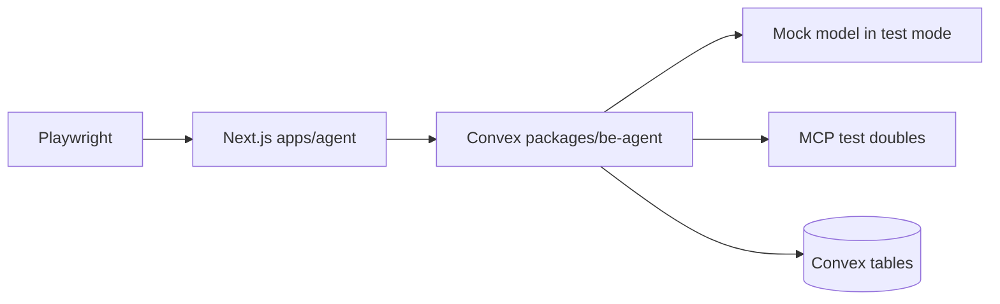
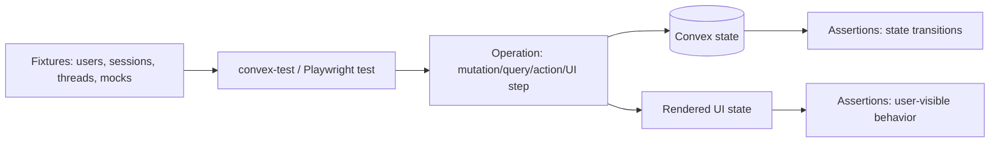
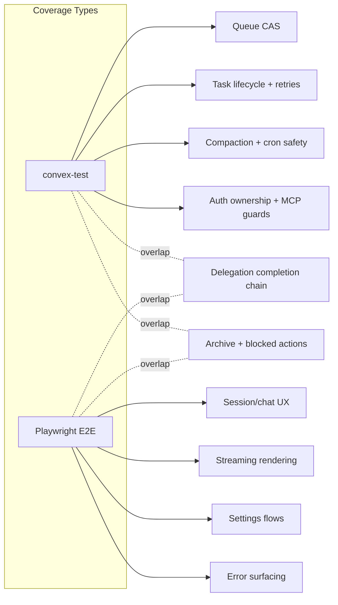

# Testing

## Philosophy

**Test-first, break-nothing, move-with-confidence.**

Every feature ships with its tests or it doesn't ship. We sacrifice development speed for absolute confidence - whenever we move forward, nothing behind us breaks.

Principles:
1. **Every mutation/query/action has a corresponding test** - no untested public surface
2. **Every state transition has a test** - state machines are the hardest things to debug when broken
3. **Every edge case flagged by Oracle reviews is a regression test** - never regress on solved issues
4. **Every error path is tested** - not just happy paths
5. **Tests are written alongside code, not after** - the test file is created in the same commit as the feature
6. **Backend tests (convex-test) cover logic; E2E tests (Playwright) cover user flows** - don't duplicate
7. **100% coverage on critical paths** - CAS transitions, ownership checks, compaction boundaries
8. **Failing test = blocked merge** - no exceptions

## Testing Layers
- `convex-test`: backend unit/integration tests for mutations, queries, actions, cron handlers, and ownership guards with mocked dependencies.
- Playwright E2E: browser-driven smoke tests against the real `apps/agent` app and live `packages/be-agent` Convex deployment in test mode.

## Test Architecture (Mermaid diagram)

## Mock Model

### Configuration per test scenario
- Default test mode: `CONVEX_TEST_MODE=true` uses `mockModel` via `getModel()`.
- Scenario override pattern: keep base mock deterministic, stub specific internal tool/action handlers (`groundWithGemini`, MCP bridge, task functions) per test.
- Validate provider shape: `specificationVersion: 'v3'`, deterministic `usage`, stable `toolCallId` format.

### Text-only responses
- `doGenerate` with no tools returns one text part and `finishReason='stop'`.
- `doStream` emits `stream-start -> text-start -> text-delta -> text-end -> finish` in order.

### Tool-call responses
- When tools are present, mock emits `tool-call` parts with schema-valid JSON input for `delegate`, `taskStatus`, `taskOutput`, `todoWrite`, `todoRead`, `webSearch`, `mcpCall`, and `mcpDiscover`.
- Assert orchestrator stores `parts` lifecycle correctly: pending then terminal (`success` or `error`).

### Multi-step responses
- Simulate text + tool-call + tool-result + final text in one turn; assert parts-only storage and `buildModelMessages` reconstruction preserve assistant/tool ordering.

### Error responses
- Simulate transient and non-transient failures from model/tool handlers.
- Assert structured error payloads, retry scheduling rules, and terminal state transitions.

## Test Auth
- Backend test auth: `signInAsTestUser` works only when `isTestMode()` is true.
- Frontend auth bypass: `NEXT_PUBLIC_CONVEX_TEST_MODE=true` allows `AuthGuard` bypass only in test mode.
- Production fuse: if `CONVEX_CLOUD_URL` indicates production and `CONVEX_TEST_MODE` is set, env validation must throw at module load.
- All public endpoints must derive identity from auth context (`getAuthUserIdOrTest`), never client-provided `userId`.

## Backend Test Matrix (convex-test)

### Queue & Concurrency

| # | Test Case | Asserts |
|---|-----------|---------|
| 1 | `ensureRunState` first writer wins under concurrent insert | Exactly one `threadRunState` row exists for thread, retried caller reads existing row |
| 2 | `enqueueRun` on idle schedules active run | `status='active'`, `activeRunToken` set, scheduler called once, queue fields cleared |
| 3 | `enqueueRun` higher priority replaces queued payload | `queuedPriority`/`queuedReason`/`queuedPromptMessageId` replaced by incoming reason |
| 4 | `enqueueRun` lower priority is rejected | Returns `{ ok:false, reason:'lower_priority' }`, queued payload unchanged |
| 5 | `enqueueRun` equal priority replaces older payload | Returns ok, queued prompt id updated to newest |
| 6 | `claimRun` consumes token once | First claim sets `runClaimed=true`; duplicate claim for same token returns `{ ok:false }` |
| 7 | `claimRun` rejects token mismatch | No state mutation when `runToken` differs from `activeRunToken` |
| 8 | `finishRun` drains queued payload to fresh token | New run scheduled with queued prompt, queue fields cleared, state remains `active` |
| 9 | `finishRun` with no queue returns idle | `activeRunToken` cleared, timers cleared, `status='idle'` |
| 10 | `finishRun` token mismatch no-op | Returns unscheduled, preserves existing active run |
| 11 | `enqueueRunIfLatest` rejects stale latest-message gate | Returns `{ ok:false, reason:'not_latest' }`, no queue/streak change |
| 12 | Prompt bound by `promptMessageId` creation time | Context query excludes newer messages (`_creationTime > prompt anchor`) |
| 13 | `enqueueRunInline` in `submitMessage` matches `enqueueRun` CAS behavior | Both paths produce identical state transitions |
| 14 | Prompt bound with `promptMessageId` excludes messages with later `_creationTime` | Query uses `_creationTime <= prompt._creationTime`, newer messages not in context |

### Task Lifecycle

| # | Test Case | Asserts |
|---|-----------|---------|
| 1 | `spawnTask` atomically creates task + worker thread + schedule | One pending task row with `retryCount=0`, unique worker `threadId`, scheduler invoked |
| 2 | `spawnTask` enforces parent session ownership | Unauthorized parent thread rejects with not found/ownership error |
| 3 | `markRunning` CAS pending->running only | Sets `startedAt` + `heartbeatAt`, rejects non-pending states |
| 4 | `markRunning` on archived session cancels task | Task patched to `status='cancelled'`, `lastError='session_archived'` |
| 5 | `updateHeartbeat` writes only for running tasks | Running task heartbeat updated; non-running unchanged |
| 6 | `completeTask` writes completion reminder + terminal fields | Parent-thread reminder message inserted, task status completed, `completionReminderMessageId` set |
| 7 | `failTask` writes failed terminal reminder | Failed task has `lastError`, reminder message prefix `[BACKGROUND TASK FAILED]` |
| 8 | `scheduleRetry` transient retry path | `running->pending`, `retryCount+1`, `pendingAt` set, backoff delay bounded by 30s |
| 9 | `scheduleRetry` archived parent session cancels | Task becomes `cancelled`, no re-schedule |
| 10 | `maybeContinueOrchestrator` enqueues only when reminder is latest | Uses `enqueueRunIfLatest`; non-latest reminder yields no enqueue |
| 11 | `completionNotifiedAt` deferred ordering | `completionNotifiedAt` set only after continuation attempt returns |
| 12 | `finalizeWorkerOutput` atomic fence | If task already `timed_out`/`cancelled`, no assistant message write and no completion transition |
| 13 | Worker heartbeat interval is 30 seconds | `updateHeartbeat` called every 30s during `runWorker` |
| 14 | Exponential backoff formula: `min(1000 * 2^retryCount, 30000)` | Retry delays: 1s, 2s, 4s (capped at 30s) |
| 15 | Max retries enforced at 3 | 4th failure transitions to `failed`, not `pending` |
| 16 | Reminder prefix `[BACKGROUND TASK COMPLETED]` for success | Exact prefix string in completion reminder |
| 17 | Reminder prefix `[BACKGROUND TASK FAILED]` for failure | Exact prefix string in failure reminder |
| 18 | Reminder prefix `[BACKGROUND TASK TIMED OUT]` for timeout | Exact prefix string in timeout reminder |
| 19 | Cancelled task emits NO reminder | `cancelled` status transition writes no parent-thread message |
| 20 | `isTransientError` correctly classifies transient vs permanent | ECONN/ETIMEDOUT/503/mcp_timeout -> transient; validation/auth -> permanent |

### Orchestrator Runtime

| # | Test Case | Asserts |
|---|-----------|---------|
| 1 | `runOrchestrator` exits when `claimRun` fails | No stream writes, no audit, no state corruption |
| 2 | Stale token guard before streaming | If active token changed, action exits and `finishRun` handles current token safely |
| 3 | Heartbeat updates while active | `heartbeatRun` updates `runHeartbeatAt` only for matching active token |
| 4 | `postTurnAuditFenced` stop path resets streak | With no incomplete todos or blocked conditions, `autoContinueStreak` reset to `0` |
| 5 | `postTurnAuditFenced` continue path writes reminder + enqueue atomically | Reminder message inserted and `enqueueRun(...todo_continuation...)` invoked in one fenced mutation |
| 6 | Auto-continue streak cap enforced | At streak `5`, enqueue returns `streak_cap`, no additional continuation queued |
| 7 | `reason='user_message'` resets streak immediately | Enqueue from user input sets `autoContinueStreak=0` even when active |
| 8 | `enqueueRun` increments streak only on accepted enqueue | Rejected lower-priority enqueue does not consume streak slot |
| 9 | `recordRunError` captures orchestrator failures | `threadRunState.lastError` updated with stringified error |
| 10 | Tool contracts: `delegate`/`taskStatus`/`taskOutput`/`todoRead`/`todoWrite`/`webSearch` | Each tool returns normalized shape; ownership-safe internal calls used |
| 11 | `todoWrite` merge-by-id semantics | Todos with `id` update in place, todos without `id` insert, omitted todos remain unchanged |
| 12 | `taskOutput` non-completed response contract | Returns `task_not_completed` with current status instead of throwing |
| 13 | `turnRequestedInput` is always false in v1 | postTurnAudit receives `false`, auto-continue can fire even when model asks a question |
| 14 | Crash gap: action dies between reminder write and continuation enqueue | Reminder persisted but no continuation - thread idle, user must resend |
| 15 | Lost-turn: active run dies without queued payload | `timeoutStaleRuns` resets to idle, user's message effectively lost |
| 16 | Mid-stream stale-run writes are not rolled back | Old run's messages visible but new run reads latest state |
| 17 | `buildModelMessages` includes parts (tool calls, results, reasoning) | Serializer produces correct CoreMessage array with separate role:tool messages |
| 18 | `buildModelMessages` includes error tool results (not just success) | Failed tool outcomes serialized so model can decide to retry |
| 19 | Context rebuild uses descending `_creationTime` + reverse for chronological | Latest 100 messages in correct temporal order |
| 20 | `recordModelUsage` maps `inputTokens`/`outputTokens` correctly | Token recording persists to `tokenUsage` table with correct field names |

### Compaction

| # | Test Case | Asserts |
|---|-----------|---------|
| 1 | Trigger by message-count threshold | `compactIfNeeded` executes when `messageCount > 200` |
| 2 | Trigger by char-count threshold | `compactIfNeeded` executes when `charCount > 100000` |
| 3 | No trigger under thresholds | Compaction path skipped and no lock acquired |
| 4 | Closed-prefix eligibility requires `isComplete=true` | Incomplete assistant message is excluded from compactable groups |
| 5 | Closed-prefix eligibility requires terminal tool parts | Any pending tool-call part blocks message eligibility |
| 6 | Cumulative carry-forward summary | New `compactionSummary` includes previous summary + newly compacted groups |
| 7 | Monotonic boundary CAS in `setCompactionSummary` | Equal/older `lastCompactedMessageId` rejected with `{ ok:false }` |
| 8 | Lock lease prevents concurrent writes | Active lock denies second acquirer until lease expires |
| 9 | Expired lease recovery | New token can acquire and proceed after lease timeout |
| 10 | Token ownership required for release/write | Wrong token cannot release lock or set summary |
| 11 | `compactionSummary` included in `getContextSize` char count | Prevents under-counting leading to deferred compaction |
| 12 | Compaction threshold: `charCount > 100_000` OR `messageCount > 200` | Both conditions trigger independently |
| 13 | Tool-pair integrity: assistant message with `tool-call` + matching `tool-result` never split | Closed-prefix grouping keeps tool pairs together |

### MCP

| # | Test Case | Asserts |
|---|-----------|---------|
| 1 | Save-time SSRF validation blocks localhost/private hosts | `validateMcpUrl` rejects loopback, metadata, `.internal`, private ranges |
| 2 | Call-time SSRF enforcement blocks resolved private IP | DNS/redirect to private target is rejected before connect |
| 3 | Name uniqueness per user | Duplicate `name` for same `userId` throws `server_name_taken` |
| 4 | Same server name allowed across different users | Per-user namespace isolation respected |
| 5 | Cache hit path returns without reconnect | Valid `cachedAt` (<5m) avoids `listTools` call |
| 6 | Cache refresh on miss/expiry | Reconnect/listTools persists new `cachedTools` and `cachedAt` |
| 7 | `mcpCallTool` retry-after-refresh on stale tool metadata | `tool_not_found` or schema mismatch triggers one refresh and one retry |
| 8 | Retry exhausted returns deterministic error payload | `{ ok:false, error, retryable }` contract returned |
| 9 | Per-call timeout wrappers enforced | connect/listTools/callTool timeout returns `mcp_*_timeout` codes |
| 10 | `authHeaders` redaction on reads | Public read omits `authHeaders`, returns `hasAuthHeaders=true/false` |
| 11 | URL/auth change invalidates cache | `beforeUpdate` clears `cachedTools` and `cachedAt` |
| 12 | Ownership resolution from worker thread | Requester thread ownership resolves via `tasks.threadId -> session` chain |
| 13 | `http:` URL with `authHeaders` blocked outside test mode | Prevents credential leak over unencrypted transport |
| 14 | MCP response validation: malformed JSON handled gracefully | Returns structured error, doesn't crash action |

### Auth & Ownership

| # | Test Case | Asserts |
|---|-----------|---------|
| 1 | `sessions.getSession` rejects cross-user access | Non-owner receives not found/unauthorized error |
| 2 | `sessions.submitMessage` enforces ownership and archive guard | Cross-user rejected; archived session returns `session_archived` |
| 3 | `messages.listMessages` ownership via session thread | Only owner can list parent-thread transcript |
| 4 | `messages.listMessages` ownership via worker-thread task chain | Owner can read worker thread; non-owner gets `thread_not_found` |
| 5 | `tasks.listTasks` requires owned session | Unowned session returns empty/reject per contract |
| 6 | `tasks.getOwnedTaskStatus` requires requester thread ownership + session match | Mismatched thread/task pair returns null |
| 7 | `todos.listTodos` requires owned session | Cross-user list denied |
| 8 | `tokenUsage.getTokenUsage` unauthorized returns zeroed counters | Returns `{ inputTokens:0, outputTokens:0, totalTokens:0 }` |
| 9 | `getAuthUserIdOrTest` test mode fallback active only in test mode | Works in test mode, returns unauthenticated in non-test mode |
| 10 | Production fuse for test auth | Env load throws when production cloud URL and `CONVEX_TEST_MODE` both set |
| 11 | Worker-thread ownership resolves via `tasks.threadId -> tasks.sessionId` | Worker messages queryable only by session owner |
| 12 | Worker-thread messages omit `sessionId` field | `sessionId` is undefined on worker messages |

### Crons & Cleanup

| # | Test Case | Asserts |
|---|-----------|---------|
| 1 | `timeoutStaleRuns` claimed-run timeout (15m) | Stale claimed run recovered: reschedule queued payload or reset idle |
| 2 | `timeoutStaleRuns` unclaimed-run timeout (5m) | Unclaimed active run recovered using `activatedAt` threshold |
| 3 | `timeoutStaleRuns` wall-clock cap (15m) despite heartbeat | Run is recovered even with fresh heartbeat when `activatedAt` exceeds cap |
| 4 | `timeoutStaleTasks` running timeout (10m) | Task becomes `timed_out` with `lastError='worker_timeout'` |
| 5 | `timeoutStaleTasks` pending never-started timeout (5m) | Task becomes `timed_out` with `lastError='worker_never_started'` |
| 6 | Timed-out task writes terminal reminder + continuation attempt | Parent reminder inserted with timed-out prefix, continuation gate invoked |
| 7 | `cleanupStaleMessages` finalizes orphaned streaming message | Copies `streamingContent` or sets fallback text, sets `isComplete=true` |
| 8 | `cleanupStaleMessages` terminalizes pending tool parts | Pending tool parts become `error` with interruption reason |
| 9 | `archiveIdleSessions` transitions and queue clearing | `active->idle` (1d), `idle->archived` (7d), archived run queue fields cleared |
| 10 | `cleanupArchivedSessions` hard-delete cascade | Deletes `tokenUsage`, `todos`, session-thread messages, worker-thread messages, `tasks`, `threadRunState`, `session` |
| 11 | Archive blocks run continuation | Archived session prevents `finishRun` re-schedule and `maybeContinueOrchestrator` enqueue |
| 12 | Manual archive from active/idle shortcut | Direct transition to `archived` with `archivedAt` set |
| 13 | Hard-delete cascade includes worker-thread messages | Messages on `tasks.threadId` also deleted |
| 14 | Hard-delete order: tokenUsage -> todos -> messages -> tasks -> threadRunState -> session | No foreign key violations from order |
| 15 | `cleanupStaleMessages` only targets messages where thread is idle | Active threads' streaming messages are not touched |

### Rate Limiting

| # | Test Case | Asserts |
|---|-----------|---------|
| 1 | `submitMessage` bucket enforces `20/min/user` | 21st request within minute is rate-limited |
| 2 | `delegation` bucket enforces `10/min/user` | Exceeding delegation calls is blocked with structured limit error |
| 3 | `searchCall` bucket enforces `30/min/user` | Exceeding web search calls is blocked |
| 4 | `mcpCall` bucket enforces `20/min/user` | Exceeding MCP calls is blocked |
| 5 | Buckets isolated by user | One user hitting limit does not affect another user |
| 6 | Internal flows exempt from limits | Auto-continue enqueue, worker heartbeat, cron transitions not rate-limited |
| 7 | Window refill behavior | Requests succeed again after bucket refill interval |
| 8 | Rate-limit storage index path valid | Reads/writes succeed using `rateLimitTables` schema wiring |
| 9 | Rate limit error includes `retryAt` timestamp | Client can show countdown to next allowed request |

### Implementation Details

| # | Test Case | Asserts |
|---|-----------|---------|
| 1 | `getModel()` returns mock in test mode | `CONVEX_TEST_MODE=true` -> mockModel instance |
| 2 | `getModel()` caches after first call | Second call returns same instance |
| 3 | `env.ts` skipValidation in test/lint mode | No throw when `CONVEX_TEST_MODE=true` or `LINT=true` |
| 4 | `env.ts` throws in production with missing keys | Missing `GOOGLE_VERTEX_API_KEY` throws at module load |
| 5 | `env.ts` production fuse: test mode + production URL | Both set -> immediate throw |
| 6 | `buildTaskCompletionReminder` output format | Contains task ID, description, and `[BACKGROUND TASK COMPLETED]` |
| 7 | `buildTaskTerminalReminder` output format | Contains error message and `[BACKGROUND TASK FAILED]` or `[TIMED OUT]` |
| 8 | `resolveOwnedSession` ownership chain | Returns session for owner, throws for non-owner |
| 9 | `resolveOwnedSessionByThread` via thread lookup | Returns session matching threadId + userId |
| 10 | `webSearch` isolated action: no tool mixing | `groundWithGemini` called in separate action context, never mixed with function tools |
| 11 | `normalizeGrounding` extracts sources correctly | Returns `{ summary, sources: [{ title, url, snippet }] }` |
| 12 | Token usage recording: session-level aggregation | Multiple turns accumulate in `tokenUsage` table |

## E2E Test Matrix (Playwright)

### Session Management

| # | Test Case | Asserts |
|---|-----------|---------|
| 1 | Test-mode login bootstrap enters app without Google OAuth | `TestLoginProvider` signs in test user and `/` loads session list |
| 2 | Create session from list view | New session card appears and navigation to `/chat/[id]` succeeds |
| 3 | Session list sorted by recent activity | Most recently messaged session appears first |
| 4 | Idle session reactivates on new message | Session status returns to active after submit |
| 5 | Archived session cannot accept new message | Composer submit shows failure state for `session_archived` |

### Chat & Streaming

| # | Test Case | Asserts |
|---|-----------|---------|
| 1 | Message submit creates immediate user row | User message appears instantly in chat log |
| 2 | Assistant streaming renders incremental text | In-progress assistant row shows `streamingContent` updates |
| 3 | Finalization switches from streaming to complete content | `isComplete` state reflected in UI and final text persists |
| 4 | Message order remains chronological | Transcript ordering stable across rerenders and refresh |
| 5 | Reasoning/tool/source parts render with correct components | `reasoning-block`, `tool-call-card`, and `source-card` visible when present |

### Tool Execution

| # | Test Case | Asserts |
|---|-----------|---------|
| 1 | Delegate tool creates background task visible in side panel | Task appears pending/running/completed with description |
| 2 | Completion reminder causes follow-up orchestrator turn | System reminder appears and assistant can continue without manual user input |
| 3 | `taskStatus` polling path displayed correctly | UI reflects running/completed transitions |
| 4 | `taskOutput` retrieval after completion works | Final worker output is accessible and rendered |
| 5 | Todo write/read loop persists across refresh | Todo states survive reload and order remains stable |
| 6 | `webSearch` shows summary + sources in chat parts | Source cards render title/url/snippet |

### Settings (MCP)

| # | Test Case | Asserts |
|---|-----------|---------|
| 1 | Add MCP server with valid URL succeeds | New server row appears in settings list |
| 2 | Duplicate server name for same user rejected | UI shows name-taken error |
| 3 | SSRF-blocked URL rejected in settings form | Blocked hostname/IP validation error shown |
| 4 | Auth headers never displayed after save | UI shows `hasAuthHeaders` indicator without raw secret |
| 5 | Update URL/auth invalidates cache and next discovery refreshes | Discovery reflects updated tool set after change |

### Error States

| # | Test Case | Asserts |
|---|-----------|---------|
| 1 | Stale/interrupted stream is repaired by janitor | Incomplete message becomes complete with interruption fallback |
| 2 | Tool failure renders explicit error status | Tool card shows `Error` state and message |
| 3 | MCP timeout error is user-visible and non-crashing | Assistant response includes structured MCP timeout payload |
| 4 | Archived-session navigation handles missing/denied resources | UI shows controlled error/redirect instead of crash |
| 5 | Rate-limit exceeded path surfaces actionable feedback | User sees throttling message and can retry later |

### Accessibility (E2E)

| # | Test Case | Asserts |
|---|-----------|---------|
| 1 | Chat transcript has `role="log"` | Chat container has correct ARIA role |
| 2 | Streaming output has `aria-live="polite"` | Assistive tech announces new content |
| 3 | Reasoning/tool expand controls are native `<button>` | Keyboard accessible, no div-as-button |
| 4 | Focus returns to composer after message submit | `document.activeElement` is the composer input |
| 5 | Status indicators never rely on color alone | Icons/text accompany all colored states |
| 6 | Interactive cards meet 44x44px hit target | Touch targets are accessible size |

## Edge Case Tests (from Oracle reviews)

| # | Edge Case | Test |
|---|-----------|------|
| 1 | Same-ms `_creationTime` ordering | Insert rapid messages and assert ordering-sensitive logic (`latest`, compaction boundary, prompt bound) uses DB `_creationTime` total order without duplicate-processing |
| 2 | Stale run writes after `consumeStream` | Simulate token swap during stream; assert stale guard prevents post-stream audit/final writes from stale token |
| 3 | Worker timeout fencing (`timed_out` task must not write) | Mark task timed out before finalization; `finalizeWorkerOutput` no-ops and writes no assistant message |
| 4 | Failed task terminal reminder | `failTask` inserts `[BACKGROUND TASK FAILED]` reminder and sets `completionReminderMessageId` |
| 5 | Compaction on incomplete message rejected | `listClosedPrefixGroups` excludes `isComplete=false` rows even without pending tool parts |
| 6 | MCP SSRF with private IP | Call-time resolution to private IP (or redirect) is blocked |
| 7 | Test auth in production mode must fail | Env bootstrap throws with production cloud URL + `CONVEX_TEST_MODE` |
| 8 | Auto-continue streak cap | At streak 5, further auto-continue enqueue returns `streak_cap` and does not schedule |
| 9 | Concurrent enqueue + streak reset | Race user message enqueue (reset) with auto-continue enqueue; final streak and queue state remain valid and deterministic |
| 10 | Archive blocks new messages | `submitMessage` on archived session rejects and no message row is inserted |
| 11 | Cancelled task no auto-reminder | `cancelled` transition writes no terminal reminder and triggers no continuation |
| 12 | `cleanupStaleMessages` terminalizes tool parts | Pending tool-call parts become `error` with interruption reason, enabling compaction |

## Test Data Flow (Mermaid diagram)

## Test Scripts & Execution

- Backend tests: run `convex-test` suites in `packages/be-agent` with deterministic mock model and stubs for MCP/search bridges.
- E2E tests: run Playwright against `apps/agent` with backend test deployment and test auth flags.
- Keep API type tests out of scope here (compiler/typecheck already covers those contracts).

Execution progression (monorepo strategy: isolate -> verify -> expand):

1. Isolate one failing test: `timeout 10 bun with-env playwright test -g "test name" --timeout=5000`
2. Verify same test again: `timeout 10 bun with-env playwright test -g "test name" --timeout=5000`
3. Expand to one file: `timeout 30 bun with-env playwright test path/to/file.test.ts --timeout=8000`
4. Expand to related files: `timeout 60 bun with-env playwright test file1.test.ts file2.test.ts --timeout=8000`
5. Full suite only when explicitly requested: `bun test:e2e -- --workers=1 --timeout=10000 --reporter=dot`

## Coverage Targets
- Backend (`convex-test`): >=90% line coverage on queue/task/orchestrator/compaction/MCP/auth modules; 100% coverage for critical CAS transitions (`enqueueRun`, `claimRun`, `finishRun`, `finalizeWorkerOutput`).
- E2E (Playwright smoke): cover all user-critical journeys (login bypass, session lifecycle, chat streaming, delegation/task completion, MCP settings CRUD, archived/error/rate-limit states).
- Edge-case suite: every Oracle-flagged issue has at least one explicit automated regression test.

