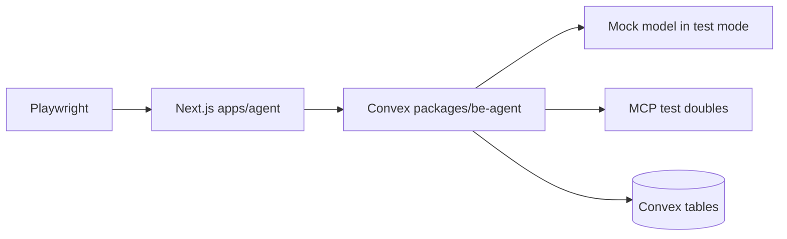
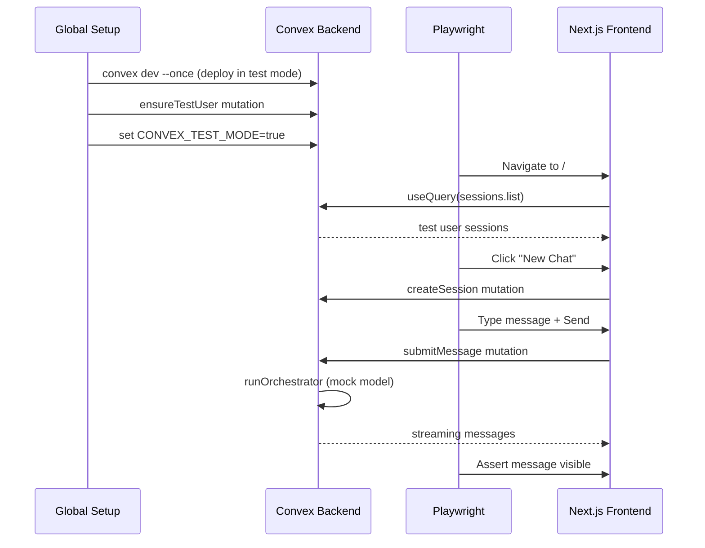
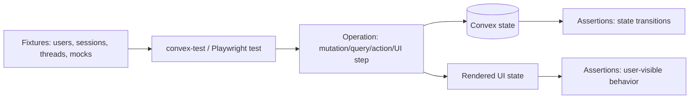
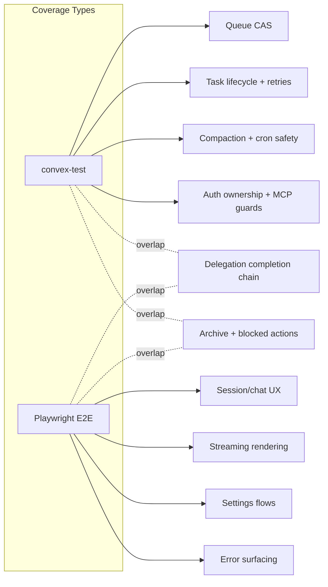

# Testing

## Philosophy

**Test-first, break-nothing, move-with-confidence.**

Every feature ships with its tests or it doesn’t ship. We sacrifice development speed for absolute confidence - whenever we move forward, nothing behind us breaks.

Principles:

1. **Every mutation/query/action has a corresponding test** - no untested public surface
2. **Every state transition has a test** - state machines are the hardest things to debug when broken
3. **Every edge case flagged by Oracle reviews is a regression test** - never regress on solved issues
4. **Every error path is tested** - not just happy paths
5. **Tests are written alongside code, not after** - the test file is created in the same commit as the feature
6. **Backend tests (convex-test) cover logic; E2E tests (Playwright) cover user flows** - don’t duplicate
7. **100% coverage on critical paths** - CAS transitions, ownership checks, compaction boundaries
8. **Failing test = blocked merge** - no exceptions

## Testing Layers

- `convex-test`: backend unit/integration tests for mutations, queries, actions, cron handlers, and ownership guards with mocked dependencies.
- Playwright E2E: browser-driven smoke tests against the real `apps/agent` app and live `packages/be-agent` Convex deployment in test mode.

## Test Architecture (Mermaid diagram)



## Action Testing Strategy

`convex-test` fully supports action testing via `t.action()`:

- `ctx.runMutation`, `ctx.runQuery`, `ctx.runAction` all work inside action handlers
- `ctx.scheduler.runAfter`/`runAt` work with `vi.useFakeTimers()` + `t.finishAllScheduledFunctions(vi.runAllTimers)`
- External HTTP calls (AI SDK) are mocked via `vi.stubGlobal("fetch", ...)`
- AI SDK provides `MockLanguageModelV3` and `simulateReadableStream` from `ai/test` for testing streaming

### Action test pattern

```typescript
test('runOrchestrator streams and finalizes', async () => {
  vi.useFakeTimers()
  const t = convexTest(schema, modules)
  // seed session + thread + user message
  // trigger action
  await t.action(internal.orchestrator_node.runOrchestrator, { runToken, threadId })
  vi.runAllTimers()
  await t.finishAllScheduledFunctions(vi.runAllTimers)
  // assert message finalized, parts populated, threadRunState back to idle
  vi.useRealTimers()
})
```

### Extract-handler pattern for unit testing action logic

For complex action logic (streaming, error classification), export the handler separately:

```typescript
const runOrchestratorHandler = async (ctx, args) => { ... }
const runOrchestrator = internalAction({ handler: runOrchestratorHandler })
export { runOrchestratorHandler }
```

Then test the handler directly:

```typescript
await t.action(async (ctx) => runOrchestratorHandler(ctx, { ... }))
```

## Mock Model

### Configuration per test scenario

- Default test mode: `CONVEX_TEST_MODE=true` uses `mockModel` via `getModel()`.
- Scenario override pattern: keep base mock deterministic, stub specific internal tool/action handlers (`groundWithGemini`, MCP bridge, task functions) per test.
- Validate provider shape: `specificationVersion: 'v3'`, deterministic `usage`, stable `toolCallId` format.

### AI SDK Test Mocks

The `ai/test` package provides `MockLanguageModelV3` and `simulateReadableStream` for deterministic testing. Use these instead of our custom `mockModel` for convex-test action tests:

```typescript
import { MockLanguageModelV3, simulateReadableStream } from 'ai/test'

const testModel = new MockLanguageModelV3({
  doStream: async () => ({
    stream: simulateReadableStream({
      chunks: [
        { type: 'text-start', id: 'text-0' },
        { type: 'text-delta', id: 'text-0', delta: 'Hello' },
        { type: 'text-end', id: 'text-0' },
        { type: 'finish', finishReason: { unified: 'stop', raw: undefined }, usage: { inputTokens: { total: 5 }, outputTokens: { total: 10 } } }
      ]
    })
  })
})
```

The custom `mockModel` in `models.mock.ts` is still used for production test mode (`CONVEX_TEST_MODE=true`). `MockLanguageModelV3` is used in convex-test unit tests for fine-grained scenario control.

### Text-only responses

- `doGenerate` with no tools returns one text part and `finishReason='stop'`.
- `doStream` emits `stream-start -> text-start -> text-delta -> text-end -> finish` in order.

### Tool-call responses

- When tools are present, mock emits `tool-call` parts with schema-valid JSON input for `delegate`, `taskStatus`, `taskOutput`, `todoWrite`, `todoRead`, `webSearch`, `mcpCall`, and `mcpDiscover`.
- Assert orchestrator stores `parts` lifecycle correctly: pending then terminal (`success` or `error`).

### Multi-step responses

- Simulate text + tool-call + tool-result + final text in one turn; assert parts-only storage and `buildModelMessages` reconstruction preserve assistant/tool ordering.

### Error responses

- Simulate transient and non-transient failures from model/tool handlers.
- Assert structured error payloads, retry scheduling rules, and terminal state transitions.

## Test Auth

- Backend test auth: `signInAsTestUser` works only when `isTestMode()` is true.
- Frontend auth bypass: `NEXT_PUBLIC_CONVEX_TEST_MODE=true` allows `AuthGuard` bypass only in test mode.
- Production fuse: if `CONVEX_CLOUD_URL` indicates production and `CONVEX_TEST_MODE` is set, env validation must throw at module load.
- All public endpoints must derive identity from auth context (`getAuthUserIdOrTest`), never client-provided `userId`.

## Backend Test Matrix (convex-test)

### Queue & Concurrency

| #   | Test Case                                                                        | Asserts                                                                                   |
| --- | -------------------------------------------------------------------------------- | ----------------------------------------------------------------------------------------- |
| 1   | `ensureRunState` first writer wins under concurrent insert                       | Exactly one `threadRunState` row exists for thread, retried caller reads existing row     |
| 2   | `enqueueRun` on idle schedules active run                                        | `status='active'`, `activeRunToken` set, scheduler called once, queue fields cleared      |
| 3   | `enqueueRun` higher priority replaces queued payload                             | `queuedPriority`/`queuedReason`/`queuedPromptMessageId` replaced by incoming reason       |
| 4   | `enqueueRun` lower priority is rejected                                          | Returns `{ ok:false, reason:'lower_priority' }`, queued payload unchanged                 |
| 5   | `enqueueRun` equal priority replaces older payload                               | Returns ok, queued prompt id updated to newest                                            |
| 6   | `claimRun` consumes token once                                                   | First claim sets `runClaimed=true`; duplicate claim for same token returns `{ ok:false }` |
| 7   | `claimRun` rejects token mismatch                                                | No state mutation when `runToken` differs from `activeRunToken`                           |
| 8   | `finishRun` drains queued payload to fresh token                                 | New run scheduled with queued prompt, queue fields cleared, state remains `active`        |
| 9   | `finishRun` with no queue returns idle                                           | `activeRunToken` cleared, timers cleared, `status='idle'`                                 |
| 10  | `finishRun` token mismatch no-op                                                 | Returns unscheduled, preserves existing active run                                        |
| 11  | `enqueueRunIfLatest` rejects stale latest-message gate                           | Returns `{ ok:false, reason:'not_latest' }`, no queue/streak change                       |
| 12  | Prompt bound by `promptMessageId` creation time                                  | Context query excludes newer messages (`_creationTime > prompt anchor`)                   |
| 13  | `enqueueRunInline` in `submitMessage` matches `enqueueRun` CAS behavior          | Both paths produce identical state transitions                                            |
| 14  | Prompt bound with `promptMessageId` excludes messages with later `_creationTime` | Query uses `_creationTime <= prompt._creationTime`, newer messages not in context         |
| 15  | `submitMessage` atomic rollback on enqueue failure                               | If inline enqueue fails, no user message or session patch commits                         |
| 16 | `createAssistantMessage` creates empty streaming message | Role=assistant, isComplete=false, empty content/parts, streamingContent='' |
| 17 | `patchStreamingMessage` updates streaming content | streamingContent patched, no-op if isComplete=true |
| 18 | `finalizeMessage` transitions to complete | isComplete=true, content set, streamingContent cleared, parts persisted |
| 19 | `appendStepMetadata` concatenates metadata | Multiple calls accumulate, no-op on missing message |
| 20 | `recordRunError` persists error to threadRunState | lastError field set, overwrites previous error |
| 21 | `readRunState` returns state or null | Correct state for existing thread, null for non-existent |
| 22 | `readSessionByThread` resolves session via threadId | Correct session, null for orphaned thread |
| 23 | `listMessagesForPrompt` bounds by promptMessageId | Only messages with _creationTime <= prompt included, latest 100, chronological |
| 24 | `postTurnAuditFenced` suppressed by higher-priority queue | Incomplete todos + already-queued user_message → no todo_continuation enqueued, streak reset |
| 25 | `listMessagesForPrompt` wrong-thread prompt rejected | promptMessageId from thread A with threadId B returns empty array |

### Task Lifecycle

| #   | Test Case                                                         | Asserts                                                                                           |
| --- | ----------------------------------------------------------------- | ------------------------------------------------------------------------------------------------- |
| 1   | `spawnTask` atomically creates task + worker thread + schedule    | One pending task row with `retryCount=0`, unique worker `threadId`, scheduler invoked             |
| 2   | `spawnTask` enforces parent session ownership                     | Unauthorized parent thread rejects with not found/ownership error                                 |
| 3   | `markRunning` CAS pending->running only                           | Sets `startedAt` + `heartbeatAt`, rejects non-pending states                                      |
| 4   | `markRunning` on archived session cancels task                    | Task patched to `status='cancelled'`, `lastError='session_archived'`                              |
| 5   | `updateHeartbeat` writes only for running tasks                   | Running task heartbeat updated; non-running unchanged                                             |
| 6   | `completeTask` writes completion reminder + terminal fields       | Parent-thread reminder message inserted, task status completed, `completionReminderMessageId` set |
| 7   | `failTask` writes failed terminal reminder                        | Failed task has `lastError`, reminder message prefix `[BACKGROUND TASK FAILED]`                   |
| 8   | `scheduleRetry` transient retry path                              | `running->pending`, `retryCount+1`, `pendingAt` set, backoff delay bounded by 30s                 |
| 9   | `scheduleRetry` archived parent session cancels                   | Task becomes `cancelled`, no re-schedule                                                          |
| 10  | `maybeContinueOrchestrator` enqueues only when reminder is latest | Uses `enqueueRunIfLatest`; non-latest reminder yields no enqueue                                  |
| 11  | `completionNotifiedAt` deferred ordering                          | `completionNotifiedAt` set only after continuation attempt returns                                |
| 12  | `finalizeWorkerOutput` atomic fence                               | If task already `timed_out`/`cancelled`, no assistant message write and no completion transition  |
| 13  | Worker heartbeat interval is 30 seconds                           | `updateHeartbeat` called every 30s during `runWorker`                                             |
| 14  | Exponential backoff formula: `min(1000 * 2^retryCount, 30000)`    | Retry delays: 1s, 2s, 4s (capped at 30s)                                                          |
| 15  | Max retries enforced at 3                                         | 4th failure transitions to `failed`, not `pending`                                                |
| 16  | Reminder prefix `[BACKGROUND TASK COMPLETED]` for success         | Exact prefix string in completion reminder                                                        |
| 17  | Reminder prefix `[BACKGROUND TASK FAILED]` for failure            | Exact prefix string in failure reminder                                                           |
| 18  | Reminder prefix `[BACKGROUND TASK TIMED OUT]` for timeout         | Exact prefix string in timeout reminder                                                           |
| 19  | Cancelled task emits NO reminder                                  | `cancelled` status transition writes no parent-thread message                                     |
| 20  | `isTransientError` correctly classifies transient vs permanent    | ECONN/ETIMEDOUT/503/mcp_timeout -> transient; validation/auth -> permanent                        |
| 21  | `runWorker` exits when `markRunning` returns `{ ok: false }`      | No model call, no message write, no state transition                                              |
| 22  | `runWorker` clears heartbeat loop in `finally` block              | `updateHeartbeat` stops after both success and failure exits                                      |
| 23  | `completeTask` CAS rejects non-`running` tasks                    | Returns `{ ok: false }`, writes no reminder for already-completed/cancelled                       |
| 24  | `finalizeWorkerOutput` success-path atomicity                     | Running task gets exactly one assistant message + `completed` in single mutation                  |
| 25  | `postTurnAuditFenced` task-wait stop branch                       | Incomplete todos + pending/running task → stop auto-continue, reset streak, no reminder           |
| 26  | `failTask` rejects non-running task | Task not in running status → { ok: false }, no reminder |

### Orchestrator Runtime

| #   | Test Case                                                                               | Asserts                                                                                            |
| --- | --------------------------------------------------------------------------------------- | -------------------------------------------------------------------------------------------------- |
| 1   | `runOrchestrator` exits when `claimRun` fails                                           | No stream writes, no audit, no state corruption                                                    |
| 2   | Stale token guard before streaming                                                      | If active token changed, action exits and `finishRun` handles current token safely                 |
| 3   | Heartbeat updates while active                                                          | `heartbeatRun` updates `runHeartbeatAt` only for matching active token                             |
| 4   | `postTurnAuditFenced` stop path resets streak                                           | With no incomplete todos or blocked conditions, `autoContinueStreak` reset to `0`                  |
| 5   | `postTurnAuditFenced` continue path writes reminder + enqueue atomically                | Reminder message inserted and `enqueueRun(...todo_continuation...)` invoked in one fenced mutation |
| 6   | Auto-continue streak cap enforced                                                       | At streak `5`, enqueue returns `streak_cap`, no additional continuation queued                     |
| 7   | `reason='user_message'` resets streak immediately                                       | Enqueue from user input sets `autoContinueStreak=0` even when active                               |
| 8   | `enqueueRun` increments streak only on accepted enqueue                                 | Rejected lower-priority enqueue does not consume streak slot                                       |
| 9   | `recordRunError` captures orchestrator failures                                         | `threadRunState.lastError` updated with stringified error                                          |
| 10  | Tool contracts: `delegate`/`taskStatus`/`taskOutput`/`todoRead`/`todoWrite`/`webSearch` | Each tool returns normalized shape; ownership-safe internal calls used                             |
| 11  | `todoWrite` merge-by-id semantics                                                       | Todos with `id` update in place, todos without `id` insert, omitted todos remain unchanged         |
| 12  | `taskOutput` non-completed response contract                                            | Returns `task_not_completed` with current status instead of throwing                               |
| 13  | `turnRequestedInput` is always false in v1                                              | postTurnAudit receives `false`, auto-continue can fire even when model asks a question             |
| 14  | Crash gap: action dies between reminder write and continuation enqueue                  | Reminder persisted but no continuation - thread idle, user must resend                             |
| 15  | Lost-turn: active run dies without queued payload                                       | `timeoutStaleRuns` resets to idle, user’s message effectively lost                                 |
| 16  | Mid-stream stale-run writes are not rolled back                                         | Old run’s messages visible but new run reads latest state                                          |
| 17  | `buildModelMessages` includes parts (tool calls, results, reasoning)                    | Serializer produces correct CoreMessage array with separate role:tool messages                     |
| 18  | `buildModelMessages` includes error tool results (not just success)                     | Failed tool outcomes serialized so model can decide to retry                                       |
| 19  | Context rebuild uses descending `_creationTime` + reverse for chronological             | Latest 100 messages in correct temporal order                                                      |
| 20  | `recordModelUsage` maps `inputTokens`/`outputTokens` correctly                          | Token recording persists to `tokenUsage` table with correct field names                            |
| 21  | `postTurnAuditFenced` no-op on stale `runToken`                                         | Mismatched token: no streak change, no reminder, no enqueue                                        |
| 22  | `runOrchestrator` always calls `finishRun` on error                                     | Error recorded, thread not left stuck `active`                                                     |
| 23  | Compaction summary injected as system prefix in same turn                               | After compaction, `streamText` receives `compactionSummary` + live tail                            |
| 24  | Compaction resumes after `lastCompactedMessageId` boundary                              | Only messages after boundary and before unresolved segment are summarized                          |

### Compaction

| #   | Test Case                                                                                    | Asserts                                                                                 |
| --- | -------------------------------------------------------------------------------------------- | --------------------------------------------------------------------------------------- |
| 1   | Trigger by message-count threshold                                                           | `compactIfNeeded` executes when `messageCount > 200`                                    |
| 2   | Trigger by char-count threshold                                                              | `compactIfNeeded` executes when `charCount > 100000`                                    |
| 3   | No trigger under thresholds                                                                  | Compaction path skipped and no lock acquired                                            |
| 4   | Closed-prefix eligibility requires `isComplete=true`                                         | Incomplete assistant message is excluded from compactable groups                        |
| 5   | Closed-prefix eligibility requires terminal tool parts                                       | Any pending tool-call part blocks message eligibility                                   |
| 6   | Cumulative carry-forward summary                                                             | New `compactionSummary` includes previous summary + newly compacted groups              |
| 7   | Monotonic boundary CAS in `setCompactionSummary`                                             | Equal/older `lastCompactedMessageId` rejected with `{ ok:false }`                       |
| 8   | Lock lease prevents concurrent writes                                                        | Active lock denies second acquirer until lease expires                                  |
| 9   | Expired lease recovery                                                                       | New token can acquire and proceed after lease timeout                                   |
| 10  | Token ownership required for release/write                                                   | Wrong token cannot release lock or set summary                                          |
| 11  | `compactionSummary` included in `getContextSize` char count                                  | Prevents under-counting leading to deferred compaction                                  |
| 12  | Compaction threshold: `charCount > 100_000` OR `messageCount > 200`                          | Both conditions trigger independently                                                   |
| 13  | Tool-pair integrity: assistant message with `tool-call` + matching `tool-result` never split | Closed-prefix grouping keeps tool pairs together                                        |
| 14  | Compaction resumes from boundary, skips already-compacted                                    | Only new messages after `lastCompactedMessageId` are summarized                         |
| 15  | Compaction 500-msg scan-window miss (v1 limitation regression)                               | Thread with >500 messages may miss older uncovered messages - assert no crash, note gap |
| 16 | `acquireCompactionLock` first acquirer succeeds | Returns { ok: true, lockToken }, second attempt returns { ok: false } |
| 17 | `acquireCompactionLock` expired lock is recoverable | Lock older than 10min can be re-acquired |
| 18 | `setCompactionSummary` validates lock token | Wrong token returns { ok: false }, correct token persists summary |
| 19 | `setCompactionSummary` enforces monotonic boundary | New boundary must have later _creationTime than stored boundary |
| 20 | `listClosedPrefixGroups` only includes complete messages | isComplete=false excluded, pending tool parts excluded |
| 21 | `compactIfNeeded` no-op under threshold | charCount < 100k AND messageCount < 200 → no lock acquired |
| 22 | `getContextSize` includes compactionSummary length | Summary chars added to total charCount |
| 23 | `compactIfNeeded` exits on no closed groups | Threshold exceeded but no complete message groups → no summary written |
| 24 | `compactIfNeeded` exits on placeholder (no summarization action) | Lock acquired, groups found, but summarization is placeholder → logs event only |

### MCP

| #   | Test Case                                                                 | Asserts                                                                               |
| --- | ------------------------------------------------------------------------- | ------------------------------------------------------------------------------------- |
| 1   | Save-time SSRF validation blocks localhost/private hosts                  | `validateMcpUrl` rejects loopback, metadata, `.internal`, private ranges              |
| 2   | Call-time SSRF enforcement blocks resolved private IP                     | DNS/redirect to private target is rejected before connect                             |
| 3   | Name uniqueness per user                                                  | Duplicate `name` for same `userId` throws `server_name_taken`                         |
| 4   | Same server name allowed across different users                           | Per-user namespace isolation respected                                                |
| 5   | Cache hit path returns without reconnect                                  | Valid `cachedAt` (<5m) avoids `listTools` call                                        |
| 6   | Cache refresh on miss/expiry                                              | Reconnect/listTools persists new `cachedTools` and `cachedAt`                         |
| 7   | `mcpCallTool` retry-after-refresh on stale tool metadata                  | `tool_not_found` or schema mismatch triggers one refresh and one retry                |
| 8   | Retry exhausted returns deterministic error payload                       | `{ ok:false, error, retryable }` contract returned                                    |
| 9   | Per-call timeout wrappers enforced                                        | connect/listTools/callTool timeout returns `mcp_*_timeout` codes                      |
| 10  | `authHeaders` redaction on reads                                          | Public read omits `authHeaders`, returns `hasAuthHeaders=true/false`                  |
| 11  | URL/auth change invalidates cache                                         | `beforeUpdate` clears `cachedTools` and `cachedAt`                                    |
| 12  | Ownership resolution from worker thread                                   | Requester thread ownership resolves via `tasks.threadId -> session` chain             |
| 13  | `http:` URL with `authHeaders` blocked outside test mode                  | Prevents credential leak over unencrypted transport                                   |
| 14  | MCP response validation: malformed JSON handled gracefully                | Returns structured error, doesn’t crash action                                        |
| 15  | `mcpDiscover` returns flattened tools from enabled servers only           | Disabled servers excluded, failed servers appear in `errors` list, discovery succeeds |
| 16  | `mcpCallTool` happy-path returns `{ ok: true, content }` for owned server | Uses caller’s server config, never crosses to another user’s same-named server        |
| 17  | Non-HTTP(S) protocol rejected (`ftp:`, `file:`)                           | Create/update with non-HTTP protocol fails with `invalid_url_protocol`                |
| 18  | Workers cannot re-delegate or manage todos                                | Worker tool map excludes `delegate`, `todoRead`, `todoWrite`                          |
| 19  | `webSearch` records token usage through search bridge                     | `tokenUsage` row written with correct thread/session attribution                      |
| 20  | `mcpCallTool` rejects invalid `toolArgs` JSON                             | Returns structured parse error, no crash                                              |
| 21  | `mcpCallTool` handles invalid persisted `authHeaders` JSON                | Returns structured error, doesn’t send malformed headers                              |

### Auth & Ownership

| #   | Test Case                                                                      | Asserts                                                                   |
| --- | ------------------------------------------------------------------------------ | ------------------------------------------------------------------------- |
| 1   | `sessions.getSession` rejects cross-user access                                | Non-owner receives not found/unauthorized error                           |
| 2   | `sessions.submitMessage` enforces ownership and archive guard                  | Cross-user rejected; archived session returns `session_archived`          |
| 3   | `messages.listMessages` ownership via session thread                           | Only owner can list parent-thread transcript                              |
| 4   | `messages.listMessages` ownership via worker-thread task chain                 | Owner can read worker thread; non-owner gets `thread_not_found`           |
| 5   | `tasks.listTasks` requires owned session                                       | Unowned session returns empty/reject per contract                         |
| 6   | `tasks.getOwnedTaskStatus` requires requester thread ownership + session match | Mismatched thread/task pair returns null                                  |
| 7   | `todos.listTodos` requires owned session                                       | Cross-user list denied                                                    |
| 8   | `tokenUsage.getTokenUsage` unauthorized returns zeroed counters                | Returns `{ inputTokens:0, outputTokens:0, totalTokens:0 }`                |
| 9   | `getAuthUserIdOrTest` test mode fallback active only in test mode              | Works in test mode, returns unauthenticated in non-test mode              |
| 10  | Production fuse for test auth                                                  | Env load throws when production cloud URL and `CONVEX_TEST_MODE` both set |
| 11  | Worker-thread ownership resolves via `tasks.threadId -> tasks.sessionId`       | Worker messages queryable only by session owner                           |
| 12  | Worker-thread messages omit `sessionId` field                                  | `sessionId` is undefined on worker messages                               |
| 13  | `signInAsTestUser` is idempotent (no duplicate users)                          | Two calls return same user ID, single user row exists                     |
| 14  | `sessions.createSession` stamps auth-derived ownership + threadId              | Session has authenticated `userId` and unique non-empty `threadId`        |
| 15  | `sessions.list` returns only caller’s non-archived sessions                    | Excludes other users’ and archived sessions                               |
| 16  | `archiveSession` enforces ownership + clears queued work                       | Non-owner rejected; owner sets `archived`, clears queue fields            |
| 17  | `getRunState` ownership check                                                  | Owner gets run state; non-owner gets `null`                               |
| 18  | MCP CRUD cross-user isolation                                                  | List only caller’s servers; update/delete others’ -> not found            |
| 19  | Parent-thread messages include `sessionId`; worker-thread messages omit it     | Verified across both contexts                                             |
| 20 | `createTestUser` creates deterministic test user | User row created with test email, idempotent on repeat call |
| 21 | `ensureTestUser` returns existing or creates new | First call creates, second returns same ID |
| 22 | `signInAsTestUser` rejected outside test mode | Throws `test_mode_only` when `CONVEX_TEST_MODE` is unset |
| 23 | `listSessions` returns ONLY caller's sessions | User A cannot see User B's sessions, even with direct ID |
| 24 | `createSession` stamps auth-derived userId only | No client-provided userId accepted |
| 25 | MCP `addMcpServer` ownership isolation | User A's server not visible to User B |
| 26 | MCP `updateMcpServer` non-owner rejected | User B cannot update User A's server |
| 27 | MCP `deleteMcpServer` non-owner rejected | User B cannot delete User A's server |
| 28 | MCP `listMcpServers` cross-user isolation | User A only sees own servers |
| 29 | Unauthenticated call to any public endpoint rejected | Non-test-mode call without auth throws |

### Crons & Cleanup

| #   | Test Case                                                                                | Asserts                                                                                                              |
| --- | ---------------------------------------------------------------------------------------- | -------------------------------------------------------------------------------------------------------------------- |
| 1   | `timeoutStaleRuns` claimed-run timeout (15m)                                             | Stale claimed run recovered: reschedule queued payload or reset idle                                                 |
| 2   | `timeoutStaleRuns` unclaimed-run timeout (5m)                                            | Unclaimed active run recovered using `activatedAt` threshold                                                         |
| 3   | `timeoutStaleRuns` wall-clock cap (15m) despite heartbeat                                | Run is recovered even with fresh heartbeat when `activatedAt` exceeds cap                                            |
| 4   | `timeoutStaleTasks` running timeout (10m)                                                | Task becomes `timed_out` with `lastError='worker_timeout'`                                                           |
| 5   | `timeoutStaleTasks` pending never-started timeout (5m)                                   | Task becomes `timed_out` with `lastError='worker_never_started'`                                                     |
| 6   | Timed-out task writes terminal reminder + continuation attempt                           | Parent reminder inserted with timed-out prefix, continuation gate invoked                                            |
| 7   | `cleanupStaleMessages` finalizes orphaned streaming message                              | Copies `streamingContent` or sets fallback text, sets `isComplete=true`                                              |
| 8   | `cleanupStaleMessages` terminalizes pending tool parts                                   | Pending tool parts become `error` with interruption reason                                                           |
| 9   | `archiveIdleSessions` transitions and queue clearing                                     | `active->idle` (1d), `idle->archived` (7d), archived run queue fields cleared                                        |
| 10  | `cleanupArchivedSessions` hard-delete cascade                                            | Deletes `tokenUsage`, `todos`, session-thread messages, worker-thread messages, `tasks`, `threadRunState`, `session` |
| 11  | Archive blocks run continuation                                                          | Archived session prevents `finishRun` re-schedule and `maybeContinueOrchestrator` enqueue                            |
| 12  | Manual archive from active/idle shortcut                                                 | Direct transition to `archived` with `archivedAt` set                                                                |
| 13  | Hard-delete cascade includes worker-thread messages                                      | Messages on `tasks.threadId` also deleted                                                                            |
| 14  | Hard-delete order: tokenUsage -> todos -> messages -> tasks -> threadRunState -> session | No foreign key violations from order                                                                                 |
| 15  | `cleanupStaleMessages` only targets messages where thread is idle                        | Active threads’ streaming messages are not touched                                                                   |
| 16 | Stale-message age gate: messages <5min not touched                                       | Idle-thread incomplete messages newer than 5 min unchanged                                        |
| 17 | 180-day hard-delete respects retention boundary                                          | Sessions archived <180 days survive; older deleted with cascade                                   |
| 18 | Cron schedule wiring matches documented intervals                                        | 5min for stale tasks/runs/messages, 1hr for archive, daily 03:00 for cleanup                     |
| 19 | `cleanupArchivedSessions` batch cap at 10 | Seed 15 expired sessions, one run deletes only 10, second run deletes 5 |

### Rate Limiting

| #   | Test Case                                     | Asserts                                                                    |
| --- | --------------------------------------------- | -------------------------------------------------------------------------- |
| 1   | `submitMessage` bucket enforces `20/min/user` | 21st request within minute is rate-limited                                 |
| 2   | `delegation` bucket enforces `10/min/user`    | Exceeding delegation calls is blocked with structured limit error          |
| 3   | `searchCall` bucket enforces `30/min/user`    | Exceeding web search calls is blocked                                      |
| 4   | `mcpCall` bucket enforces `20/min/user`       | Exceeding MCP calls is blocked                                             |
| 5   | Buckets isolated by user                      | One user hitting limit does not affect another user                        |
| 6   | Internal flows exempt from limits             | Auto-continue enqueue, worker heartbeat, cron transitions not rate-limited |
| 7   | Window refill behavior                        | Requests succeed again after bucket refill interval                        |
| 8   | Rate-limit storage index path valid           | Reads/writes succeed using `rateLimitTables` schema wiring                 |
| 9   | Rate limit error includes `retryAt` timestamp | Client can show countdown to next allowed request                          |

### Implementation Details

| #   | Test Case                                                                    | Asserts                                                                               |
| --- | ---------------------------------------------------------------------------- | ------------------------------------------------------------------------------------- |
| 1   | `getModel()` returns mock in test mode                                       | `CONVEX_TEST_MODE=true` -> mockModel instance                                         |
| 2   | `getModel()` caches after first call                                         | Second call returns same instance                                                     |
| 3   | `env.ts` skipValidation in test/lint mode                                    | No throw when `CONVEX_TEST_MODE=true` or `LINT=true`                                  |
| 4   | `env.ts` throws in production with missing keys                              | Missing `GOOGLE_VERTEX_API_KEY` throws at module load                                 |
| 5   | `env.ts` production fuse: test mode + production URL                         | Both set -> immediate throw                                                           |
| 6   | `buildTaskCompletionReminder` output format                                  | Contains task ID, description, and `[BACKGROUND TASK COMPLETED]`                      |
| 7   | `buildTaskTerminalReminder` output format                                    | Contains error message and `[BACKGROUND TASK FAILED]` or `[TIMED OUT]`                |
| 8   | `resolveOwnedSession` ownership chain                                        | Returns session for owner, throws for non-owner                                       |
| 9   | `resolveOwnedSessionByThread` via thread lookup                              | Returns session matching threadId + userId                                            |
| 10  | `webSearch` isolated action: no tool mixing                                  | `groundWithGemini` called in separate action context, never mixed with function tools |
| 11  | `normalizeGrounding` extracts sources correctly                              | Returns `{ summary, sources: [{ title, url, snippet }] }`                             |
| 12  | Token usage recording: session-level aggregation                             | Multiple turns accumulate in `tokenUsage` table                                       |
| 13  | Mock model no-tool `doGenerate` returns text + `stop`                        | One text part, `finishReason='stop'`                                                  |
| 14  | Mock model `doStream` emits correct v3 triplet                               | `stream-start -> text-start -> text-delta -> text-end -> finish` in order             |
| 15  | Mock model tool-enabled `doGenerate` returns `tool-call` part                | Schema-valid JSON input matching tool’s inputSchema                                   |
| 16  | `env.ts` rejects each missing required var individually                      | Missing `AUTH_SECRET`, `AUTH_GOOGLE_ID`, etc. each throw                              |
| 17 | `CI=true` alone does NOT bypass env validation                               | All required vars still validated under CI                                            |
| 18 | `buildModelMessages` excludes `source` parts from model input                | Source parts preserved for UI but not in CoreMessage array sent to model              |
| 19 | Worker messages persist `parts` (tool calls, reasoning) same as orchestrator | Worker-thread messages viewable in task panel with full structured parts              |
| 20 | `buildTodoReminder` output format | Contains `[TODO CONTINUATION]`, lists incomplete todos with status/priority/content |

### Tool Factories

| # | Test Case | Asserts |
|---|-----------|---------|
| 1 | `createOrchestratorTools` returns all 6 tools | delegate, taskStatus, taskOutput, todoRead, todoWrite, webSearch keys present |
| 2 | `createWorkerTools` returns only webSearch | No delegate, todoRead, todoWrite, taskStatus, taskOutput |
| 3 | delegate tool calls spawnTask | Task created with correct sessionId/parentThreadId |
| 4 | todoWrite tool calls syncOwned | Todos upserted correctly |
| 5 | todoRead tool returns session todos | Returns array from listTodos |
| 6 | taskStatus tool returns task status | Correct status/description for owned task |
| 7 | taskOutput tool returns result | Completed task's result returned |
| 8 | `createOrchestratorTools` includes mcpCall and mcpDiscover | All 8 orchestrator tools present (delegate, taskStatus, taskOutput, todoWrite, todoRead, webSearch, mcpCall, mcpDiscover) |

### Worker Action (convex-test)

| # | Test Case | Asserts |
|---|-----------|---------|
| 1 | `runWorker` claims task via markRunning | Task transitions pending→running |
| 2 | `runWorker` exits on claim failure | No model call, no message write for already-running task |
| 3 | `runWorker` generates text and completes task | Assistant message created, task status=completed with result |
| 4 | `runWorker` schedules retry on transient error | retryCount incremented, status back to pending |
| 5 | `runWorker` fails on permanent error | status=failed, lastError set |
| 6 | `runWorker` clears heartbeat in finally | No lingering interval after success or error |
| 7 | `isTransientError` classifies correctly | ECONN/ETIMEDOUT/503/mcp_timeout → transient; validation/auth → permanent |

### Orchestrator Action (convex-test)

| # | Test Case | Asserts |
|---|-----------|---------|
| 1 | `runOrchestrator` claims, streams, finalizes, finishes | Full flow: claimRun → createAssistantMessage → stream → finalizeMessage → postTurnAudit → finishRun |
| 2 | `runOrchestrator` exits on claim failure | No model call, finishRun still called in finally |
| 3 | `runOrchestrator` exits on stale token mid-stream | isStale() detected → no postTurnAudit, finishRun called |
| 4 | `runOrchestrator` records error on model failure | recordRunError called, finishRun called in finally |
| 5 | `runOrchestrator` heartbeat runs during execution | heartbeatRun called at interval, cleared in finally |

### Integration & Lifecycle (convex-test)

| #   | Test Case                                                                                                                 | Asserts                                                                                                       |
| --- | ------------------------------------------------------------------------------------------------------------------------- | ------------------------------------------------------------------------------------------------------------- |
| 1   | Full delegation chain: submit -> orchestrator -> delegate -> worker -> complete -> reminder -> continuation -> taskOutput | Consistent state across `messages`, `tasks`, `threadRunState`, `tokenUsage`; orchestrator reads worker result |
| 2   | Full lifecycle with compaction: many turns -> worker -> auto-continue -> compaction -> next turn                          | `compactionSummary` + live tail preserve tool outcomes and worker reminders                                   |
| 3   | Worker crash-gap regression: reminder persisted, no continuation queued                                                   | Thread stays idle, later user message doesn’t create duplicate continuation                                   |
| 4   | Archived-in-flight regression: archive during active run                                                                  | Current turn finishes but `finishRun`/`maybeContinueOrchestrator` don’t schedule further                      |
| 5   | Terminal-error propagation: worker failed -> reminder -> continuation -> parent state                                     | Exactly one reminder, no lingering pending/running, task panel agrees                                         |
| 6   | Equal-priority task-completion burst burns streak cap (v1 limitation)                                                     | Burst of completions increments streak correctly, cap enforced, no infinite loop                              |
| 7   | Retry-caused duplicate side effects (v1 limitation)                                                                       | Duplicate tool execution noted but no terminal-state corruption                                               |
| 8   | Complex text->tool->text->tool serialization (v1 limitation)                                                              | `buildModelMessages` preserves all content even if mid-turn boundaries degrade                                |
| 9   | Non-blocking conversation: user sends message while background task running                                               | User gets normal response; task continues independently; no queue deadlock                                    |
| 10  | Production auth smoke: login → OAuth → protected routes → sign-out → redirect                                             | Full auth lifecycle works (test-mode skipped)                                                                 |
| 11  | Full MCP E2E: add server in settings → trigger discover in chat → call tool → result renders                              | Complete product path from config to tool usage                                                               |
| 12  | Worker output only available after completion, not live-streamed (v1 limitation)                                          | No streaming content visible during worker execution; result appears via taskOutput only                      |
| 13 | Full retention lifecycle in one test | Create session → make active → wait 24h → archiveIdleSessions → wait 7d → archiveIdleSessions → wait 180d → cleanupArchivedSessions → verify zero rows in ALL tables |
| 14 | Full compaction pipeline in one test | Insert 250 messages → compactIfNeeded triggers → lock acquired → groups built → summary set → next getContextSize includes summary → second compaction cumulative |
| 15 | Worker retry prompt duplication regression | Worker retries do not create duplicate prompt entries in worker thread |
| 16 | Archived-in-flight worker writes completion reminder but no continuation | Worker completes into archived session thread; reminder persisted, maybeContinueOrchestrator skips |
| 17 | Duplicate notification retry fencing | Re-running notification path after partial failure does not emit second reminder or enqueue second continuation |
| 18 | Post-operation orphan row assertions | After cleanupArchivedSessions: zero messages, tasks, todos, tokenUsage, threadRunState for deleted session |
| 19 | Production model smoke (non-mock) | One test with real Vertex model verifies streaming + finalization (skipped in CI, manual gate) |
| 20 | WebKit/mobile viewport smoke | One Playwright test on WebKit verifying core chat flow on 375px viewport (run before release) |

### Test Infrastructure Notes

**Timer mocks**: The project uses `bun:test`, not Vitest. Timer mocking in bun:test uses the same `vi.useFakeTimers()` API (bun:test is Vitest-compatible). However, verify that `t.finishAllScheduledFunctions(vi.runAllTimers)` works correctly with bun's timer implementation. If not, use `setTimeout` polling as a fallback.

**Model cache isolation**: `getModel()` in `ai.ts` caches the model in a module-level variable. Between tests, this cache must be reset to prevent test pollution. Add `beforeEach(() => { resetModelCache() })` or restructure `getModel` to accept an injectable model for testing.

**TestLoginProvider alignment**: The current `test-login-provider.tsx` is a no-op (always renders children). The plan references `signInAsTestUser` which is not exported from `testauth.ts`. For E2E: test auth works entirely backend-side via `getAuthUserIdOrTest` — the frontend provider just needs to exist. Update plan to match: TestLoginProvider is intentionally a pass-through; test auth is backend-only.

**MCP CRUD test pattern**: MCP operations go through noboil `crud()` with hooks. Tests should verify both the happy path (owner CRUD succeeds) AND the cross-user isolation (non-owner operations return not_found/empty).

## E2E Infrastructure

### File Structure

```
apps/agent/
├── playwright.config.ts        # createPlaywrightConfig({ port: 3010 })
├── e2e/
│   ├── global-setup.ts         # re-export from @a/e2e + agent-specific setup
│   ├── global-teardown.ts      # re-export from @a/e2e
│   ├── fixtures.ts             # extend base test with page objects
│   ├── helpers.ts              # re-export login from @a/e2e/helpers
│   ├── pages/
│   │   ├── session-list.ts     # page object: session list (/)
│   │   ├── chat.ts             # page object: chat page (/chat/[id])
│   │   └── settings.ts         # page object: settings (/settings)
│   ├── session.test.ts         # Session Management tests
│   ├── chat.test.ts            # Chat & Streaming tests
│   ├── tools.test.ts           # Tool Execution tests
│   ├── settings.test.ts        # Settings (MCP) tests
│   ├── error.test.ts           # Error States tests
│   ├── a11y.test.ts            # Accessibility tests
│   └── frontend-states.test.ts # Frontend States tests
```

### Playwright Config

Uses shared `createPlaywrightConfig` from `@a/e2e/playwright-config`:

```typescript
import { createPlaywrightConfig } from '@a/e2e/playwright-config'
export default createPlaywrightConfig({ port: 3010 })
```

This provides:
- Web server: `next dev --turbo --port 3010` with `CONVEX_TEST_MODE=true` and `PLAYWRIGHT=1`
- Chromium only, workers: 1 (serial), retries: 2
- Global setup/teardown for test user + cleanup
- Test results in `./test-results/`

### Global Setup (agent-specific)

The shared `@a/e2e/global-setup` sets `CONVEX_TEST_MODE` on the Convex backend and ensures the test user exists. The agent app needs to customize it to target `packages/be-agent` instead of `packages/be-convex`:

```typescript
/** biome-ignore-all lint/style/noProcessEnv: env detection */
import { ConvexHttpClient } from 'convex/browser'
import { anyApi } from 'convex/server'
import type { FunctionReference } from 'convex/server'
import { execSync } from 'node:child_process'

const globalSetup = async () => {
  execSync('bun with-env convex env set CONVEX_TEST_MODE true', {
    cwd: '../../packages/be-agent',
    stdio: 'pipe'
  })
  const convexUrl = process.env.NEXT_PUBLIC_CONVEX_URL ?? 'http://127.0.0.1:3212'
  const client = new ConvexHttpClient(convexUrl)
  await client.mutation(
    anyApi.testauth.ensureTestUser as FunctionReference<'mutation'>,
    {}
  )
}

export default globalSetup
```

### Pre-E2E Deployment

Before running E2E tests, the backend must be deployed in test mode:

```bash
CONVEX_TEST_MODE=true bun --cwd packages/be-agent with-env convex dev --once
```

This is handled by the test script in `apps/agent/package.json`:

```json
{
  "test:e2e": "NEXT_PUBLIC_CONVEX_TEST_MODE=true CONVEX_TEST_MODE=true bun --cwd ../../packages/be-agent with-env convex dev --once && bun with-env playwright test --reporter=list"
}
```

### Page Objects

Page objects encapsulate locators and actions for each page. Pattern from existing `@a/e2e/base-page`:

```typescript
import BasePage from '@a/e2e/base-page'

class ChatPage extends BasePage {
  getComposer = () => this.page.getByRole('textbox', { name: /message/i })
  getSendButton = () => this.page.getByRole('button', { name: /send/i })
  getMessageLog = () => this.page.getByRole('log')
  getMessages = () => this.page.locator('article')
  getStreamingIndicator = () => this.page.locator('[data-streaming="true"]')
  getToolCards = () => this.page.locator('details').filter({ has: this.page.locator('summary') })
  
  sendMessage = async (content: string) => {
    await this.getComposer().fill(content)
    await this.getSendButton().click()
  }
}
```

### Fixtures

```typescript
import { test as baseTest, expect } from '@a/e2e/base-test'
import ChatPage from './pages/chat'
import SessionListPage from './pages/session-list'
import SettingsPage from './pages/settings'

interface Fixtures {
  chatPage: ChatPage
  sessionListPage: SessionListPage
  settingsPage: SettingsPage
}

const test = baseTest.extend<Fixtures>({
  chatPage: async ({ page }, run) => { await run(new ChatPage(page)) },
  sessionListPage: async ({ page }, run) => { await run(new SessionListPage(page)) },
  settingsPage: async ({ page }, run) => { await run(new SettingsPage(page)) }
})

export { expect, test }
```

### Mock Model Behavior in E2E

In E2E mode (`CONVEX_TEST_MODE=true`), the backend uses `mockModel` which:
- Returns deterministic text responses for text-only queries
- Returns schema-valid tool calls when tools are available
- Returns tool-call parts that get resolved by actual tool handlers (which execute real Convex mutations)

This means E2E tests exercise the FULL pipeline: frontend → Convex mutation → orchestrator action → mock model → tool execution → message persistence → reactive query → frontend renders. The only mock is the LLM itself.

### Test Data Seeding

E2E tests create their own sessions and messages via the UI or via direct Convex mutations using `ConvexHttpClient`:

```typescript
import { ConvexHttpClient } from 'convex/browser'
import { anyApi } from 'convex/server'

const seedSession = async (client: ConvexHttpClient) =>
  client.mutation(anyApi.sessions.createSession as FunctionReference<'mutation'>, { title: 'E2E Test' })
```

Global teardown cleans up test data by querying all test-user-owned sessions and deleting them.



## E2E Prerequisites (UI components required before E2E tests)

The following UI components must be implemented before their dependent E2E tests can pass:

| Component | Location | Dependent E2E Tests |
|---|---|---|
| Task panel (side panel) | `chat/[id]/page.tsx` | Tool Execution #1-4, Frontend States #9 |
| Token usage panel | `chat/[id]/page.tsx` | Frontend States #9 |
| Typing indicator | `chat/[id]/page.tsx` | Frontend States #16 |
| Todo read/write UI | `chat/[id]/page.tsx` | Tool Execution #5 |
| MCP server form (add/edit) | `settings/page.tsx` | Settings #1-5 |
| MCP server list | `settings/page.tsx` | Settings #1-5 |
| MCP server delete | `settings/page.tsx` | Frontend States #10 |
| MCP URL validation errors | `settings/page.tsx` | Settings #3 |
| MCP auth headers indicator | `settings/page.tsx` | Settings #4 |
| Timestamp display on messages | `chat/[id]/page.tsx` | Frontend States #5 |

These components are Phase 6 (Polish) deliverables. E2E tests for these features cannot pass until the UI is implemented.

## E2E Test Matrix (Playwright)

### Session Management

| #   | Test Case                                                 | Asserts                                                           |
| --- | --------------------------------------------------------- | ----------------------------------------------------------------- |
| 1   | Test-mode login bootstrap enters app without Google OAuth | `TestLoginProvider` signs in test user and `/` loads session list |
| 2   | Create session from list view                             | New session card appears and navigation to `/chat/[id]` succeeds  |
| 3   | Session list sorted by recent activity                    | Most recently messaged session appears first                      |
| 4   | Idle session reactivates on new message                   | Session status returns to active after submit                     |
| 5   | Archived session cannot accept new message                | Composer submit shows failure state for `session_archived`        |

### Chat & Streaming

| #   | Test Case                                                  | Asserts                                                                     |
| --- | ---------------------------------------------------------- | --------------------------------------------------------------------------- |
| 1   | Message submit creates immediate user row                  | User message appears instantly in chat log                                  |
| 2   | Assistant streaming renders incremental text               | In-progress assistant row shows `streamingContent` updates                  |
| 3   | Finalization switches from streaming to complete content   | `isComplete` state reflected in UI and final text persists                  |
| 4   | Message order remains chronological                        | Transcript ordering stable across rerenders and refresh                     |
| 5   | Reasoning/tool/source parts render with correct components | `reasoning-block`, `tool-call-card`, and `source-card` visible when present |

### Tool Execution

| #   | Test Case                                                   | Asserts                                                                      |
| --- | ----------------------------------------------------------- | ---------------------------------------------------------------------------- |
| 1   | Delegate tool creates background task visible in side panel | Task appears pending/running/completed with description                      |
| 2   | Completion reminder causes follow-up orchestrator turn      | System reminder appears and assistant can continue without manual user input |
| 3   | `taskStatus` polling path displayed correctly               | UI reflects running/completed transitions                                    |
| 4   | `taskOutput` retrieval after completion works               | Final worker output is accessible and rendered                               |
| 5   | Todo write/read loop persists across refresh                | Todo states survive reload and order remains stable                          |
| 6   | `webSearch` shows summary + sources in chat parts           | Source cards render title/url/snippet                                        |

### Settings (MCP)

| #   | Test Case                                                      | Asserts                                                |
| --- | -------------------------------------------------------------- | ------------------------------------------------------ |
| 1   | Add MCP server with valid URL succeeds                         | New server row appears in settings list                |
| 2   | Duplicate server name for same user rejected                   | UI shows name-taken error                              |
| 3   | SSRF-blocked URL rejected in settings form                     | Blocked hostname/IP validation error shown             |
| 4   | Auth headers never displayed after save                        | UI shows `hasAuthHeaders` indicator without raw secret |
| 5   | Update URL/auth invalidates cache and next discovery refreshes | Discovery reflects updated tool set after change       |

### Error States

| #   | Test Case                                                    | Asserts                                                        |
| --- | ------------------------------------------------------------ | -------------------------------------------------------------- |
| 1   | Stale/interrupted stream is repaired by janitor              | Incomplete message becomes complete with interruption fallback |
| 2   | Tool failure renders explicit error status                   | Tool card shows `Error` state and message                      |
| 3   | MCP timeout error is user-visible and non-crashing           | Assistant response includes structured MCP timeout payload     |
| 4   | Archived-session navigation handles missing/denied resources | UI shows controlled error/redirect instead of crash            |
| 5   | Rate-limit exceeded path surfaces actionable feedback        | User sees throttling message and can retry later               |

### Accessibility (E2E)

| #   | Test Case                                            | Asserts                                        |
| --- | ---------------------------------------------------- | ---------------------------------------------- |
| 1   | Chat transcript has `role="log"`                     | Chat container has correct ARIA role           |
| 2   | Streaming output has `aria-live="polite"`            | Assistive tech announces new content           |
| 3   | Reasoning/tool expand controls are native `<button>` | Keyboard accessible, no div-as-button          |
| 4   | Focus returns to composer after message submit       | `document.activeElement` is the composer input |
| 5   | Status indicators never rely on color alone          | Icons/text accompany all colored states        |
| 6   | Interactive cards meet 44x44px hit target            | Touch targets are accessible size              |
| 7 | `html` element has `lang="en"` attribute | Root HTML tag has correct language |
| 8 | Source card links have `rel="noopener noreferrer"` | External links don't leak referrer |

### Frontend States (E2E)

| #   | Test Case                                                             | Asserts                                                                      |
| --- | --------------------------------------------------------------------- | ---------------------------------------------------------------------------- |
| 1   | Session list loading/empty/error states                               | Loading placeholder shown, empty state for new user, error UI on API failure |
| 2   | Auth routing: unauthenticated -> `/login` redirect                    | `/`, `/chat/[id]`, `/settings` all redirect when not authenticated           |
| 3   | Auth routing: authenticated -> `/login` redirects to `/`              | Logged-in user on login page goes to session list                            |
| 4   | Chat-log scrollable with long conversation                            | Earlier messages reachable, composer stays visible                           |
| 5   | Message-row metadata (role, timestamp)                                | Each row shows role indicator and relative timestamp                         |
| 6   | Incremental structured parts appear during streaming                  | Reasoning/tool/source parts show on in-flight assistant message              |
| 7   | Tool-call-card details (name, inputs, outputs, status labels)         | Tool name, Running/Completed/Error labels, expandable args/results           |
| 8   | Source-card link opens new tab                                        | `target="_blank"`, chat page stays intact                                    |
| 9   | Token-usage panel renders and increments                              | Totals render, increase after activity, persist after reload                 |
| 10  | MCP server delete removes from list and discovery                     | Deleted server gone from settings and future tool calls                      |
| 11  | Keyboard toggle for reasoning/tool expand                             | Enter/Space toggles expand/collapse                                          |
| 12  | Visible focus indicator on expandable controls                        | Focus ring visible when tabbed                                               |
| 13  | Focus returns to composer after modal/drawer close                    | `document.activeElement` is composer after close                             |
| 14  | Contrast meets WCAG AA on desktop and mobile                          | Interactive elements pass contrast check                                     |
| 15  | `/login` Google OAuth handoff in non-test mode                        | Clicking sign-in initiates Google OAuth flow                                 |
| 16  | `getRunState`-driven typing indicator on chat page                    | Activity indicator visible while orchestrator active, hidden when idle       |
| 17  | No file upload/attachment UI exposed in v1                            | Composer has no upload button; paste-file has no effect                      |
| 18  | Responsive viewport: chat usable on mobile (375px) and tablet (768px) | Core chat, settings, session list functional across breakpoints              |
| 19 | Session row click navigates to chat | Clicking session card in list navigates to /chat/[id] |
| 20 | Settings back link returns to session list | Clicking "Sessions" link on settings page navigates to / |
| 21 | Settings placeholder text visible | "MCP Servers" heading and placeholder text rendered |
| 22 | Chat loading states (session + messages) | Loading text shown while session/messages queries pending |
| 23 | Chat empty state shows "No messages yet" | Empty thread shows placeholder text |
| 24 | Blank/whitespace submit is no-op | Empty or whitespace-only input does not create message |
| 25 | Composer disabled during send | Input and button disabled while submitMessage in flight |
| 26 | Input clears after successful send | Draft reset to empty string after message sent |
| 27 | Auto-scroll to latest message | New message scrolls chat log to bottom |
| 28 | Header links (Sessions, Settings) navigate correctly | Both nav links work from chat page |
| 29 | `createSession` bootstraps threadRunState | New session has exactly one idle threadRunState row for its threadId |

## Integration & Lifecycle

| #   | Edge Case                                                | Test                                                                                                                                                                     |
| --- | -------------------------------------------------------- | ------------------------------------------------------------------------------------------------------------------------------------------------------------------------ |
| 1   | Same-ms `_creationTime` ordering                         | Insert rapid messages and assert ordering-sensitive logic (`latest`, compaction boundary, prompt bound) uses DB `_creationTime` total order without duplicate-processing |
| 2   | Stale run writes after `consumeStream`                   | Simulate token swap during stream; assert stale guard prevents post-stream audit/final writes from stale token                                                           |
| 3   | Worker timeout fencing (`timed_out` task must not write) | Mark task timed out before finalization; `finalizeWorkerOutput` no-ops and writes no assistant message                                                                   |
| 4   | Failed task terminal reminder                            | `failTask` inserts `[BACKGROUND TASK FAILED]` reminder and sets `completionReminderMessageId`                                                                            |
| 5   | Compaction on incomplete message rejected                | `listClosedPrefixGroups` excludes `isComplete=false` rows even without pending tool parts                                                                                |
| 6   | MCP SSRF with private IP                                 | Call-time resolution to private IP (or redirect) is blocked                                                                                                              |
| 7   | Test auth in production mode must fail                   | Env bootstrap throws with production cloud URL + `CONVEX_TEST_MODE`                                                                                                      |
| 8   | Auto-continue streak cap                                 | At streak 5, further auto-continue enqueue returns `streak_cap` and does not schedule                                                                                    |
| 9   | Concurrent enqueue + streak reset                        | Race user message enqueue (reset) with auto-continue enqueue; final streak and queue state remain valid and deterministic                                                |
| 10  | Archive blocks new messages                              | `submitMessage` on archived session rejects and no message row is inserted                                                                                               |
| 11  | Cancelled task no auto-reminder                          | `cancelled` transition writes no terminal reminder and triggers no continuation                                                                                          |
| 12  | `cleanupStaleMessages` terminalizes tool parts           | Pending tool-call parts become `error` with interruption reason, enabling compaction                                                                                     |

## Test Data Flow (Mermaid diagram)



## Test Count Summary

| Layer | Tests | Pass | Skip | Fail |
|---|---|---|---|---|
| Backend `f.test.ts` | 458 | 458 | 0 | 0 |
| Backend `prod-smoke.test.ts` | 1 | 1 | 0 | 0 |
| E2E Playwright | 75 | 75 | 0 | 0 |
| **Total** | **534** | **534** | **0** | **0** |

### oh-my-openagent Parity Tests

67 tests adapted from oh-my-openagent's battle-tested test suite (1,173 relevant tests across 93 files). These cover the core reliability behaviors that make the agent production-grade:

| Source File | Tests Adapted | Coverage |
|---|---|---|
| `features/background-agent/manager.test.ts` (120) | 15 | Task cancellation, cleanup, retry, timeout, multi-session |
| `tools/delegate-task/tools.test.ts` (112) | 12 | Invalid args guidance, sync/async flow, metadata, failure |
| `hooks/todo-continuation-enforcer/*.test.ts` (91) | 18 | Cooldown, backoff, failure cap, stagnation, progress reset |
| `features/background-agent/error-classifier.test.ts` (65) | 10 | Transient/permanent/rate-limit error classification |
| `features/background-agent/concurrency.test.ts` (37) | 12 | CAS queue, priority matrix, slot release, per-thread isolation |
| `hooks/session-recovery/*.test.ts` (41) | 8 | Stale run recovery, error recording, run state cleanup |
| `features/background-agent/fallback-retry-handler.test.ts` (19) | 6 | Retry with cooldown, backoff interactions |
| `features/background-agent/task-poller.test.ts` (20) | 5 | Active task listing, audit snapshot |
| `hooks/session-recovery/detect-error-type.test.ts` (17) | 5 | Transient error marker assertions |
| `tools/task/todo-sync.test.ts` (22) | 7 | Missing session, deleted ID, ordering, duplicates |
| `tools/task/types.test.ts` (32) | 6 | Schema validation for task/todo/threadRunState |
| `features/background-agent/session-idle-event-handler.test.ts` (13) | 7 | Idle fencing, queued priority, snapshot cases |
| `tools/task/task-create.test.ts` (15) | 4 | spawnTask creation, defaults, state |
| `tools/task/task-update.test.ts` (14) | 4 | completeTask/failTask transitions, reject paths |
| `tools/task/task-get.test.ts` (9) | 4 | getOwnedTaskStatus ownership, missing, deleted |
| `tools/task/task-list.test.ts` (8) | 4 | listTasks status inclusion, ownership gating |
| `features/background-agent/task-history.test.ts` (12) | 4 | Lifecycle retention, cleanup cascade |
| `features/background-agent/cancel-task-cleanup.test.ts` (3) | 4 | Archive-driven task/queue cancellation |
| `features/background-agent/task-completion-cleanup.test.ts` (3) | 4 | Reminder + continuation stamping |
| `hooks/stop-continuation-guard/index.test.ts` (10) | 4 | Streak cap, archive/input/task blocking |
| `hooks/delegate-task-english-directive/index.test.ts` (8) | 4 | Delegate schema/error guidance |
| `hooks/tasks-todowrite-disabler/index.test.ts` (7) | 4 | Worker tool restrictions |
| `hooks/compaction-context-injector/index.test.ts` (9) | 4 | Compaction summary/boundary behavior |
| `tools/background-task/tools.test.ts` (17) | 4 | delegate/taskStatus/taskOutput contracts |

### Stagnation Detection

| # | Test Case | Asserts |
|---|-----------|---------|
| 1 | Stagnation increments when todos unchanged | stagnationCount increases after continuation with same snapshot |
| 2 | Stagnation resets on todo progress | Completed todo -> stagnationCount back to 0 |
| 3 | Stagnation stops auto-continue at cap (3) | At count 3, postTurnAudit returns shouldContinue=false |
| 4 | Progress via completed count increase | More completed todos -> progress detected, reset |
| 5 | Progress via snapshot change | Todo content/status change -> progress, reset |
| 6 | First cycle has no stagnation | No previous snapshot -> stagnationCount stays 0 |

### Continuation Cooldown

| # | Test Case | Asserts |
|---|-----------|---------|
| 1 | Cooldown blocks rapid continuation | Within cooldown window -> skip |
| 2 | Cooldown uses exponential backoff | Delay doubles with each failure |
| 3 | Max consecutive failures stops continuation | At 5 failures -> stop entirely |
| 4 | Failure reset after 5-minute window | After 5min -> consecutiveFailures reset to 0 |
| 5 | Success resets consecutive failures | Successful continuation -> reset to 0 |

### Compaction Todo Preservation

| # | Test Case | Asserts |
|---|-----------|---------|
| 1 | Snapshot captures todos before compaction | todos stored in snapshot |
| 2 | Restore when todos missing after compaction | snapshot restored to DB |
| 3 | Skip restore when todos still present | snapshot discarded |
| 4 | Empty snapshot not saved | No todos -> no snapshot |

### Task Reminder

| # | Test Case | Asserts |
|---|-----------|---------|
| 1 | Counter increments on non-task tool | turnsSinceTaskTool increases |
| 2 | Counter resets on task tool usage | taskStatus/taskOutput -> counter 0 |
| 3 | Reminder injected at threshold (10) | At 10 -> system message added |
| 4 | Counter resets after injection | After reminder -> counter 0 |

### Delegate Retry Guidance

| # | Test Case | Asserts |
|---|-----------|---------|
| 1 | Detect missing_load_skills pattern | Error output contains fix hint |
| 2 | Detect unknown_category pattern | Error output lists available categories |
| 3 | Unknown error returns generic guidance | No pattern match -> generic retry message |
| 4 | Extract available list from error | Available options extracted and included |

### Real-World Scenario Tests

| # | Test Case | Type | Asserts |
|---|-----------|------|---------|
| 1 | Multi-turn conversation | E2E | Send message → response → follow-up → multi-turn history preserved |
| 2 | Multi-session isolation | E2E | 3 sessions → messages stay in correct sessions when navigating between |
| 3 | Rapid message sending | E2E | 3 messages quickly → correct order, no duplicates |
| 4 | Session archival flow | E2E | Create → archive → verify removed from list |
| 5 | Settings persistence across navigation | E2E | Add MCP server → navigate to chat → back to settings → server still there |
| 6 | Browser refresh persistence | E2E | Send message → refresh → messages still visible |
| 7 | Empty state first-chat flow | E2E | New user → empty list → create first chat → list shows it |
| 8 | Error display | E2E | Trigger error → verify shown to user |
| 9 | Long message rendering | E2E | 500+ char message → renders without layout break |
| 10 | Concurrent tab reactive updates | E2E | Open same session in two tabs → both see same messages |
| 11 | Message sent while orchestrator responding | Backend | Queue accepts second message, doesn't interrupt active run |
| 12 | Orphaned streaming message cleanup | Backend | `cleanupStaleMessages` finalizes after 5min |
| 13 | Same session in two browser tabs | E2E | Both tabs see same messages via reactive query |
| 14 | Session with many messages renders | E2E | Chat page loads, scrolls, latest messages visible |
| 15 | Message to cron-archived session race | Backend | `submitMessage` rejects with `session_archived` |
| 16 | Back/forward browser navigation | E2E | Chat page restores messages after back/forward |
| 17 | Rapid MCP server create/delete | E2E | Final state consistent, no orphaned servers |
| 18 | Empty model response | Backend | Empty assistant message persists without crash |
| 19 | Heartbeat keeps long-running run alive | Backend | Run with fresh heartbeat NOT timed out |
| 20 | Reactive updates after page idle | E2E | Mutations work after 5s idle period |
| 21 | Text selection in chat log | E2E | User can select message text (user-select not none) |
| 22 | Special characters in content | Backend | HTML entities, unicode, emoji, markdown preserved exactly |

## Test Scripts & Execution

- Backend tests: run `convex-test` suites in `packages/be-agent` with deterministic mock model and stubs for MCP/search bridges.
- E2E tests: run Playwright against `apps/agent` with backend test deployment and test auth flags.
- Keep API type tests out of scope here (compiler/typecheck already covers those contracts).

Execution progression (monorepo strategy: isolate -> verify -> expand):

1. Isolate one failing test: `timeout 10 bun with-env playwright test -g "test name" --timeout=5000`
2. Verify same test again: `timeout 10 bun with-env playwright test -g "test name" --timeout=5000`
3. Expand to one file: `timeout 30 bun with-env playwright test path/to/file.test.ts --timeout=8000`
4. Expand to related files: `timeout 60 bun with-env playwright test file1.test.ts file2.test.ts --timeout=8000`
5. Full suite only when explicitly requested: `bun test:e2e -- --workers=1 --timeout=10000 --reporter=dot`

## Coverage Targets

- Backend (`convex-test`): >=90% line coverage on queue/task/orchestrator/compaction/MCP/auth modules; 100% coverage for critical CAS transitions (`enqueueRun`, `claimRun`, `finishRun`, `finalizeWorkerOutput`).
- E2E (Playwright smoke): cover all user-critical journeys (login bypass, session lifecycle, chat streaming, delegation/task completion, MCP settings CRUD, archived/error/rate-limit states).
- Edge-case suite: every Oracle-flagged issue has at least one explicit automated regression test.


