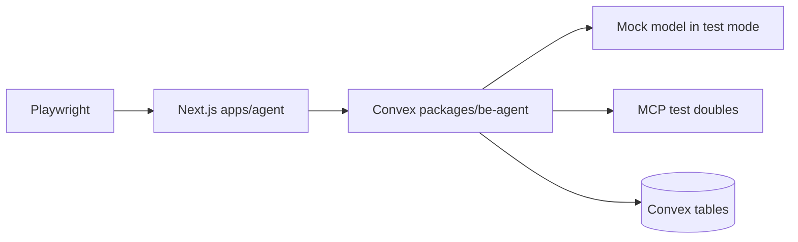

# Testing

## Philosophy

Test-first, break-nothing, move-with-confidence. Every feature ships with its tests or it doesn’t ship.

## Test Count

| Layer                 | Tests   | Pass    |
| --------------------- | ------- | ------- |
| Backend (convex-test) | 858     | 858     |
| Production smoke      | 1       | 1       |
| E2E (Playwright)      | 75      | 75      |
| **Total**             | **934** | **934** |

## E2E Infrastructure

Playwright coverage is organized as product-level browser tests around `apps/agent`, with shared E2E support code separated into reusable test infrastructure layers.

- Test files are grouped by feature flows (session list, chat runtime, settings/MCP, and error/accessibility paths) so failures map directly to user workflows.
- Playwright configuration defines the agent app target, test-mode environment wiring, and browser/project settings used across local and CI runs.
- Global setup provisions deterministic test preconditions before browser tests begin, including test-auth bootstrap and backend mode alignment.
- Page objects encapsulate stable interaction contracts for key surfaces (session navigation, composer/chat stream assertions, task panel behavior, and settings forms).
- Shared fixtures provide typed setup helpers for auth state, seeded context, and reusable UI bootstrap steps to keep specs focused on behavior assertions.

## Action Testing Strategy

Action behavior is validated in `convex-test` through direct action invocation and deterministic scheduler/timer control.

- Use `t.action()` to execute action handlers in real Convex test context so `runMutation`, `runQuery`, `runAction`, and scheduler wiring are exercised together.
- Use `vi.useFakeTimers()` for timeout/backoff/heartbeat paths, then flush scheduled execution deterministically to assert state transitions.
- Assert compare-and-set lifecycle transitions as state contracts instead of implementation details, especially for queue, run-token fencing, retry loops, and terminalization paths.

## Mock Model

The mock model provides deterministic generation and streaming behavior for stable tests while preserving production contracts.

- In backend test mode, model selection resolves to the mock model so action tests are repeatable and do not depend on live provider variability.
- In E2E mode, test configuration still uses deterministic model behavior through test-mode model selection, while exercising full app wiring end to end.
- Scenario-specific behaviors are introduced by stubbing internal boundaries around tools/actions rather than changing the public runtime model contract.

## Test Infrastructure

### E2E Infrastructure

- Playwright runs against `apps/agent` with test-mode backend identity and deterministic environment setup.
- Global setup provisions test auth and backend test mode before browser tests run.
- Page-object structure covers session list, chat, and settings flows.

### Test Architecture



### Action Testing Strategy

- Action handlers are validated through `convex-test` action execution paths, including scheduler behavior and timer-driven flows.
- Queue CAS transitions, lifecycle mutations, and recovery crons are asserted as deterministic state transitions.
- External boundaries (search/MCP/model I/O) are isolated with controlled stubs for deterministic assertions.

### AI SDK Mocks

- AI SDK test mocks provide deterministic stream and tool-call parts for action-level tests.
- Tool-call lifecycle is validated end-to-end: pending -> success/error -> persisted model context.

### Mock Model Configuration

- Runtime test mode uses a deterministic model configuration with stable output and usage accounting.
- Scenario-specific behavior is applied by stubbing internal boundaries, not by changing production contracts.

### Test Data Seeding

- E2E tests seed sessions through UI or Convex client helpers.
- Global setup ensures a deterministic test user.
- Teardown removes test-owned sessions and related data.

## Test Matrix

| #   | Category                | Test name                          | What it asserts                                                                        |
| --- | ----------------------- | ---------------------------------- | -------------------------------------------------------------------------------------- |
| 1   | Queue & Concurrency     | Run state singleton creation       | Exactly one `threadRunState` row exists per thread under concurrent initialization     |
| 2   | Queue & Concurrency     | Idle enqueue activates run         | Idle thread transitions to active with token and scheduled orchestrator                |
| 3   | Queue & Concurrency     | Priority replacement rules         | Higher and equal priority payloads replace queue slot; lower priority is rejected      |
| 4   | Queue & Concurrency     | Claim CAS consumption              | Matching token can claim once; duplicate claims are rejected                           |
| 5   | Queue & Concurrency     | Finish drains queue                | Queued payload schedules fresh token and clears queued fields                          |
| 6   | Queue & Concurrency     | Prompt latest gate                 | `enqueueRunIfLatest` blocks stale reminder enqueue attempts                            |
| 7   | Task Lifecycle          | Spawn task atomicity               | Worker thread creation, task insert, and scheduling happen atomically                  |
| 8   | Task Lifecycle          | Pending-to-running CAS             | `markRunning` only allows `pending -> running` transition                              |
| 9   | Task Lifecycle          | Completion reminder write          | Completion persists parent-thread reminder and terminal task fields                    |
| 10  | Task Lifecycle          | Retry scheduling policy            | Transient failures requeue with bounded exponential backoff                            |
| 11  | Task Lifecycle          | Terminal transitions               | Non-transient failures become `failed`; stale tasks become `timed_out`                 |
| 12  | Task Lifecycle          | Deferred notification marker       | `completionNotifiedAt` is written only after continuation attempt                      |
| 13  | Orchestrator Runtime    | Claim-fail fast exit               | Orchestrator exits cleanly when token claim fails                                      |
| 14  | Orchestrator Runtime    | Streaming persistence flow         | Assistant row streams partial text, then finalizes to complete content                 |
| 15  | Orchestrator Runtime    | Stale token fencing                | Stale run cannot apply continuation side effects                                       |
| 16  | Orchestrator Runtime    | Finish in finally                  | `finishRun` executes on both success and error paths                                   |
| 17  | Orchestrator Runtime    | Context serialization              | Model context includes tool call/results and reasoning in correct order                |
| 18  | Compaction              | Threshold trigger                  | Compaction runs when message-count or char-count thresholds are exceeded               |
| 19  | Compaction              | Closed-prefix eligibility          | Only complete, terminalized message groups are compactable                             |
| 20  | Compaction              | Lock ownership                     | Only lock owner can write/release compaction summary                                   |
| 21  | Compaction              | Boundary monotonicity              | `lastCompactedMessageId` must move forward                                             |
| 22  | Compaction              | Cumulative summary                 | New summaries include prior summary context plus newly compacted groups                |
| 23  | MCP                     | Save-time URL guard                | Non-HTTP URLs and blocked hosts are rejected                                           |
| 24  | MCP                     | Call-time SSRF guard               | DNS/redirect resolution to private targets is blocked before connect                   |
| 25  | MCP                     | Discovery cache behavior           | Valid cache returns fast; stale cache refreshes via `listTools`                        |
| 26  | MCP                     | Tool-call retry path               | `tool_not_found`/schema mismatch triggers one refresh-and-retry                        |
| 27  | MCP                     | Timeout envelopes                  | Connect/list/call timeouts return structured `mcp_*_timeout` errors                    |
| 28  | Auth & Ownership        | Session ownership enforcement      | Cross-user session access is denied across get/list/submit/archive                     |
| 29  | Auth & Ownership        | Message ownership chain            | Worker-thread message reads require task->session owner match                          |
| 30  | Auth & Ownership        | Test-auth gate                     | Test login endpoints operate only in test mode                                         |
| 31  | Auth & Ownership        | Production fuse                    | Production deployment fails if test mode is enabled                                    |
| 32  | Crons & Cleanup         | Stale run recovery                 | Stale active runs reset idle or drain queued payload safely                            |
| 33  | Crons & Cleanup         | Stale task timeout                 | Running/pending stale tasks become `timed_out` with terminal reminder flow             |
| 34  | Crons & Cleanup         | Stale streaming janitor            | Incomplete idle-thread messages are finalized and pending tool parts terminalized      |
| 35  | Crons & Cleanup         | Retention progression              | Sessions transition active->idle->archived and then hard-delete after retention TTL    |
| 36  | Crons & Cleanup         | Hard-delete cascade                | Session-owned and worker-thread data are removed without orphans                       |
| 37  | Rate Limiting           | Submit-message bucket              | `submitMessage` enforces per-user bucket limits                                        |
| 38  | Rate Limiting           | Delegation/search/MCP buckets      | Tool entry points enforce per-user rate limits                                         |
| 39  | Rate Limiting           | Isolation and refill               | Buckets are user-isolated and recover after refill window                              |
| 40  | Implementation Details  | Env validation behavior            | Required envs enforced; test/lint mode handling remains deterministic                  |
| 41  | Implementation Details  | Model selection behavior           | Test mode resolves mock model; runtime caching behavior is stable                      |
| 42  | Implementation Details  | Reminder format contracts          | System reminder payloads include required IDs and status metadata                      |
| 43  | Tool Factories          | Orchestrator tool map              | Full orchestrator tool surface is constructed and invocable                            |
| 44  | Tool Factories          | Worker tool restrictions           | Worker tool set excludes delegation and todo mutation tools                            |
| 45  | Tool Factories          | Task/todo tool wiring              | Factory methods call ownership-safe internal functions                                 |
| 46  | Worker Action           | Worker success path                | Worker generates output, persists assistant message, and completes task                |
| 47  | Worker Action           | Worker retry path                  | Transient failure schedules retry and preserves lifecycle consistency                  |
| 48  | Worker Action           | Worker fail path                   | Permanent failures set terminal state and error metadata                               |
| 49  | Orchestrator Action     | Orchestrator full run              | Claim, stream, audit, and finish execute with correct side effects                     |
| 50  | Orchestrator Action     | Error classification path          | Error handling writes run/task error state with deterministic contracts                |
| 51  | Integration & Lifecycle | Delegation completion chain        | Submit -> delegate -> worker -> reminder -> continuation remains consistent end-to-end |
| 52  | Integration & Lifecycle | Archive-in-flight behavior         | Active run can finish, but archive blocks subsequent continuation                      |
| 53  | Integration & Lifecycle | Non-blocking conversation          | User can continue chatting while background work is running                            |
| 54  | Error Classification    | Transient classifier matrix        | Network/timeout/rate-limit signatures are categorized as retryable                     |
| 55  | Error Classification    | Permanent classifier matrix        | Validation/auth/config failures are categorized as non-retryable                       |
| 56  | Stagnation & Cooldown   | Stagnation cap                     | Unchanged todo snapshots trigger continuation stop at configured cap                   |
| 57  | Stagnation & Cooldown   | Cooldown backoff                   | Continuation retries honor exponential cooldown and reset on success                   |
| 58  | Stagnation & Cooldown   | Failure ceiling                    | Excess consecutive failures stop continuation attempts until reset window              |
| 59  | Real-World Scenarios    | Multi-session isolation            | Sessions remain isolated across fast navigation and concurrent activity                |
| 60  | Real-World Scenarios    | Refresh resilience                 | Message/task state survives browser refresh and route changes                          |
| 61  | Real-World Scenarios    | Rapid interaction stability        | Rapid submit/delegate operations preserve ordering and avoid duplicates                |
| 62  | oh-my-openagent Parity  | Queue and continuation parity      | Core queue, continuation, and reminder behaviors match adapted reference contracts     |
| 63  | oh-my-openagent Parity  | Background task parity             | Task retries, terminal reminders, and cleanup behaviors match adapted parity set       |
| 64  | oh-my-openagent Parity  | Error-handling parity              | Error classification and retry guidance align with adapted parity expectations         |
| 65  | E2E: Session Management | Test-login entry and session CRUD  | Test mode enters app, creates sessions, and preserves activity ordering                |
| 66  | E2E: Session Management | Archive protections                | Archived sessions reject new messages with controlled UI feedback                      |
| 67  | E2E: Chat & Streaming   | Incremental stream rendering       | UI shows partial assistant output and finalization transitions                         |
| 68  | E2E: Chat & Streaming   | Structured parts rendering         | Reasoning/tool/source components render with expected states                           |
| 69  | E2E: Chat & Streaming   | Chronological transcript           | Ordering remains stable through rerenders and refresh                                  |
| 70  | E2E: Settings           | MCP CRUD settings flow             | Add/update/delete server operations are reflected in UI and backend state              |
| 71  | E2E: Settings           | URL validation and secrecy         | Blocked URLs fail; auth headers are never displayed back to client                     |
| 72  | E2E: Error States       | Interrupted stream UX              | Janitor-repaired interrupted messages render as completed fallback                     |
| 73  | E2E: Error States       | Tool and MCP failures              | Structured errors surface without app crash                                            |
| 74  | E2E: Accessibility      | Log/live-region semantics          | Chat transcript and streaming announcements are screen-reader compatible               |
| 75  | E2E: Accessibility      | Keyboard and focus behavior        | Expand controls and composer focus behavior remain keyboard accessible                 |
| 76  | E2E: Frontend States    | Loading/empty/error state coverage | Session/chat/settings show explicit non-happy-path UI states                           |
| 77  | E2E: Frontend States    | Responsive behavior                | Core flows remain usable across mobile and desktop breakpoints                         |
| 78  | E2E: Real-World Flows   | End-to-end user workflow           | Session create, chat, delegate, task completion, and settings all work together        |

Coverage note: this matrix is the flat reference checklist for the full 934-test suite, grouped by category while preserving one-table navigation.

## Running Tests

### Backend (convex-test)

```bash
cd packages/be-agent
CONVEX_TEST_MODE=true bun with-env bun test convex/f.test.ts
```

### Production Smoke (real Vertex API)

```bash
cd packages/be-agent
GOOGLE_VERTEX_API_KEY=<key> bun with-env bun test convex/prod-smoke.test.ts
```

### E2E (Playwright)

```bash
# Deploy backend in test mode first
cd packages/be-agent && bun with-env convex dev --once

# Run E2E
cd apps/agent
NEXT_PUBLIC_CONVEX_TEST_MODE=true CONVEX_TEST_MODE=true NEXT_PUBLIC_CONVEX_URL=http://127.0.0.1:3212 bun with-env npx playwright test
```

### Adding a New Test

Backend tests go in `packages/be-agent/convex/f.test.ts`. Follow the existing pattern:

1. Create a new `describe` block or add to an existing one
2. Each test creates its own session via `asUser(0).mutation(api.sessions.createSession, {})`
3. Use `internal` API for internal mutations, `api` for public endpoints
4. Use `ctx.run(async c => c.db.query(...))` to inspect DB state

E2E tests go in `apps/agent/e2e/<category>.test.ts`. Follow the fixture pattern:

1. Import `{ test, expect }` from `./fixtures`
2. Use page objects (`sessionListPage`, `chatPage`) for locators
3. Use `.is-user, .is-assistant` selector for message elements (ai-elements DOM)

### Test File Layout

```
packages/be-agent/convex/f.test.ts        — 858 backend tests
packages/be-agent/convex/prod-smoke.test.ts — 1 production smoke test
apps/agent/e2e/session.test.ts             — session management E2E
apps/agent/e2e/chat.test.ts                — chat & streaming E2E
apps/agent/e2e/settings.test.ts            — MCP settings E2E
apps/agent/e2e/error.test.ts               — error states E2E
apps/agent/e2e/a11y.test.ts                — accessibility E2E
apps/agent/e2e/frontend-states.test.ts     — frontend states E2E
apps/agent/e2e/real-world.test.ts          — real-world scenario E2E
```
