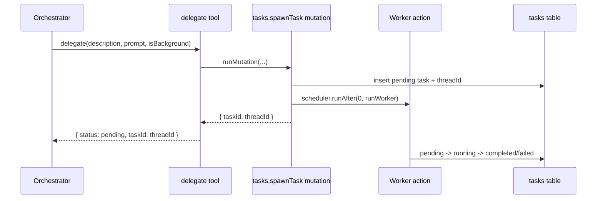

# Tool Definitions

## Scope

This document extracts and rewrites the plan sections for tool architecture and tool-related system prompt behavior.

Key baseline for v1:

- Tools are defined with AI SDK v6 `tool()` and Zod schemas.
- Tool execution runs inside Convex actions and receives action context (`ctx`) so tools can call internal queries, mutations, and actions.
- Tool calls read/write from our own `messages` table and app tables.

Reference docs and code:

- AI SDK tool API: https://ai-sdk.vercel.ai/docs/reference/ai-sdk-core/tool
- oh-my-openagent delegate reference: `src/tools/delegate-task/`
- oh-my-openagent background task reference: `src/tools/background-task/`

## Tool Architecture

Tool definitions follow this structure:

```ts
import { tool } from 'ai'
import { z } from 'zod/v4'

const delegateTool = tool({
  description: 'Delegate a task to a worker agent.',
  inputSchema: z.object({
    description: z.string(),
    isBackground: z.boolean().default(true),
    prompt: z.string()
  }),
  execute: async input => {
    const spawn = await ctx.runMutation(internal.tasks.spawnTask, {
      description: input.description,
      isBackground: input.isBackground,
      parentThreadId: ctx.threadId,
      prompt: input.prompt,
      userId: ctx.userId
    })
    return {
      status: 'pending',
      taskId: spawn.taskId,
      threadId: spawn.threadId
    }
  }
})
```

Execution model:

1. `streamText` receives a tool map built from AI SDK `tool()`.
2. The model emits a tool call.
3. The tool `execute` handler runs in Convex action runtime with `ctx`.
4. The handler invokes internal mutation/query/action functions.
5. The tool returns normalized JSON back to the model.

```mermaid
flowchart LR
  A[Orchestrator streamText] --> B[AI SDK v6 tool call]
  B --> C[tool execute(input)]
  C --> D{Convex operation}
  D -->|runMutation| E[Internal mutation]
  D -->|runQuery| F[Internal query]
  D -->|runAction| G[Internal action]
  E --> H[Tool result]
  F --> H
  G --> H
  H --> I[Model continues response]
```

## Tool-Related Prompt Rules

Orchestrator prompt behavior tied to tools:

- `delegate`: use for independent parallelizable work.
- `webSearch`: use for fresh external information and return sources.
- `todoWrite`: maintain multi-step tracking discipline (`in_progress` before work, `completed` after completion, only one in progress).
- `taskStatus`: check background progress by `taskId`.
- `taskOutput`: retrieve final output after completion reminders.
- MCP tools are separate (`mcpCall`, `mcpDiscover`) and not covered in this tools file.

Worker prompt behavior tied to tools:

- Worker is scoped to delegated task prompt.
- Worker may use `webSearch` where needed.
- Worker does not manage todos and does not re-delegate.

## Definitions

## `delegate`

Purpose:

- Spawn a worker task asynchronously.
- Return identifiers needed for polling and output retrieval.

Input schema:

- `description: string`
- `isBackground: boolean` (default `true`)
- `prompt: string`

Execution details:

- Calls `internal.tasks.spawnTask` mutation.
- Mutation atomically creates worker thread, inserts task row, and schedules worker action.
- Returns `{ status: 'pending', taskId, threadId }`.



## `taskStatus`

Purpose:

- Poll state of one background task.

Input schema:

- `taskId: string`

Execution details:

- Calls `internal.tasks.getOwnedTaskStatusInternal`.
- Returns ownership-scoped status data (`status`, `retryCount`, `lastError`, `completedAt`, `threadId`) or `null`.

## `taskOutput`

Purpose:

- Fetch final output for a completed task.

Input schema:

- `taskId: string`

Execution details:

- Calls `internal.tasks.getOwnedTaskOutput`.
- Returns `result` when completed.
- Returns structured non-completed response (`task_not_completed`, current status) when still running/pending.

## `todoWrite`

Purpose:

- Upsert session todo state in one write path.

Input schema:

- `todos: Array<{ id?, content, position, priority, status }>`
- `id` is the optional Convex document `_id` of an existing todo (returned by `todoRead`)
- `priority` in `high | medium | low`
- `status` in `pending | in_progress | completed | cancelled`

Execution details:

- Calls `internal.todos.syncOwned`.
- The `todoWrite` tool receives an array of todos. Each todo includes an optional `id` field (the Convex document `_id` of an existing todo). Todos WITH `id` are updated in place. Todos WITHOUT `id` are inserted as new. Existing todos NOT included in the array are left unchanged. The system prompt instructs the model to include the `id` field (returned by `todoRead`) when updating existing todos. This prevents silent deletion and position-based collision.
- Returns `{ updated: todos.length }`.

## `todoRead`

Purpose:

- Read session todo list for current thread.

Input schema:

- empty object

Execution details:

- Calls `internal.todos.listOwnedByThread`.
- Returns `{ todos }` sorted by `position` via `by_session_position` index.

## `webSearch`

Purpose:

- Perform grounded web search through a dedicated Gemini call and return normalized summary + sources.

Input schema:

- `query: string`

Execution details:

- Tool handler calls `internal.search.groundWithGemini` action.
- `groundWithGemini` runs a dedicated model call with only `google.tools.googleSearch({})` enabled.
- Search bridge records token usage via `internal.tokenUsage.recordModelUsage`.
- Result is normalized to `{ summary, sources }` for orchestrator/worker usage.

Isolation rule:

- Keep provider grounding tool calls in isolated search action.
- Do not mix provider tools with function tools in same generation call.

```mermaid
flowchart LR
  A[Orchestrator or Worker] --> B[webSearch tool execute]
  B --> C[internal.search.groundWithGemini]
  C --> D[Gemini generateText with googleSearch only]
  D --> E[normalizeGrounding]
  E --> F[{ summary, sources }]
  F --> A
```

## End-to-End Notes

- `delegate`, `taskStatus`, and `taskOutput` provide asynchronous background workflow control.
- `todoWrite` and `todoRead` provide explicit todo persistence and retrieval over `todos` table CRUD.
- `webSearch` is a dedicated grounding bridge action with normalized response contract.

### Internal Function Specifications (Phase 2-3 Implementation)

These internal functions are fully specified by their name, arguments, and description. Concrete implementations are produced during Phase 2 (Core Runtime) and Phase 3 (Tools & Delegation). They are listed here as the contract that tool implementations depend on.

- `internal.tasks.getOwnedTaskStatusInternal({ taskId })` - Returns task status/description for the owning session. Used by `taskStatus` tool.
- `internal.tasks.getOwnedTaskOutput({ taskId })` - Returns full task result. Used by `taskOutput` tool.
- `internal.tasks.getById({ taskId })` - Returns raw task row. Used internally by workers.
- `internal.tasks.countActiveByThread({ threadId })` - Counts pending+running tasks for a thread. Used by `postTurnAudit`.
- `internal.todos.syncOwned({ sessionId, todos })` - Upserts todos for a session. Used by `todoWrite` tool.
- `internal.todos.listOwnedByThread({ threadId })` - Lists todos via session lookup. Used by `todoRead` and `postTurnAudit`.
- `internal.sessions.getByThreadIdInternal({ threadId })` - Finds session by threadId. Used by worker completion chain.

## Recovered: Search Integration

### Why split search tool

`google.tools.googleSearch({})` is provider-defined. Mixing provider-defined tools and function tools in one model call can cause function tools to be ignored by provider preparation logic.

### Recovered Design

1. `webSearch` in orchestrator and worker remains a function tool.
2. Function tool calls `internal.search.groundWithGemini` action.
3. That action makes a dedicated model call with only `google.tools.googleSearch({})` enabled.
4. Action records model usage through `internal.tokenUsage.recordModelUsage`.
5. Action returns normalized `{ summary, sources }` payload.
6. In test mode, `getModel()` returns the mock model; search tests stub this action directly.

```typescript
const normalizeGrounding = result => {
  const text = result.text ?? ''
  const sources = []
  const metadata = result.providerMetadata?.google
  if (metadata?.groundingChunks) {
    for (const chunk of metadata.groundingChunks) {
      if (chunk.web) {
        sources.push({
          snippet: chunk.web.snippet ?? '',
          title: chunk.web.title ?? '',
          url: chunk.web.uri ?? ''
        })
      }
    }
  }
  return { sources, summary: text }
}

const groundWithGemini = internalAction({
  args: { query: v.string(), threadId: v.string() },
  handler: async (ctx, { query, threadId }) => {
    const { generateText } = await import('ai')
    const { createVertex } = await import('@ai-sdk/google-vertex')
  const vertex = createVertex({ googleVertexApiKey: process.env.GOOGLE_VERTEX_API_KEY })
    const model = await getModel()
    const out = await generateText({
      model,
      prompt: query,
      tools: {
        googleSearch: google.tools.googleSearch({})
      }
    })
    await ctx.runMutation(internal.tokenUsage.recordModelUsage, {
      agentName: 'search-bridge',
      outputTokens: out.usage?.outputTokens ?? 0,
      model: model.modelId,
      inputTokens: out.usage?.inputTokens ?? 0,
      provider: model.provider ?? 'google',
      threadId,
      totalTokens: out.usage?.totalTokens ?? 0
    })
    return normalizeGrounding(out)
  }
})

const webSearchTool = tool({
  description: 'Run grounded web search and return summary with sources.',
  inputSchema: z.object({ query: z.string() }),
  execute: async ({ query }) => {
    try {
      const result = await ctx.runAction(internal.search.groundWithGemini, {
        query,
        threadId: ctx.threadId
      })
      return { sources: result.sources, summary: result.summary }
    } catch (error) {
      return { code: 'search_failed', error: String(error), ok: false }
    }
  }
})
```

Provider-defined tool isolation note:

- Keep provider-defined grounding tool calls isolated in `groundWithGemini`.
- Do not mix provider-defined tools with function tools in the same `generateText` call.
