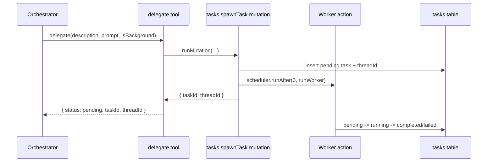

# Tool Definitions

## Scope

Tools are defined with AI SDK `tool()` + Zod schemas and executed from Convex actions with action context.

References:

- AI SDK tool API: https://ai-sdk.vercel.ai/docs/reference/ai-sdk-core/tool
- oh-my-openagent delegate reference: `src/tools/delegate-task/`
- oh-my-openagent background task reference: `src/tools/background-task/`

Implementation:
- `packages/be-agent/convex/toolFactories.ts`
- `packages/be-agent/convex/tasks.ts`
- `packages/be-agent/convex/todos.ts`
- `packages/be-agent/convex/search.ts`
- `packages/be-agent/convex/mcp.ts`

## Tool Architecture

Execution model:

1. `streamText` receives a tool map from factory functions.
2. The model emits a tool call.
3. Tool handler executes in Convex action runtime.
4. Handler calls internal mutations/queries/actions.
5. Tool returns normalized JSON for model continuation.

```mermaid
flowchart LR
  A[Orchestrator streamText] --> B[AI SDK v6 tool call]
  B --> C[tool execute(input)]
  C --> D{Convex operation}
  D -->|runMutation| E[Internal mutation]
  D -->|runQuery| F[Internal query]
  D -->|runAction| G[Internal action]
  E --> H[Tool result]
  F --> H
  G --> H
  H --> I[Model continues response]
```

## Orchestrator Tool Set

- `delegate`: spawn worker task and return identifiers.
- `taskStatus`: poll task status by `taskId`.
- `taskOutput`: retrieve final output and status-aware fallback payload.
- `todoRead`: list ordered session todos.
- `todoWrite`: upsert todos by optional `id` (merge-by-id behavior).
- `webSearch`: grounded search bridge returning `{ summary, sources }`.
- `mcpCall`: invoke configured MCP tool with structured response.
- `mcpDiscover`: enumerate enabled MCP tool inventory.

## Worker Tool Set

- `webSearch`
- `mcpCall`
- `mcpDiscover`

Workers do not re-delegate and do not manage todos.

## `delegate` Flow

`delegate` calls `internal.tasks.spawnTask` and returns task/thread identifiers.



## `webSearch` Isolation Rule

Grounding search runs in a dedicated action so provider-defined tools do not mix with function tools in the same generation call.

```mermaid
flowchart LR
  A[Orchestrator or Worker] --> B[webSearch tool execute]
  B --> C[internal.search.groundWithGemini]
  C --> D[Gemini generateText with googleSearch only]
  D --> E[normalizeGrounding]
  E --> F[{ summary, sources }]
  F --> A
```

## Contracts and Error Shape

- Tool outputs are model-readable and deterministic.
- Non-terminal task output uses explicit status payload, not thrown errors.
- MCP and search failures return structured error objects suitable for follow-up reasoning.

## Tests

See `apps/agent/plan/testing.md`.
