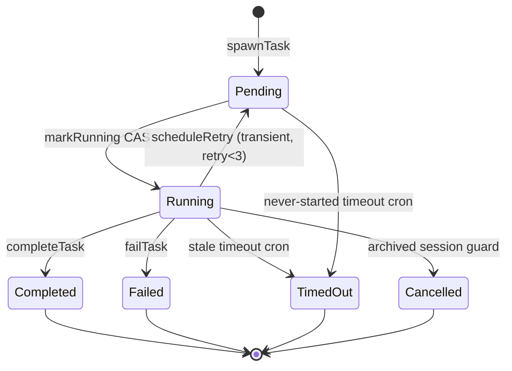
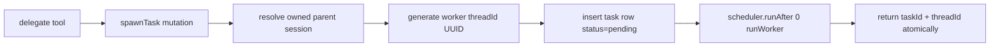
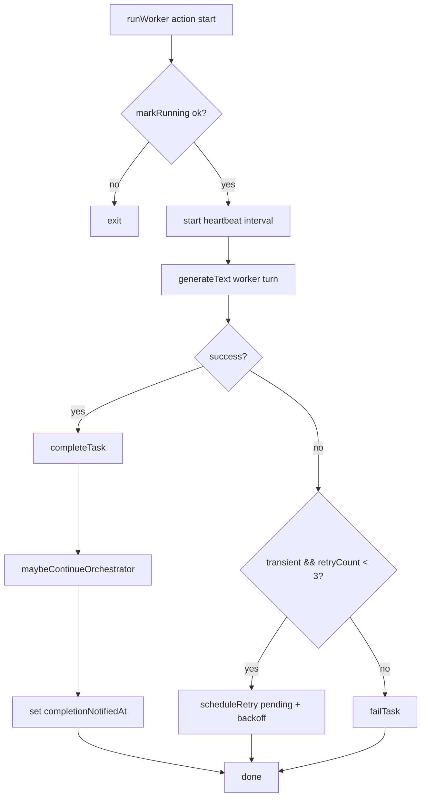
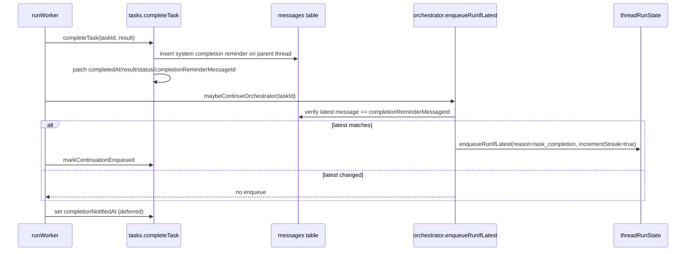

# Worker Runtime (Delegation + Background Tasks)

This document extracts and rewrites worker/task planning from `PLAN.md` for the DIY architecture: AI SDK v6 calls in Convex actions, with task/message persistence in our own Convex tables.

## Scope and References

- PLAN sections: Task Lifecycle, helper functions (task-related), delegation behavior
- OpenAgent references:
  - `oh-my-openagent/src/features/background-agent/`
  - `oh-my-openagent/src/features/claude-tasks/`

## Task State Machine

Canonical task statuses:

- `pending`
- `running`
- terminal: `completed | failed | timed_out | cancelled`
- retry loop: `running -> pending` (bounded retries)



## `spawnTask` Mutation (Atomic spawn + schedule)

`spawnTask` is mutation-first and performs all delegation bootstrapping in one transaction boundary:

1. Resolve parent session ownership from `parentThreadId` + user.
2. Generate worker `threadId` with `crypto.randomUUID()` (no `threads` table row).
3. Insert `tasks` row with `status: 'pending'`, `retryCount: 0`, `pendingAt`.
4. Schedule `runWorker` action immediately.
5. Return `{ taskId, threadId }`.

Because this is one mutation boundary, the parent turn receives a consistent task/thread pair.



Worker threads are UUID strings generated by `crypto.randomUUID()`. No `threads` table exists - `threadId` is a plain string stored on `session`, `messages`, `tasks`, and `threadRunState`. Worker threads are distinguished from orchestrator threads only by their association with a `tasks` row.

Worker-thread message inserts intentionally omit `sessionId`. Ownership for those rows resolves through `tasks.threadId -> tasks.sessionId`.

All message inserts include `createdAt: Date.now()`. This is the canonical ordering field used by `by_thread_createdAt` index.

## `runWorker` Action Flow

`runWorker` executes worker generation with explicit lifecycle transitions.

1. `markRunning(taskId)` CAS (`pending -> running` only).
2. Start heartbeat interval (`updateHeartbeat` every 30s).
3. Build worker prompt context from `tasks.prompt` and thread messages.
4. Call AI SDK v6 `generateText()` directly (worker usually does single-shot completion).
5. On success: `completeTask(taskId, result)`.
6. On error:
   - if transient and `retryCount < 3`: `scheduleRetry` (`running -> pending`)
   - else `failTask` (`running -> failed`)
7. Clear heartbeat timer in `finally`.



## Completion Reminder Chain

Worker completion does not immediately force a continuation. It first persists a parent-thread reminder, then conditionally enqueues orchestrator continuation.

### Sequence

1. `completeTask` CAS validates `status === 'running'`.
2. Save system completion reminder message to **parent thread** in `messages` table.
3. Patch task:
   - `status: 'completed'`
   - `result`
   - `completedAt`
   - `completionReminderMessageId`
4. Call `maybeContinueOrchestrator(taskId)`.
5. `maybeContinueOrchestrator` runs `enqueueRunIfLatest` with `expectedLatestMessageId`.
6. If enqueue succeeds, mark `continuationEnqueuedAt`.
7. After the notification attempt finishes, set `completionNotifiedAt` (deferred marker).



## Worker Heartbeat and Stale Timeout Cron

### Runtime heartbeat

- `runWorker` sends `updateHeartbeat(taskId)` every 30 seconds while running.
- `markRunning` initializes `startedAt` and first heartbeat.

### Cron-based stale handling

- `timeoutStaleTasks` scans `tasks` by status.
- Running tasks:
  - timeout if `now - (heartbeatAt || startedAt || creationTime) > 10 minutes`
  - patch: `status: 'timed_out'`, `lastError: 'worker_timeout'`
- Pending tasks:
  - timeout if `now - (pendingAt || creationTime) > 5 minutes`
  - patch: `status: 'timed_out'`, `lastError: 'worker_never_started'`

After applying terminal timeout state, `timeoutStaleTasks` also writes a parent-thread reminder via `buildTaskTerminalReminder` (`status: 'timed_out'`) and calls `maybeContinueOrchestrator`.

## Retry Policy (Exponential Backoff + Safety Guards)

- Retry only for transient failures (network, timeout, overload, rate-limit class errors).
- Max retries: `3`.
- `scheduleRetry` checks session archival first:
  - if parent session archived: task becomes `cancelled` (`lastError: 'session_archived'`)
  - else patch to `pending`, increment retry, set `pendingAt`, schedule next worker attempt
- Backoff delay: `min(1000 * 2^retryCount, 30000)` ms.

## `completionNotifiedAt` Deferred Ordering

Ordering is intentional:

1. `completeTask` persists completion + reminder message.
2. Notification/continuation attempt (`maybeContinueOrchestrator`) runs.
3. Only then set `completionNotifiedAt`.

This preserves recoverability for crash windows: a task can be `completed` but still have `completionNotifiedAt` unset, allowing future retry/cron notification logic to re-attempt continuation processing.

### Terminal State Reminders

Both `completeTask` and `failTask` save a reminder to the parent thread. `failTask` uses `buildTaskTerminalReminder` with status `failed` and the `lastError` message. `timeoutStaleTasks` (status `timed_out`) also saves a terminal reminder. This ensures the orchestrator is always notified when a delegated task reaches any terminal state — not just success. The reminder text uses `[BACKGROUND TASK FAILED]` or `[BACKGROUND TASK TIMED OUT]` prefixes so the orchestrator can distinguish outcomes.

`cancelled` tasks do NOT emit automatic reminders — cancellation is user-initiated (via session archival or explicit cancellation), not an unexpected failure. The orchestrator is already aware of the archive action. Only `completed`, `failed`, and `timed_out` states emit reminders.

After `buildTaskCompletionReminder`, define `buildTaskTerminalReminder` for failed/timed-out tasks:

```typescript
const buildTaskTerminalReminder = ({ taskId, description, status, error }) => {
  const prefix = status === 'failed' ? 'BACKGROUND TASK FAILED' : 'BACKGROUND TASK TIMED OUT'
  return [
    '<system-reminder>',
    `[${prefix}]`,
    `Task ID: ${taskId}`,
    `Description: ${description}`,
    error ? `Error: ${error}` : '',
    'The task did not complete successfully. Decide whether to retry via delegate or inform the user.',
    '</system-reminder>'
  ].filter(Boolean).join('\n')
}
```

## v1 Known Limitations

- Crash gap: if worker crashes between `completeTask` and `maybeContinueOrchestrator`, reminder exists but no continuation is enqueued.
- Duplicate side effects on retries: external MCP/tool effects from a failed attempt are not rolled back.
- Prompt duplication on retry can happen in worker thread history (cosmetic).

## Recovered: Internal Functions (Worker/Task)

```typescript
const spawnTask = internalMutation({
  args: {
    description: v.string(),
    isBackground: v.boolean(),
    parentThreadId: v.string(),
    prompt: v.string(),
    userId: v.string()
  },
  handler: async (ctx, args) => {
    const session = await resolveOwnedSessionByThread({
      ctx,
      threadId: args.parentThreadId,
      userId: args.userId
    })

    const workerThreadId = crypto.randomUUID()

    const taskId = await ctx.db.insert('tasks', {
      agent: 'Worker',
      description: args.description,
      isBackground: args.isBackground,
      parentThreadId: args.parentThreadId,
      pendingAt: Date.now(),
      prompt: args.prompt,
      retryCount: 0,
      sessionId: session._id,
      status: 'pending',
      threadId: workerThreadId,
      userId: session.userId
    })

    await ctx.scheduler.runAfter(0, internal.agents.runWorker, {
      prompt: args.prompt,
      taskId,
      threadId: workerThreadId
    })

    return { taskId, threadId: workerThreadId }
  }
})

const markRunning = internalMutation({
  args: { taskId: v.id('tasks') },
  handler: async (ctx, { taskId }) => {
    const task = await ctx.db.get(taskId)
    if (!task || task.status !== 'pending') return { ok: false }
    const session = await ctx.db.get(task.sessionId)
    if (session?.status === 'archived') {
      await ctx.db.patch(taskId, { lastError: 'session_archived', status: 'cancelled' })
      return { ok: false }
    }
    await ctx.db.patch(taskId, { heartbeatAt: Date.now(), startedAt: Date.now(), status: 'running' })
    return { ok: true }
  }
})

const updateHeartbeat = internalMutation({
  args: { taskId: v.id('tasks') },
  handler: async (ctx, { taskId }) => {
    const task = await ctx.db.get(taskId)
    if (!task || task.status !== 'running') return
    await ctx.db.patch(taskId, { heartbeatAt: Date.now() })
  }
})

const completeTask = internalMutation({
  args: { result: v.string(), taskId: v.id('tasks') },
  handler: async (ctx, { result, taskId }) => {
    const task = await ctx.db.get(taskId)
    if (!task || task.status !== 'running') return { ok: false }
    if (task.completionNotifiedAt) return { ok: false }

    const reminderText = buildTaskCompletionReminder({
      description: task.description,
      taskId: String(taskId)
    })

    const reminderMessageId = await ctx.db.insert('messages', {
      content: reminderText,
      createdAt: Date.now(),
      isComplete: true,
      role: 'system',
      sessionId: task.sessionId,
      threadId: task.parentThreadId,
      userId: task.userId
    })

    await ctx.db.patch(taskId, {
      completedAt: Date.now(),
      completionReminderMessageId: String(reminderMessageId),
      result,
      status: 'completed'
    })

    const session = await ctx.db
      .query('session')
      .withIndex('by_threadId', q => q.eq('threadId', task.parentThreadId))
      .first()
    if (session) await ctx.db.patch(session._id, { lastActivityAt: Date.now() })

    return { ok: true, reminderMessageId: String(reminderMessageId) }
  }
})

const failTask = internalMutation({
  args: { errorMessage: v.string(), taskId: v.id('tasks') },
  handler: async (ctx, { errorMessage, taskId }) => {
    const task = await ctx.db.get(taskId)
    if (!task || task.status !== 'running') return { ok: false }
    await ctx.db.patch(taskId, {
      lastError: errorMessage,
      retryCount: task.retryCount + 1,
      status: 'failed'
    })

    const reminderText = buildTaskTerminalReminder({
      description: task.description,
      error: errorMessage,
      status: 'failed',
      taskId: String(taskId)
    })
    const reminderMessageId = await ctx.db.insert('messages', {
      content: reminderText,
      createdAt: Date.now(),
      isComplete: true,
      role: 'system',
      sessionId: task.sessionId,
      threadId: task.parentThreadId,
      userId: task.userId
    })
    await ctx.db.patch(taskId, {
      completionReminderMessageId: String(reminderMessageId)
    })

    const session = await ctx.db
      .query('session')
      .withIndex('by_threadId', q => q.eq('threadId', task.parentThreadId))
      .first()
    if (session) await ctx.db.patch(session._id, { lastActivityAt: Date.now() })

    await maybeContinueOrchestrator({ ctx, taskId })

    return { ok: true }
  }
})

const scheduleRetry = internalMutation({
  args: { taskId: v.id('tasks') },
  handler: async (ctx, { taskId }) => {
    const task = await ctx.db.get(taskId)
    if (!task || task.status !== 'running') return
    const session = await ctx.db.get(task.sessionId)
    if (session?.status === 'archived') {
      await ctx.db.patch(taskId, { lastError: 'session_archived', status: 'cancelled' })
      return
    }
    const retryCount = task.retryCount + 1
    await ctx.db.patch(taskId, { pendingAt: Date.now(), retryCount, status: 'pending' })
    const delay = Math.min(1000 * Math.pow(2, retryCount), 30_000)
    await ctx.scheduler.runAfter(delay, internal.agents.runWorker, {
      prompt: task.prompt ?? task.description,
      taskId,
      threadId: task.threadId
    })
  }
})

const markContinuationEnqueued = internalMutation({
  args: { taskId: v.id('tasks') },
  handler: async (ctx, { taskId }) => {
    const task = await ctx.db.get(taskId)
    if (!task) return
    await ctx.db.patch(taskId, { continuationEnqueuedAt: Date.now() })
  }
})

const maybeContinueOrchestrator = async ({ ctx, taskId }) => {
  const task = await ctx.runQuery(internal.tasks.getById, { taskId })
  if (!task || !task.completionReminderMessageId) return
  const session = await ctx.runQuery(internal.sessions.getByThreadIdInternal, { threadId: task.parentThreadId })
  if (session?.status === 'archived') return
  if (task.continuationEnqueuedAt) return

  const enqueued = await ctx.runMutation(internal.orchestrator.enqueueRunIfLatest, {
    expectedLatestMessageId: task.completionReminderMessageId,
    incrementStreak: true,
    promptMessageId: task.completionReminderMessageId,
    reason: 'task_completion',
    threadId: task.parentThreadId
  })
  if (!enqueued.ok) return

  await ctx.runMutation(internal.tasks.markContinuationEnqueued, { taskId })
}

const isTransientError = msg => {
  const transient = ['ECONNRESET', 'ETIMEDOUT', 'rate_limit', '503', '429', 'overloaded']
  const lower = msg.toLowerCase()
  for (const t of transient) {
    if (lower.includes(t.toLowerCase())) return true
  }
  return false
}
```

After `maybeContinueOrchestrator` completes (whether it enqueued continuation or not), caller sets `completionNotifiedAt`. This is intentionally deferred from `completeTask` so crash windows remain recoverable (`status: 'completed'` with `completionNotifiedAt` unset).

v1 limitation: if worker crashes between `completeTask` and `maybeContinueOrchestrator`, completion reminder is persisted but continuation is not enqueued. The thread can remain idle with no queued payload, so `timeoutStaleRuns` cannot recover this case. User input re-engages orchestrator. On retry, `continuationEnqueuedAt` guards duplicate enqueue.

Worker retry side-effect safety: if `runWorker` retries after partial MCP side effects, external effects can duplicate. Prompt save duplication on retry can also produce duplicate worker-thread prompt entries. Both are accepted v1 trade-offs.

## Recovered: Agent Definitions (Worker)

`Agent` class usage is replaced with direct AI SDK calls and plain config.

```typescript
const WORKER_RUNTIME_CONFIG = {
  callSettings: {
    temperature: 0.5
  },
  contextOptions: { recentMessages: 50 },
  instructions: WORKER_SYSTEM_PROMPT,
  languageModel: getModel,
  maxSteps: 10,
  name: 'Worker',
  tools: {
    mcpCall: mcpCallTool,
    mcpDiscover: mcpDiscoverTool,
    webSearch: webSearchTool
  },
  usageHandler: usageHandlerByThread
} as const

const runWorker = internalAction({
  args: { prompt: v.string(), taskId: v.id('tasks'), threadId: v.string() },
  handler: async (ctx, args) => {
    const marked = await ctx.runMutation(internal.tasks.markRunning, { taskId: args.taskId })
    if (!marked.ok) return

    const heartbeatInterval = setInterval(async () => {
      try {
        await ctx.runMutation(internal.tasks.updateHeartbeat, { taskId: args.taskId })
      } catch (_error) {}
    }, 30_000)

    try {
      const promptMessageId = await ctx.db.insert('messages', {
        content: args.prompt,
        createdAt: Date.now(),
        isComplete: true,
        role: 'user',
        threadId: args.threadId
      })

      const { generateText } = await import('ai')
      const model = await getModel()

      const context = await ctx.db
        .query('messages')
        .withIndex('by_threadId', q => q.eq('threadId', args.threadId))
        .order('desc')
        .take(WORKER_RUNTIME_CONFIG.contextOptions.recentMessages)

      const messages = []
      for (const m of context.reverse()) {
        messages.push({ content: m.content, role: m.role })
      }

      const result = await generateText({
        maxSteps: WORKER_RUNTIME_CONFIG.maxSteps,
        messages,
        model,
        system: WORKER_RUNTIME_CONFIG.instructions,
        temperature: WORKER_RUNTIME_CONFIG.callSettings.temperature,
        tools: WORKER_RUNTIME_CONFIG.tools
      })

      await usageHandlerByThread(ctx, {
        agentName: WORKER_RUNTIME_CONFIG.name,
        model: model.modelId,
        provider: model.provider ?? 'unknown',
        providerMetadata: result.providerMetadata,
        threadId: args.threadId,
        usage: result.usage,
        userId: undefined
      })

      const latestTask = await ctx.runQuery(internal.tasks.getById, {
        taskId: args.taskId
      })
      if (
        !latestTask ||
        latestTask.status === 'timed_out' ||
        latestTask.status === 'cancelled'
      ) {
        return
      }

      const text = result.text ?? ''
      await ctx.db.insert('messages', {
        content: text,
        createdAt: Date.now(),
        isComplete: true,
        role: 'assistant',
        threadId: args.threadId
      })

      const completed = await ctx.runMutation(internal.tasks.completeTask, {
        result: text,
        taskId: args.taskId
      })

      if (completed.ok && completed.reminderMessageId) {
        await maybeContinueOrchestrator({ ctx, taskId: args.taskId })
      }
      await ctx.db.patch(args.taskId, { completionNotifiedAt: Date.now() })
    } catch (error) {
      const task = await ctx.runQuery(internal.tasks.getById, { taskId: args.taskId })
      if (task && task.retryCount < 3 && isTransientError(String(error))) {
        await ctx.runMutation(internal.tasks.scheduleRetry, { taskId: args.taskId })
      } else {
        await ctx.runMutation(internal.tasks.failTask, {
          errorMessage: String(error),
          taskId: args.taskId
        })
      }
    } finally {
      clearInterval(heartbeatInterval)
    }
  }
})
```

### Timeout Fencing

Worker finalization is a single `internalMutation` (`finalizeWorkerOutput`) that atomically: (1) re-reads task status, (2) if still `running`, writes the assistant message AND transitions to `completed` in the same mutation. If the task is already `timed_out`/`cancelled`, the mutation is a no-op. This prevents the TOCTOU race between status check and message write.
