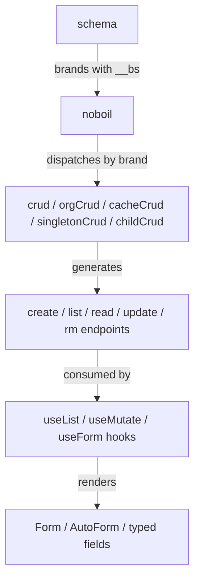
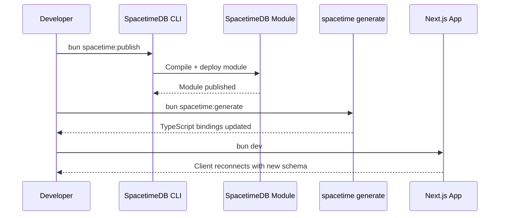
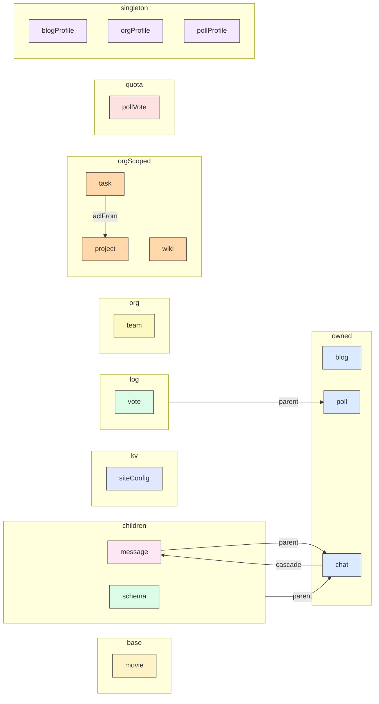

The mental model. Read this once and you can predict noboil's behavior instead of memorizing its API.

## Schema-first design

You define a Zod schema once. Everything else — the database table definition, the CRUD endpoints, the TypeScript types for input validation and query results — is derived from that single source of truth.

```ts
import { schema } from 'noboil/convex/schema'
import { boolean, object, string } from 'zod/v4'

export const s = schema({
  owned: {
    blog: object({
      title: string().min(1),
      body: string(),
      published: boolean().default(false)
    })
  }
})
```

The schema is the contract. Change it, and the table shape, validators, and endpoint signatures all update. There is no separate `v.object(...)` definition to keep in sync.

## Schema branding

noboil uses TypeScript's structural type system against you (in a good way). Each schema slot stamps the Zod object with an opaque brand that the table factory checks at the type level.

The brand registry below is auto-generated from `lib/noboil/src/convex/server/types.ts` (`SchemaHintMap`):

{/* AUTO-GENERATED:BRAND-REGISTRY:START */}
| Brand | Maker → Factory + Wrapper |
|---|---|
| `base` | Created by makeBase() → use cacheCrud() + baseTable() |
| `kv` | Created by makeKv() → use kv() + kvTable() |
| `log` | Created by makeLog() → use log() + logTable() |
| `orgDef` | Created by makeOrg() → pass to setup(\{ orgSchema \}) |
| `org` | Created by makeOrgScoped() → use orgCrud() + orgTable() |
| `owned` | Created by makeOwned() → use crud() + ownedTable() |
| `quota` | Created by makeQuota() → use quota() + quotaTable() |
| `singleton` | Created by makeSingleton() → use singletonCrud() + singletonTable() |
{/* AUTO-GENERATED:BRAND-REGISTRY:END */}

Auto-injected fields and indexes per brand (sourced from `lib/noboil/src/shared/factory-meta.ts`):

{/* AUTO-GENERATED:AUTO-FIELDS:START */}
| Slot | Brand | Wrapper | Auto-injected fields | Indexes | Description |
|---|---|---|---|---|---|
| `base` | `base` | `baseTable / cacheCrud` | `updatedAt? (optional)` | `(none — keyed by upstream id)` | External-data cache (TTL, refresh, invalidate) |
| `children` | `child` | `childTable / childCrud` | `parentId`, `updatedAt` | `by_parent` | Child-of-parent CRUD with cascade options |
| `kv` | `kv` | `kvTable / kv` | `key`, `updatedAt`, `createdAt`, `deletedAt? (when softDelete)` | `by_key (unique)` | Named key → value, public reads + role-gated writes ([kv](./kv)) |
| `log` | `log` | `logTable / log` | `parent`, `seq`, `userId`, `createdAt`, `idempotencyKey?`, `deletedAt? (when softDelete)` | `by_parent_seq`, `by_idempotency` | Append-only event log with atomic seq + idempotency ([log](./log)) |
| `orgScoped` | `org` | `orgTable / orgCrud` | `userId`, `orgId`, `updatedAt` | `by_org`, `by_org_user` | Org-scoped CRUD with membership + role checks |
| `org` | `orgDef` | `orgTables (via setup)` | `(n/a — org definition itself)` | `(n/a)` | The org definition (passed as orgSchema to noboil()) |
| `owned` | `owned` | `ownedTable / crud` | `userId`, `updatedAt` | `by_user` | User-owned CRUD |
| `quota` | `quota` | `quotaTable / quota` | `owner`, `timestamps[]` | `by_owner (unique)` | Sliding-window rate limit primitive ([quota](./quota)) |
| `singleton` | `singleton` | `singletonTable / singletonCrud` | `userId`, `updatedAt` | `by_user` | One row per user (get + upsert) |
{/* AUTO-GENERATED:AUTO-FIELDS:END */}

Passing an `owned`-branded schema where the factory expects `orgScoped` is a compile-time error. The `SchemaTypeError` type produces a message like:

```
Schema mismatch: expected org-scoped (makeOrgScoped), got user-owned (makeOwned).
Created by makeOrgScoped() -> use orgCrud() + orgTable()
```

**When to use which:**

- **`owned`** — most tables. Each row belongs to one user.
- **`orgScoped`** — rows belong to an organization. Queries scope by `orgId`; mutations verify org membership and role.
- **`base`** — shared/global data with no ownership (e.g., a cache of external API responses). No auth required on reads or writes.
- **`singleton`** — exactly one row per user (e.g., user profile, user preferences).
- **`children`** — rows that have a foreign key to a parent table; access control inherits from the parent.
- **`log`** — append-only event tables (messages, votes, audit). Atomic per-parent `seq`, idempotent appends, soft-delete + restore, no-update by default. See [log factory](./log).
- **`kv`** — string-keyed global state (banner, feature flags, system status). Public reads, role-gated writes, optional key whitelist, conflict detection. See [kv factory](./kv).
- **`quota`** — sliding-window rate limits per owner (anti-spam, ballot-stuffing, API throttling). `check`/`record`/`consume` triad with hooks. See [quota factory](./quota).

## The `noboil()` entry point

`noboil()` is the single entry point. Call it once with a config object that includes a `tables` callback mapping each table name to a registered table:

```ts
import { noboil } from 'noboil/convex/server'
import { action, internalMutation, internalQuery, mutation, query } from './_generated/server'
import { getAuthUserId } from '@convex-dev/auth/server'
import { s } from './s'

export const api = noboil({
  query, mutation, action, internalQuery, internalMutation, getAuthUserId,
  orgSchema: s.team,
  hooks: { /* global hooks */ },
  middleware: [auditLog(), inputSanitize()],
  tables: ({ table }) => ({
    blog: table(s.blog, { rateLimit: { max: 10, window: 60_000 }, search: 'content' }),
    wiki: table(s.wiki, { acl: true, softDelete: true }),
    profile: table(s.profile),
    movie: table(s.movie, { key: 'tmdbId', ttl: 86_400 })
  })
})
```

The `table()` helper detects each schema's brand at runtime (via a `__bs` marker written by `schema()`) and dispatches to the matching factory under the hood. The table name comes from the object key — no need to repeat it.

`api` is then used by per-module files to expose endpoints:

```ts
// convex/blog.ts
import { api } from '../lazy'
export const { create, update, rm, pub: { list, read, search } } = api.blog
```

### Lower-level path: `setup() + crud()`

If you want explicit control over which factories are called, use `setup()` directly:

```ts
const { crud, orgCrud, childCrud, cacheCrud, singletonCrud, pq, q, m, cq, cm } = setup({
  query, mutation, action, internalQuery, internalMutation, getAuthUserId
})

const { create, update, rm, pub: { list, read } } = crud('blog', s.blog, { rateLimit: { max: 10, window: 60_000 } })
```

`noboil()` is built on top of this. Use whichever style you prefer.

### Factories

| Factory | Input | Returns | Purpose |
|---|---|---|---|
| `crud(table, schema, opts?)` | `OwnedSchema` | `{ create, update, rm, pub, auth, ... }` | User-owned tables |
| `orgCrud(table, schema, opts?)` | `OrgSchema` | `{ create, update, rm, list, read, ... }` | Org-scoped tables |
| `childCrud(table, meta, opts?)` | child config | `{ create, update, rm, list, get, ... }` | Tables with a foreign key to a parent |
| `cacheCrud(opts)` | `BaseSchema` + key field | `{ load, get, invalidate, refresh, ... }` | External data cache with TTL |
| `singletonCrud(table, schema, opts?)` | `SingletonSchema` | `{ get, upsert }` | One row per user |

### Custom builders

| Builder | Auth required | Context | Use for |
|---|---|---|---|
| `pq` | No (viewer ID resolved but optional) | `viewerId`, `withAuthor` | Public queries — anyone can call, viewer info available if logged in |
| `q` | Yes (throws if unauthenticated) | `user`, `viewerId`, `get`, `withAuthor` | Authenticated queries with ownership checks |
| `m` | Yes | `user`, `create`, `patch`, `delete`, `get` | Authenticated mutations with ownership checks |
| `cq` | No | empty | Context-free queries (internal tooling, cron jobs) |
| `cm` | No | empty | Context-free mutations (internal tooling, cron jobs) |

## Auth/pub split

Every `crud()` call returns two read APIs: `pub` and `auth`.

```ts
export const { create, update, rm, pub, auth } = crud('blog', owned.blog)

// In your Convex module, re-export:
export const { list, read, search } = pub   // no auth required
// auth.list, auth.read, auth.search        // require login
```

- **`pub.list`**, **`pub.read`**, **`pub.search`** — callable by anyone, including unauthenticated users. Use for public-facing content.
- **`auth.list`**, **`auth.read`**, **`auth.search`** — require a logged-in user. `auth.list` automatically scopes to the current user's rows.
- **`create`**, **`update`**, **`rm`** — always require authentication. Mutations verify the caller owns the document before allowing changes.

You can attach default `where` filters to either side:

```ts
crud('blog', owned.blog, {
  pub: { where: { published: true } },       // public list only shows published
  auth: { where: { archived: false } },      // authed list hides archived
})
```

## Hooks and middleware

### Lifecycle hooks

Six hooks fire around each mutation. `before*` hooks can transform data; `after*` hooks are side-effect-only.

| Hook | Fires | Receives | Returns |
|---|---|---|---|
| `beforeCreate` | Before insert | `{ data }` | Modified `data` |
| `afterCreate` | After insert | `{ data, id }` | void |
| `beforeUpdate` | Before patch | `{ id, patch, prev }` | Modified `patch` |
| `afterUpdate` | After patch | `{ id, patch, prev }` | void |
| `beforeDelete` | Before delete | `{ id, doc }` | void |
| `afterDelete` | After delete | `{ id, doc }` | void |

### Global vs per-table hooks

**Global hooks** are passed to `setup()` and run on every table. Their context includes a `table` field so you can branch:

```ts
setup({
  // ...
  hooks: {
    afterCreate: (ctx, { id }) => {
      console.log(`Created ${id} in ${ctx.table}`)
    },
  },
})
```

**Per-table hooks** are passed in the options of each CRUD factory:

```ts
crud('blog', owned.blog, {
  hooks: {
    beforeCreate: (_ctx, { data }) => ({ ...data, slug: slugify(data.title) }),
  },
})
```

When both exist, global hooks run first. For `before*` hooks, the global hook's output is piped into the per-table hook.

### Built-in middleware

Middleware is syntactic sugar over global hooks with a `name` field and an `operation` field in context. Pass them to `setup()`:

```ts
setup({
  // ...
  middleware: [auditLog(), inputSanitize(), slowQueryWarn({ threshold: 300 })],
})
```

| Middleware | What it does |
|---|---|
| `auditLog(opts?)` | Logs create/update/delete with table, userId, and id. `verbose: true` includes payload. |
| `inputSanitize(opts?)` | Strips HTML/script tags from string fields in `beforeCreate` and `beforeUpdate`. |
| `slowQueryWarn(opts?)` | Warns when a mutation exceeds `threshold` ms (default 500). |

Multiple middleware compose left-to-right. They merge into the global hooks chain via `composeMiddleware()`.

## The `where` clause query language

All `list`, `read`, and `search` endpoints accept an optional `where` parameter. It is a typed object derived from your schema shape.

### Field equality

```ts
// Exact match
where: { published: true }

// Multiple fields (AND)
where: { published: true, category: "tech" }
```

### Comparison operators

For numeric fields, use comparison operator objects instead of a direct value:

```ts
where: { rating: { $gte: 4 } }
where: { price: { $between: [10, 50] } }
```

Available operators: `$gt`, `$gte`, `$lt`, `$lte`, `$between`.

### The `own` filter

```ts
where: { own: true }
```

Shorthand for "only rows where `userId` matches the authenticated caller." This works on `pub` endpoints too — if the caller is logged in, it scopes; if not, it is ignored.

### OR groups

```ts
where: {
  published: true,
  or: [
    { category: "tech" },
    { category: "science" },
  ],
}
```

Top-level fields are AND-ed. The `or` array creates a disjunction — each entry is a `WhereGroupOf<S>` with the same shape as the top-level (minus `or` itself).

## Escape hatches

### Custom queries alongside generated ones

The `pq`, `q`, `m`, `cq`, and `cm` builders returned by `setup()` are standard `zCustomQuery`/`zCustomMutation` wrappers. Use them in the same file as your generated CRUD:

```ts
export const { create, update, rm, pub } = crud('blog', owned.blog)

// Custom query alongside generated ones
export const trending = pq({
  args: { limit: z.number().default(10) },
  handler: async (ctx, { limit }) => {
    // Full access to ctx.db — write any query you want
    return ctx.db.query('blog')
      .filter(q => q.eq(q.field('published'), true))
      .order('desc')
      .take(limit)
  },
})
```

`pq` gives you viewer info without requiring auth. `q` requires auth and gives you `ctx.user` and `ctx.get` (ownership-checked document fetch). `m` gives you `ctx.create`, `ctx.patch`, `ctx.delete` with automatic timestamps and ownership.

### Ejecting individual tables

If a table outgrows the CRUD pattern, stop calling the factory for that table and write raw Convex functions using `pq`/`q`/`m`. The schema branding and table definitions are independent of the CRUD layer — you keep `ownedTable(owned.blog)` in your schema even after ejecting the CRUD for `blog`. See the [ejecting guide](/docs/ejecting) for a full walkthrough.

## Architecture overview



## SpacetimeDB dev loop

After editing your schema or reducer logic:



Schema changes require both steps. If you only `publish`, the module updates but the client TypeScript types are stale. If you only `generate`, you get updated types but the server module doesn't match.

## Bundled shadcn UI

`readonly/ui/` is synced from [cnsync](https://github.com/1qh/cnsync) — never edit by hand. All demos and the generated forms render against this set.

{/* AUTO-GENERATED:UI-COMPONENTS:START */}
**55 top-level components:** `accordion`, `alert`, `alert-dialog`, `aspect-ratio`, `avatar`, `badge`, `breadcrumb`, `button`, `button-group`, `calendar`, `card`, `carousel`, `chart`, `checkbox`, `collapsible`, `combobox`, `command`, `context-menu`, `dialog`, `direction`, `drawer`, `dropdown-menu`, `empty`, `field`, `hover-card`, `input`, `input-group`, `input-otp`, `item`, `kbd`, `label`, `menubar`, `native-select`, `navigation-menu`, `pagination`, `popover`, `progress`, `radio-group`, `resizable`, `scroll-area`, `select`, `separator`, `sheet`, `sidebar`, `skeleton`, `slider`, `sonner`, `spinner`, `switch`, `table`, `tabs`, `textarea`, `toggle`, `toggle-group`, `tooltip`

- **ai-elements** (48): `agent`, `artifact`, `attachments`, `audio-player`, `canvas`, `chain-of-thought`, `checkpoint`, `code-block`, `commit`, `confirmation`, `connection`, `context`, `controls`, `conversation`, `edge`, `environment-variables`, `file-tree`, `image`, `inline-citation`, `jsx-preview`, `message`, `mic-selector`, `model-selector`, `node`, `open-in-chat`, `package-info`, `panel`, `persona`, `plan`, `prompt-input`, `queue`, `reasoning`, `sandbox`, `schema-display`, `shimmer`, `snippet`, `sources`, `speech-input`, `stack-trace`, `suggestion`, `task`, `terminal`, `test-results`, `tool`, `toolbar`, `transcription`, `voice-selector`, `web-preview`
{/* AUTO-GENERATED:UI-COMPONENTS:END */}

## Demo coverage matrix

Auto-generated grid showing every registered table, the noboil options it ships with in `lazy.ts`, and which of the 5 vertical demo apps consume it (per database). Use this to find a working example of any feature.

{/* AUTO-GENERATED:DEMO-MATRIX:START */}
**15 tables across 10 demo apps.** ✓ = the demo's frontend imports from this table.

| Table | Options | cvx-blog | cvx-chat | cvx-movie | cvx-org | cvx-poll | stdb-blog | stdb-chat | stdb-movie | stdb-org | stdb-poll |
|---|---|--|--|--|--|--|--|--|--|--|--|
| `blog` | `pub`, `rateLimit`, `search` | ✓ | — | — | — | — | ✓ | — | — | — | — |
| `blogProfile` | — | ✓ | — | — | — | — | ✓ | — | — | — | — |
| `chat` | `cascade`, `pub`, `rateLimit` | — | ✓ | — | — | — | — | ✓ | — | — | — |
| `message` | `pub` | — | ✓ | — | — | — | — | ✓ | — | — | — |
| `movie` | `key` | — | — | ✓ | — | — | — | — | — | — | — |
| `org` | `unique` | — | — | — | ✓ | — | — | — | — | ✓ | — |
| `orgProfile` | — | — | — | — | ✓ | — | — | — | — | ✓ | — |
| `poll` | — | — | — | — | — | ✓ | — | — | — | — | ✓ |
| `pollProfile` | — | — | — | — | — | ✓ | — | — | — | — | ✓ |
| `pollVoteQuota` | — | — | — | — | — | ✓ | — | — | — | — | ✓ |
| `project` | `acl`, `cascade` | — | — | — | ✓ | — | — | — | — | ✓ | — |
| `siteConfig` | `softDelete` | — | — | — | — | ✓ | — | — | — | — | ✓ |
| `task` | `acl`, `aclFrom` | — | — | — | ✓ | — | — | — | — | ✓ | — |
| `vote` | `softDelete` | — | — | — | — | ✓ | — | — | — | — | ✓ |
| `wiki` | `acl`, `rateLimit`, `softDelete` | — | — | — | ✓ | — | — | — | — | ✓ | — |
{/* AUTO-GENERATED:DEMO-MATRIX:END */}

## `noboil()` config options

Auto-generated from `NoboilOptions` in `lib/noboil/src/convex/server/noboil.ts`. Pass these to `noboil({ ... })` at the entry point.

{/* AUTO-GENERATED:NOBOIL-OPTIONS:START */}
Plus `tables: ({ table }) => ({ ... })` callback (always required). 11 top-level options on `SetupConfig`:

| Field | Type | Required |
|---|---|---|
| `action` | `ActionBuilder&lt;DM, 'public'&gt;` | **required** |
| `getAuthUserId` | `(ctx: never) =&gt; Promise&lt;null \| string&gt;` | **required** |
| `internalMutation` | `MutationBuilder&lt;DM, 'internal'&gt;` | **required** |
| `internalQuery` | `QueryBuilder&lt;DM, 'internal'&gt;` | **required** |
| `mutation` | `MutationBuilder&lt;DM, 'public'&gt;` | **required** |
| `query` | `QueryBuilder&lt;DM, 'public'&gt;` | **required** |
| `hooks?` | `GlobalHooks` | optional |
| `middleware?` | `Middleware[]` | optional |
| `orgCascadeTables?` | `OrgCascadeTableConfig&lt;DM&gt;[]` | optional |
| `orgSchema?` | `ZodObject` | optional |
| `strictFilter?` | `boolean` | optional |
{/* AUTO-GENERATED:NOBOIL-OPTIONS:END */}

## Built-in middleware

Auto-generated list of every middleware factory exported from `noboil/{convex,spacetimedb}/server`. Compose them in the `middleware: [...]` array of `noboil({ ... })`.

{/* AUTO-GENERATED:MIDDLEWARE:START */}
**3 middleware factories** (combine via `middleware: [a(), b()]` in `noboil({ ... })`).

| Factory | Options arg | Convex | SpacetimeDB |
|---|---|---|---|
| `auditLog` | `opts?: \{ logLevel?: 'debug' \| 'info'; verbose?: boolean \}` | ✓ | ✓ |
| `inputSanitize` | `opts?: \{ fields?: string[] \}` | ✓ | ✓ |
| `slowQueryWarn` | `opts?: \{ threshold?: number \}` | ✓ | ✓ |
{/* AUTO-GENERATED:MIDDLEWARE:END */}

## Schema relationships

Mermaid graph derived from every `parent: '...'`, `aclFrom: { table: '...' }`, `cascade: [{ table: '...' }]`, and `foreignKey` reference in `backend/convex/s.ts`.

{/* AUTO-GENERATED:SCHEMA-DIAGRAM:START */}
**16 tables, 5 relationships** (parent / cascade / aclFrom). Color = factory slot.


{/* AUTO-GENERATED:SCHEMA-DIAGRAM:END */}

## Schema fields

Every user-defined Zod field per table, parsed from `backend/convex/s.ts`. Auto-injected fields (`userId`, `updatedAt`, `_creationTime`) live in [auto-fields](#schema-branding) above and are not duplicated here.

{/* AUTO-GENERATED:SCHEMA-FIELDS:START */}
Auto-extracted from `backend/convex/s.ts`. **12 tables, 44 user-defined fields** (auto-injected fields like `userId`/`updatedAt` are added by factories — see [auto-fields](#schema-branding) above).

### slot: `base`

**`movie`** — 14 field(s)

| Field | Zod chain |
|---|---|
| `backdrop_path` | `string().nullable()` |
| `budget` | `number().nullable()` |
| `genres` | `array(object(\{ id: number(), name: string() \}))` |
| `original_title` | `string()` |
| `overview` | `string()` |
| `poster_path` | `string().nullable()` |
| `release_date` | `string()` |
| `revenue` | `number().nullable()` |
| `runtime` | `number().nullable()` |
| `tagline` | `string().nullable()` |
| `title` | `string()` |
| `tmdb_id` | `number()` |
| `vote_average` | `number()` |
| `vote_count` | `number()` |

### slot: `children`

**`message`** — 3 field(s)

| Field | Zod chain |
|---|---|
| `chatId` | `zid('chat')` |
| `parts` | `array(messagePart)` |
| `role` | `zenum(['user', 'assistant', 'system'])` |

### slot: `kv`

**`siteConfig`** — 0 field(s)

_(no inline fields parsed — see source)_

### slot: `log`

**`vote`** — 0 field(s)

_(no inline fields parsed — see source)_

### slot: `org`

**`team`** — 0 field(s)

_(no inline fields parsed — see source)_

### slot: `orgScoped`

**`project`** — 4 field(s)

| Field | Zod chain |
|---|---|
| `description` | `string().optional()` |
| `editors` | `array(zid('users')).max(100).optional()` |
| `name` | `string().min(1)` |
| `status` | `zenum(['active', 'archived', 'completed']).optional()` |

**`task`** — 5 field(s)

| Field | Zod chain |
|---|---|
| `assigneeId` | `zid('users').nullable().optional()` |
| `completed` | `boolean().optional()` |
| `priority` | `zenum(['low', 'medium', 'high']).optional()` |
| `projectId` | `zid('project')` |
| `title` | `string().min(1)` |

**`wiki`** — 6 field(s)

| Field | Zod chain |
|---|---|
| `content` | `string().optional()` |
| `deletedAt` | `number().optional()` |
| `editors` | `array(zid('users')).max(100).optional()` |
| `slug` | `string()` |
| `status` | `zenum(['draft', 'published'])` |
| `title` | `string().min(1)` |

### slot: `owned`

**`blog`** — 7 field(s)

| Field | Zod chain |
|---|---|
| `attachments` | `files.max(5).optional()` |
| `category` | `zenum(['tech', 'life', 'tutorial'], \{ error: 'Select a category' \})` |
| `content` | `string().min(3, 'At least 3 characters')` |
| `coverImage` | `file.nullable().optional()` |
| `published` | `boolean()` |
| `tags` | `array(string()).max(5, 'Max 5 tags').optional()` |
| `title` | `string().min(1, 'Required')` |

**`chat`** — 2 field(s)

| Field | Zod chain |
|---|---|
| `isPublic` | `boolean()` |
| `title` | `string().min(1)` |

**`poll`** — 3 field(s)

| Field | Zod chain |
|---|---|
| `closedAt` | `number().nullable().optional()` |
| `options` | `array(string().min(1)).min(2).max(10)` |
| `question` | `string().min(1)` |

### slot: `quota`

**`pollVote`** — 0 field(s)

_(no inline fields parsed — see source)_

{/* AUTO-GENERATED:SCHEMA-FIELDS:END */}
